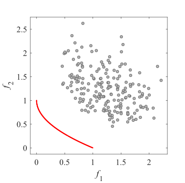
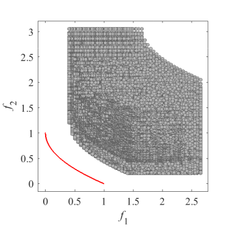
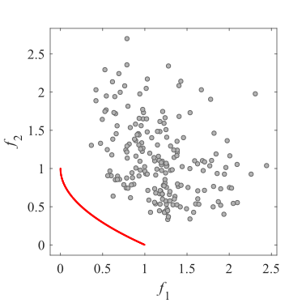
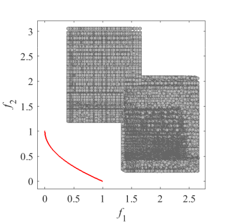
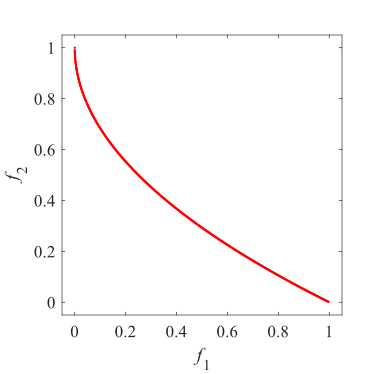
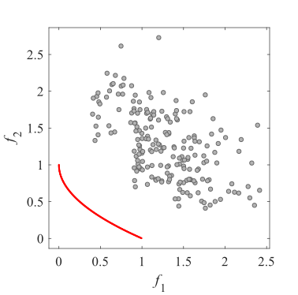
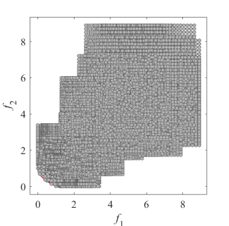
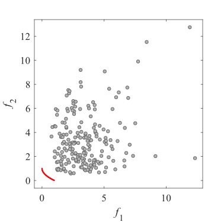
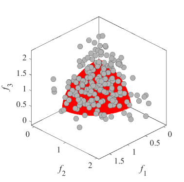

# Test_Functions_for_Multi_Objective_Optimization
test functions for multi-bjective optimization
 
## BT
Benchmark MOP with bias feature  
Reference  
H. Li, Q. Zhang, and J. Deng, Biased multiobjective optimization and
decomposition algorithm, IEEE Transactions on Cybernetics, 2017, 47(1):
52-66.
 
|Pareto Front on the BT1 |Initial population on the BT1| Grid Points on the BT1|
|:-:|:-:|:-:|
|Pareto Front on the BT2 |Initial population on the BT2| Grid Points on the BT2|
|Pareto Front on the BT3 |Initial population on the BT3| Grid Points on the BT3|
|Pareto Front on the BT4 |Initial population on the BT4| Grid Points on the BT4|
|Pareto Front on the BT5 |Initial population on the BT5| Grid Points on the BT5|
|Pareto Front on the BT6 |Initial population on the BT6| Grid Points on the BT6|
|Pareto Front on the BT7 |Initial population on the BT7| Grid Points on the BT7|
|Pareto Front on the BT8 |Initial population on the BT8| Grid Points on the BT8|
|Pareto Front on the BT9 |Initial population on the BT9| Grid Points on the BT9|
