# Test_Functions_for_Multi_Objective_Optimization
test functions for multi-bjective optimization
 
## DTLZ
Benchmark MOP proposed by Deb, Thiele, Laumanns, and Zitzler  
Reference  
K. Deb, L. Thiele, M. Laumanns, and E. Zitzler, Scalable test problems
for evolutionary multiobjective optimization, Evolutionary multiobjective
Optimization. Theoretical Advances and Applications, 2005, 105-145.
 
|Pareto Front on the DTLZ1 |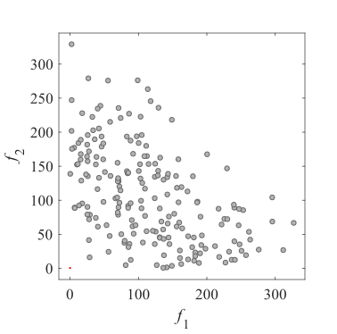Initial population on the DTLZ1|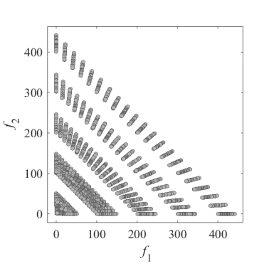 Grid Points on the DTLZ1|
|:-:|:-:|:-:|
|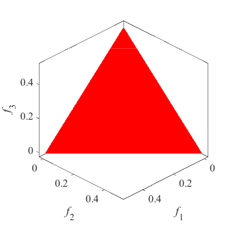Pareto Front on the DTLZ1 |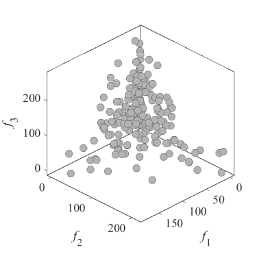Initial population on the DTLZ1|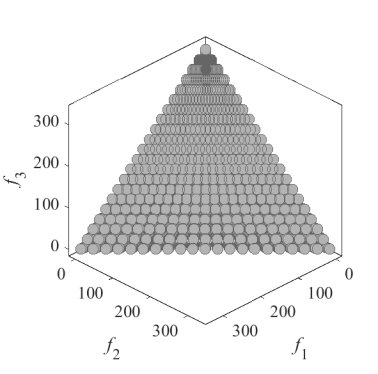 Grid Points on the DTLZ1|
|Pareto Front on the DTLZ2 |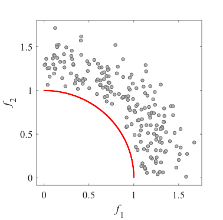Initial population on the DTLZ2| Grid Points on the DTLZ2|
|Pareto Front on the DTLZ2 |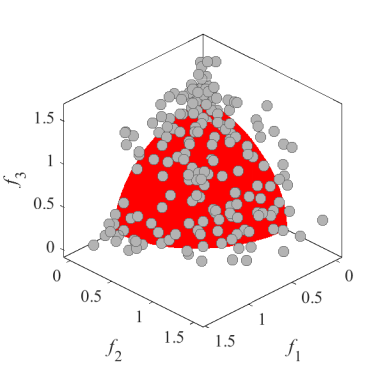Initial population on the DTLZ2| Grid Points on the DTLZ2|
|Pareto Front on the DTLZ3 |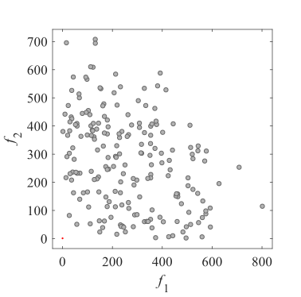Initial population on the DTLZ3| Grid Points on the DTLZ3|
|Pareto Front on the DTLZ3 |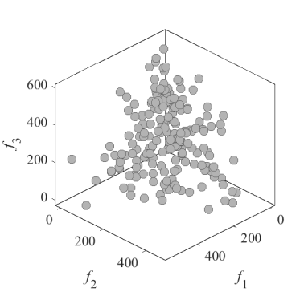Initial population on the DTLZ3| Grid Points on the DTLZ3|
|Pareto Front on the DTLZ4 |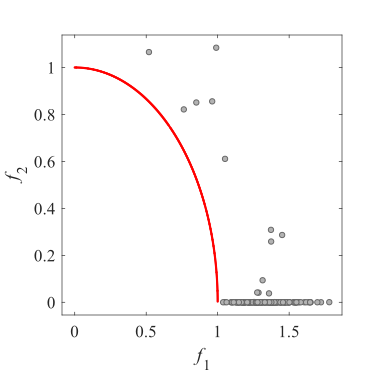Initial population on the DTLZ4| Grid Points on the DTLZ4|
|Pareto Front on the DTLZ4 |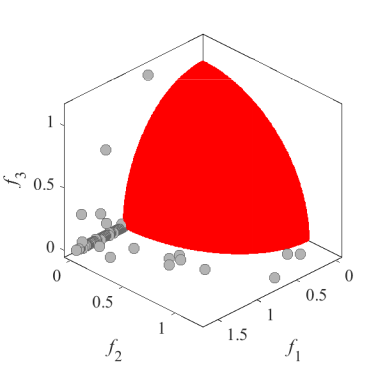Initial population on the DTLZ4| Grid Points on the DTLZ4|
|Pareto Front on the DTLZ5 |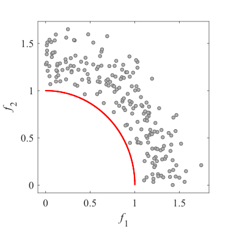Initial population on the DTLZ5|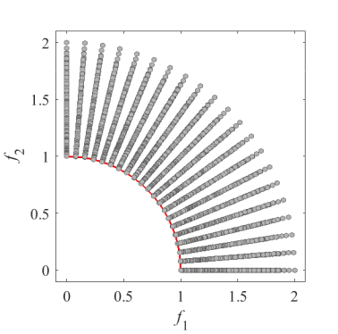 Grid Points on the DTLZ5|
|Pareto Front on the DTLZ5 |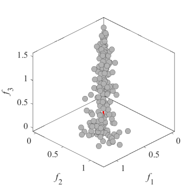Initial population on the DTLZ5|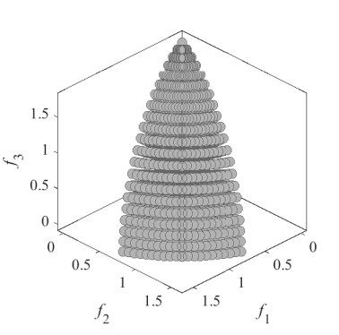 Grid Points on the DTLZ5|
|Pareto Front on the DTLZ6 |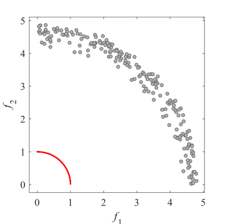Initial population on the DTLZ6|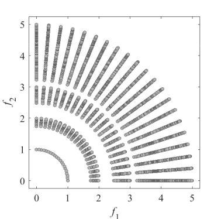 Grid Points on the DTLZ6|
|Pareto Front on the DTLZ6 |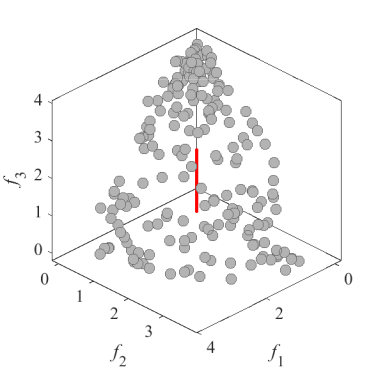Initial population on the DTLZ6|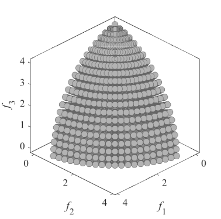 Grid Points on the DTLZ6|
|Pareto Front on the DTLZ7 |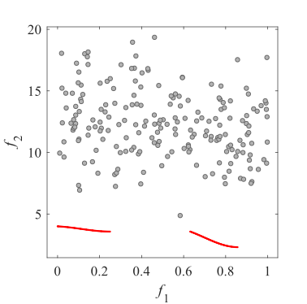Initial population on the DTLZ7| Grid Points on the DTLZ7|
|Pareto Front on the DTLZ7 |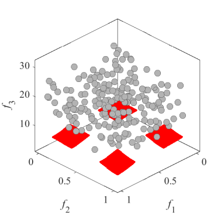Initial population on the DTLZ7| Grid Points on the DTLZ7|
|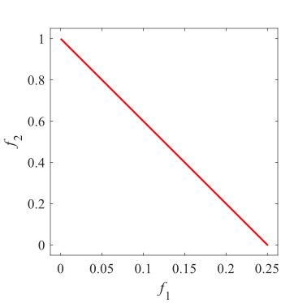Pareto Front on the DTLZ8 |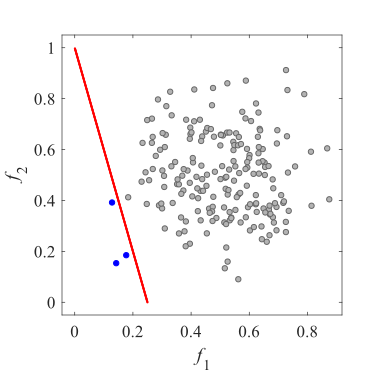Initial population on the DTLZ8|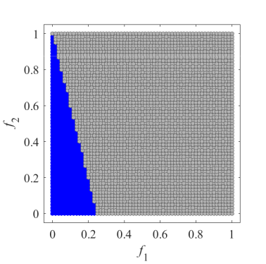 Grid Points on the DTLZ8|
|Pareto Front on the DTLZ8 |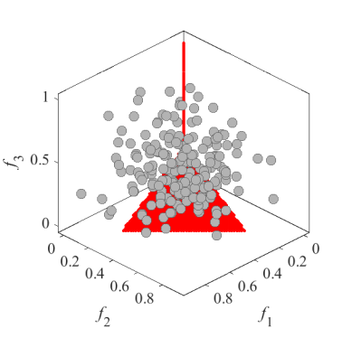Initial population on the DTLZ8|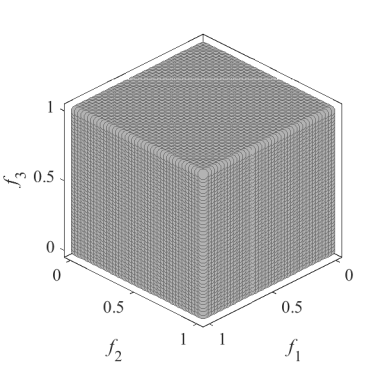 Grid Points on the DTLZ8|
|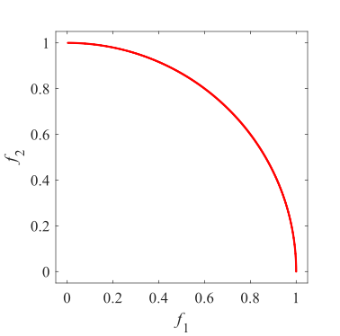Pareto Front on the DTLZ9 |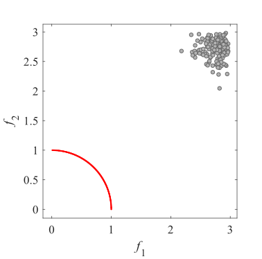Initial population on the DTLZ9| Grid Points on the DTLZ9|
|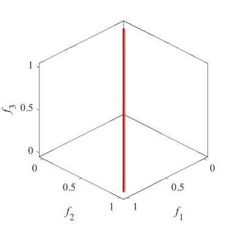Pareto Front on the DTLZ9 |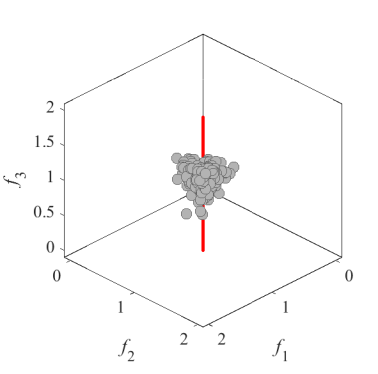Initial population on the DTLZ9| Grid Points on the DTLZ9|
 
Extended DTLZ5    I --- 2 --- Dimensionality of the true Pareto front  
Reference  
K. Deb and D. K. Saxena, On finding Pareto-optimal solutions through
dimensionality reduction for certain large-dimensional multi-objective
optimization problems, KanGAL Report 2005011, 2005.
 
|Pareto Front on the DTLZ5IM|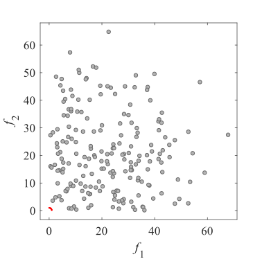Initial population on the DTLZ5IM| Grid Points on the DTLZ5IM|
|:-:|:-:|:-:|
|Pareto Front on the DTLZ5IM|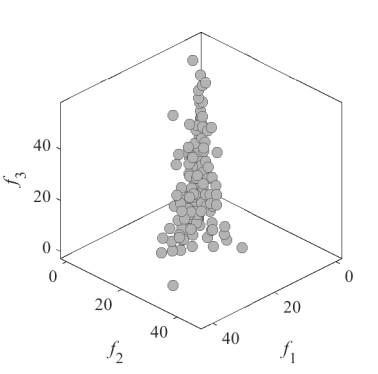Initial population on the DTLZ5IM|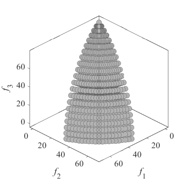 Grid Points on the DTLZ5IM|
 
Scaled DTLZ and Convex DTLZ2  
Reference  
K. Deb and H. Jain, An evolutionary many-objective optimization algorithm
using reference-point based non-dominated sorting approach, part I:
Solving problems with box constraints, IEEE Transactions on Evolutionary
Computation, 2014, 18(4): 577-601.
  
|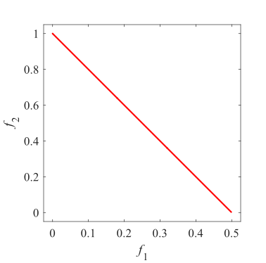Pareto Front on the SDTLZ1 |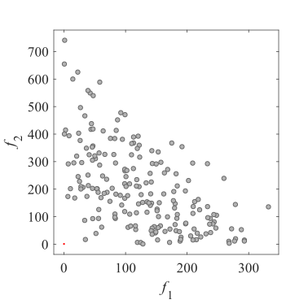Initial population on the SDTLZ1| Grid Points on the SDTLZ1|
|:-:|:-:|:-:|
|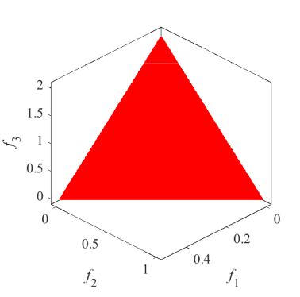Pareto Front on the SDTLZ1 |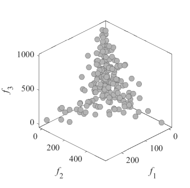Initial population on the SDTLZ1| Grid Points on the SDTLZ1|
|Pareto Front on the SDTLZ2 |Initial population on the SDTLZ2| Grid Points on the SDTLZ2|
|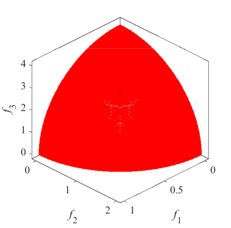Pareto Front on the SDTLZ2 |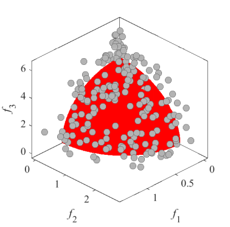Initial population on the SDTLZ2|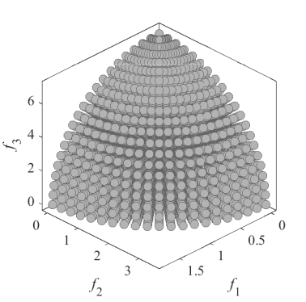 Grid Points on the SDTLZ2|
|Pareto Front on the SDTLZ2 |Initial population on the SDTLZ2| Grid Points on the SDTLZ2|
|Pareto Front on the SDTLZ2 |Initial population on the SDTLZ2| Grid Points on the SDTLZ2|
 
Constrained DTLZ and Inverted DTLZ  
Reference  
H. Jain and K. Deb, An evolutionary many-objective optimization algorithm
using reference-point based non-dominated sorting approach, part II:
Handling constraints and extending to an adaptive approach, IEEE
Transactions on Evolutionary Computation, 2014, 18(4): 602-622.
 
|Pareto Front on the C1_DTLZ1 |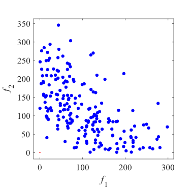Initial population on the C1_DTLZ1|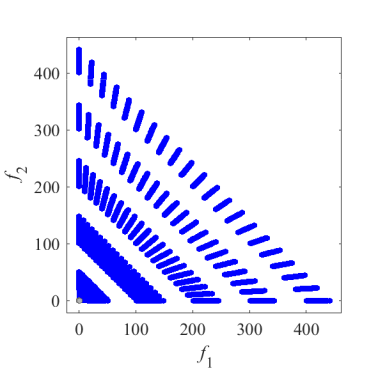 Grid Points on the C1_DTLZ1|
|:-:|:-:|:-:|
|Pareto Front on the C1_DTLZ1 |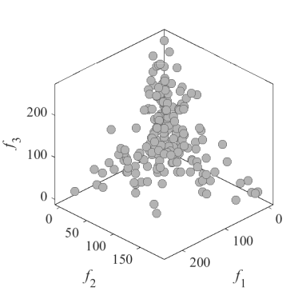Initial population on the C1_DTLZ1| Grid Points on the C1_DTLZ1|
|Pareto Front on the C2_DTLZ2 |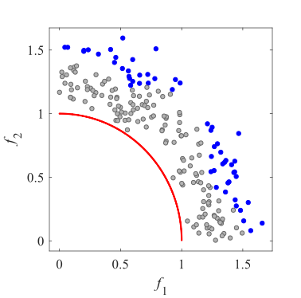Initial population on the C2_DTLZ2|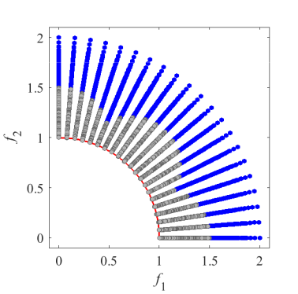 Grid Points on the C2_DTLZ2|
|Pareto Front on the C2_DTLZ2 |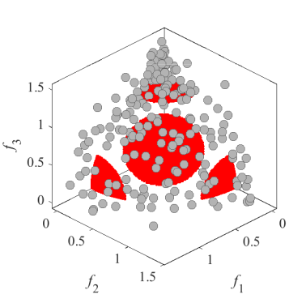Initial population on the C2_DTLZ2|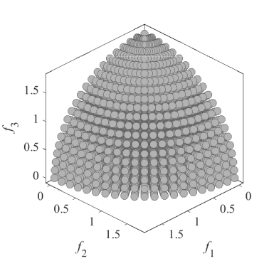 Grid Points on the C2_DTLZ2|
|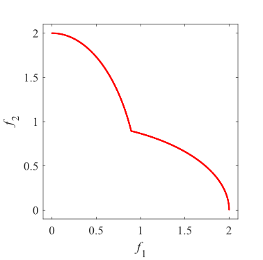Pareto Front on the C3_DTLZ4 |Initial population on the C3_DTLZ4| Grid Points on the C3_DTLZ4|
|Pareto Front on the C3_DTLZ4 |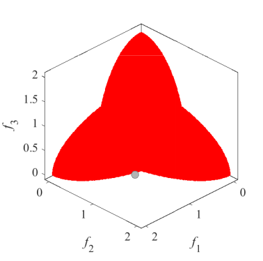Initial population on the C3_DTLZ4| Grid Points on the C3_DTLZ4|
|Pareto Front on the IDTLZ1 |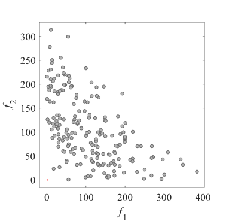Initial population on the IDTLZ1| Grid Points on the IDTLZ1|
|Pareto Front on the IDTLZ1 |Initial population on the IDTLZ1| Grid Points on the IDTLZ1|
|Pareto Front on the IDTLZ2 |Initial population on the IDTLZ2| Grid Points on the IDTLZ2|
|Pareto Front on the IDTLZ2 |Initial population on the IDTLZ2| Grid Points on the IDTLZ2|
