# Test_Functions_for_Multi_Objective_Optimization
test functions for multi-bjective optimization
 
## IMMOEA_F
Benchmark MOP for Inverse Modeling - MOEA  
Reference  
R. Cheng, Y. Jin, K. Narukawa, and B. Sendhoff, A multiobjective
evolutionary algorithm using Gaussian process-based inverse modeling,
IEEE Transactions on Evolutionary Computation, 2015, 19(6): 838-856.
 
|Pareto Front on the IMMOEA_F1 |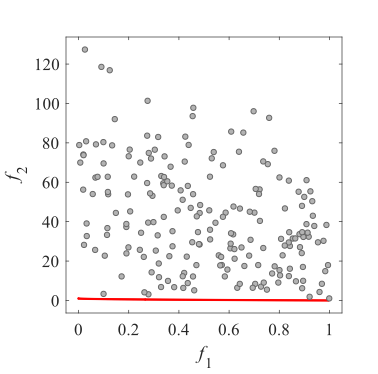Initial population on the IMMOEA_F1| Grid Points on the IMMOEA_F1|
|:-:|:-:|:-:|
|Pareto Front on the IMMOEA_F2 |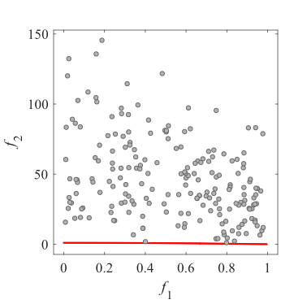Initial population on the IMMOEA_F2| Grid Points on the IMMOEA_F2|
|Pareto Front on the IMMOEA_F3 |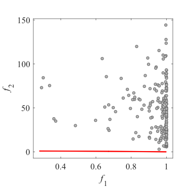Initial population on the IMMOEA_F3|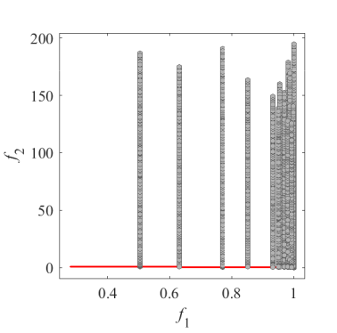 Grid Points on the IMMOEA_F3|
|Pareto Front on the IMMOEA_F4 |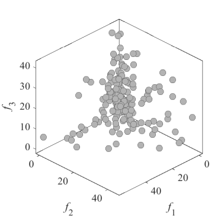Initial population on the IMMOEA_F4|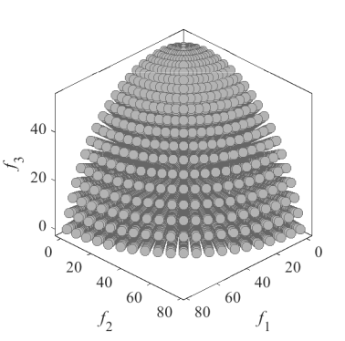 Grid Points on the IMMOEA_F4|
|Pareto Front on the IMMOEA_F5 |Initial population on the IMMOEA_F5| Grid Points on the IMMOEA_F5|
|Pareto Front on the IMMOEA_F6 |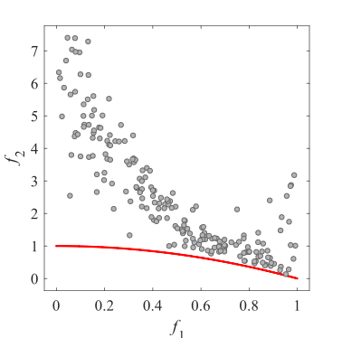Initial population on the IMMOEA_F6| Grid Points on the IMMOEA_F6|
|Pareto Front on the IMMOEA_F7 |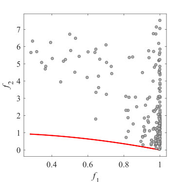Initial population on the IMMOEA_F7| Grid Points on the IMMOEA_F7|
|Pareto Front on the IMMOEA_F8 |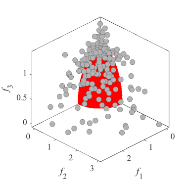Initial population on the IMMOEA_F8|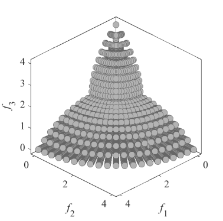 Grid Points on the IMMOEA_F8|
|Pareto Front on the IMMOEA_F9 |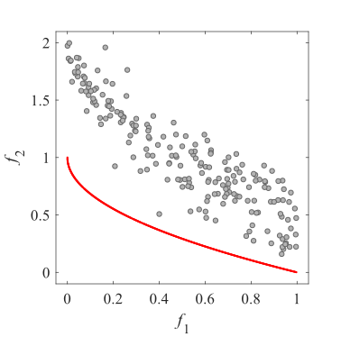Initial population on the IMMOEA_F9|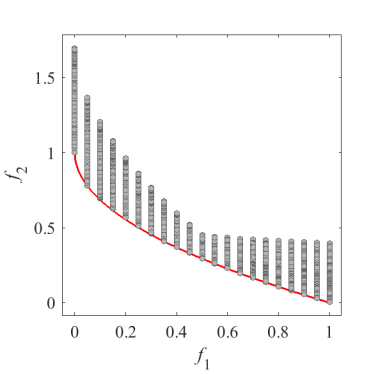 Grid Points on the IMMOEA_F9|
|Pareto Front on the IMMOEA_F10 |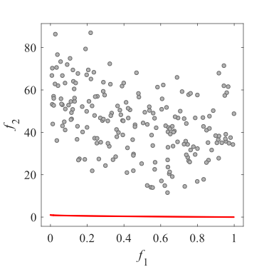Initial population on the IMMOEA_F10|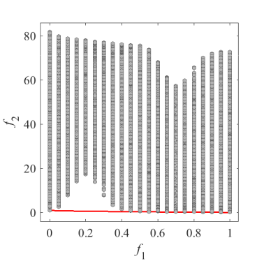 Grid Points on the IMMOEA_F10|