# IMMOEA
### Benchmark MOP for Inverse Modeling - MOEA  
Reference  
R. Cheng, Y. Jin, K. Narukawa, and B. Sendhoff, A multiobjective
evolutionary algorithm using Gaussian process-based inverse modeling,
IEEE Transactions on Evolutionary Computation, 2015, 19(6): 838-856.
 
|Pareto Front on the IMMOEA_F1|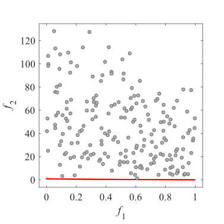Initial population on the IMMOEA_F1|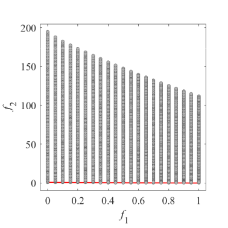Grid Points on the IMMOEA_F1|
|:-:|:-:|:-:|
|Pareto Front on the IMMOEA_F2|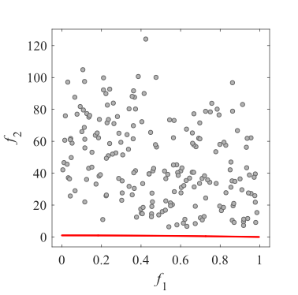Initial population on the IMMOEA_F2|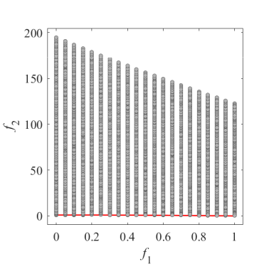Grid Points on the IMMOEA_F2|
|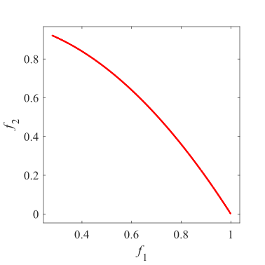Pareto Front on the IMMOEA_F3|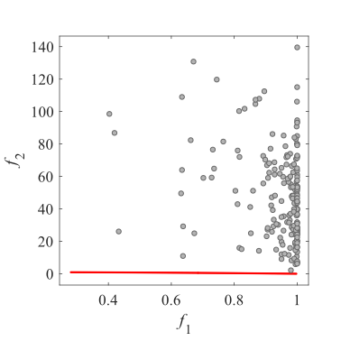Initial population on the IMMOEA_F3|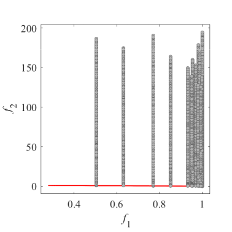Grid Points on the IMMOEA_F3|
|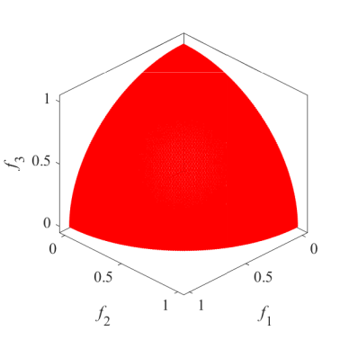Pareto Front on the IMMOEA_F4|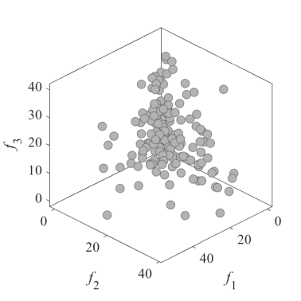Initial population on the IMMOEA_F4|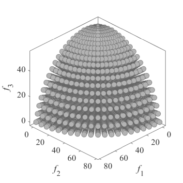Grid Points on the IMMOEA_F4|
|Pareto Front on the IMMOEA_F5|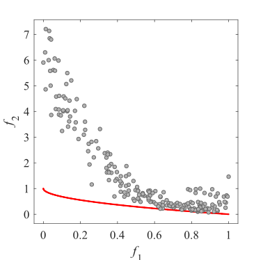Initial population on the IMMOEA_F5|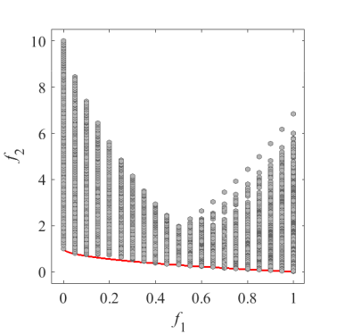Grid Points on the IMMOEA_F5|
|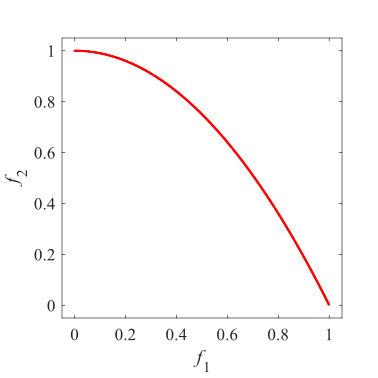Pareto Front on the IMMOEA_F6|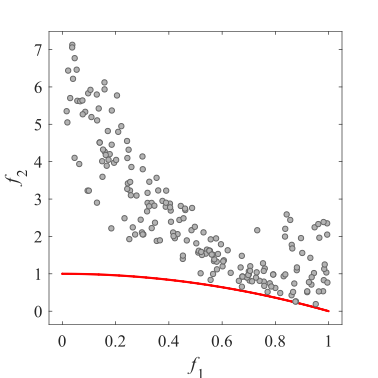Initial population on the IMMOEA_F6|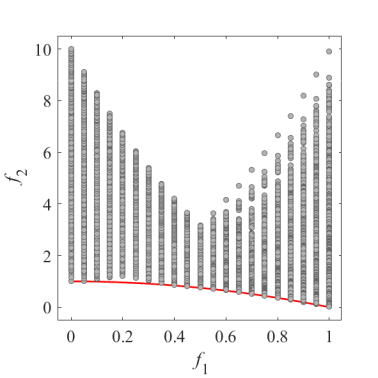Grid Points on the IMMOEA_F6|
|Pareto Front on the IMMOEA_F7|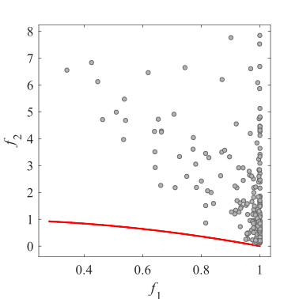Initial population on the IMMOEA_F7|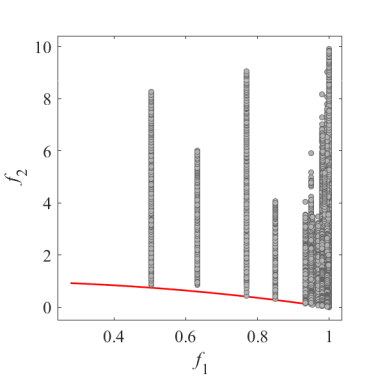Grid Points on the IMMOEA_F7|
|Pareto Front on the IMMOEA_F8|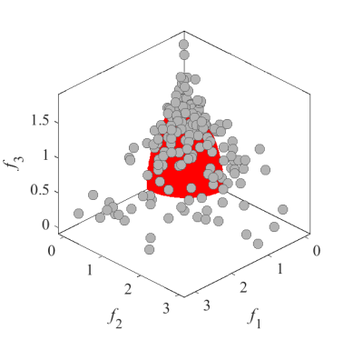Initial population on the IMMOEA_F8|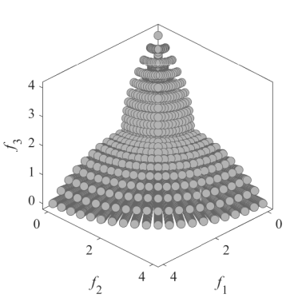Grid Points on the IMMOEA_F8|
|Pareto Front on the IMMOEA_F9|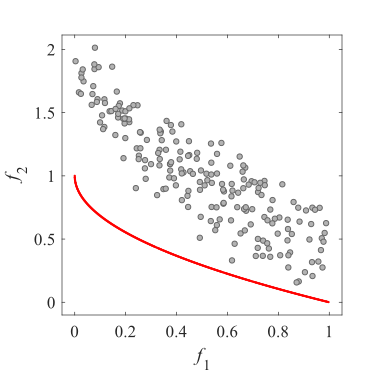Initial population on the IMMOEA_F9|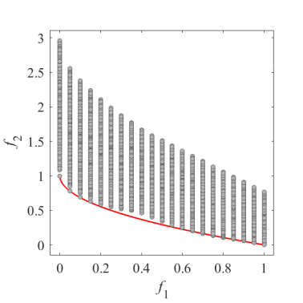Grid Points on the IMMOEA_F9|
|Pareto Front on the IMMOEA_F10|Initial population on the IMMOEA_F10|Grid Points on the IMMOEA_F10|
