# IMOP
### Benchmark MOP with irregular Pareto front  
Reference  
Y. Tian, R. Cheng, X. Zhang, M. Li, and Y. Jin, Diversity assessment of
multi-objective evolutionary algorithms: Performance metric and benchmark
problems, IEEE Computational Intelligence Magazine, 2019.
 
|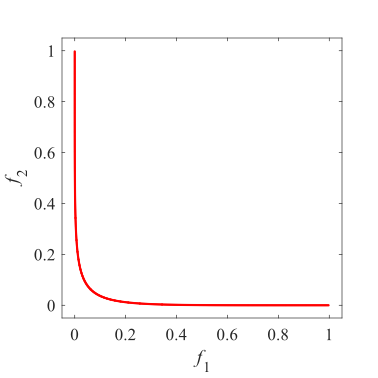Pareto Front on the IMOP1|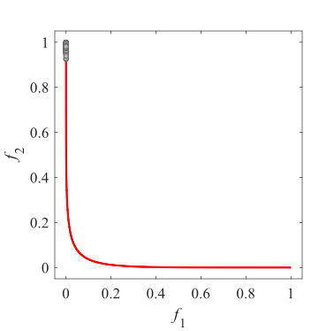Initial population on the IMOP1|Grid Points on the IMOP1|
|:-:|:-:|:-:|
|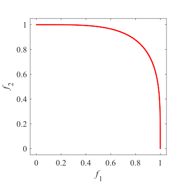Pareto Front on the IMOP2|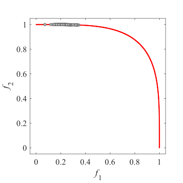Initial population on the IMOP2|Grid Points on the IMOP2|
|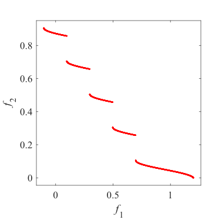Pareto Front on the IMOP3|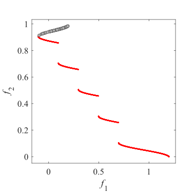Initial population on the IMOP3|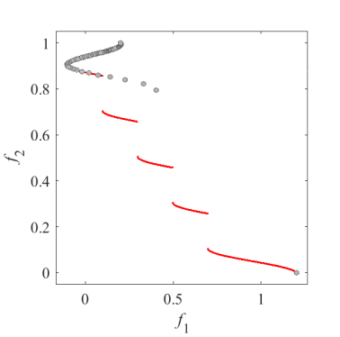Grid Points on the IMOP3|
|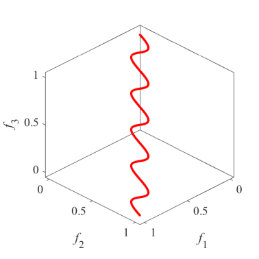Pareto Front on the IMOP4|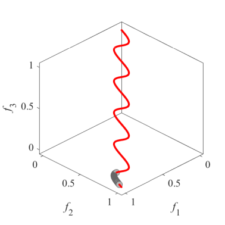Initial population on the IMOP4|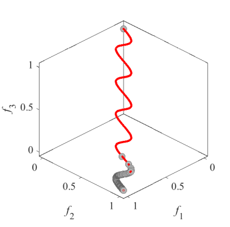Grid Points on the IMOP4|
|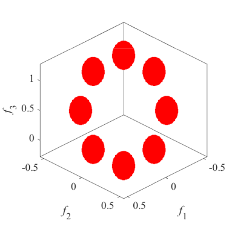Pareto Front on the IMOP5|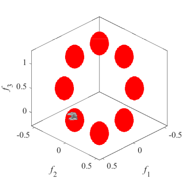Initial population on the IMOP5|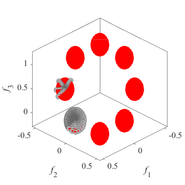Grid Points on the IMOP5|
|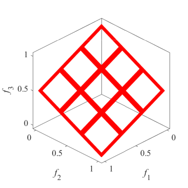Pareto Front on the IMOP6|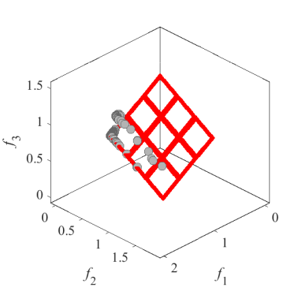Initial population on the IMOP6|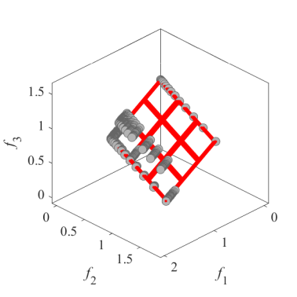Grid Points on the IMOP6|
|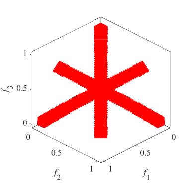Pareto Front on the IMOP7|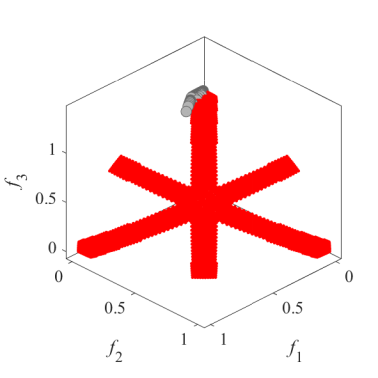Initial population on the IMOP7|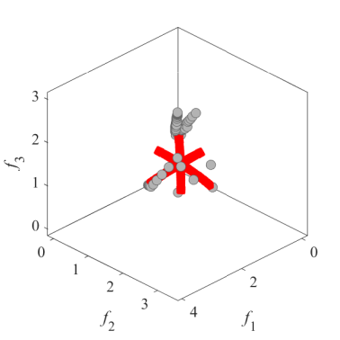Grid Points on the IMOP7|
|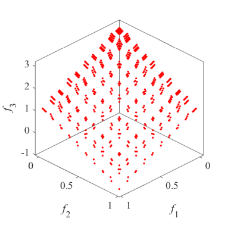Pareto Front on the IMOP8|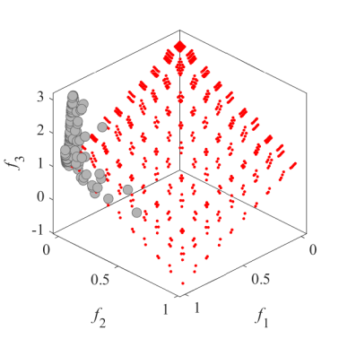Initial population on the IMOP8|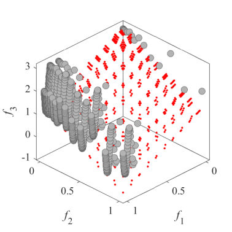Grid Points on the IMOP8|
|Pareto Front on the IMOP9|Initial population on the IMOP9|Grid Points on the IMOP9|
|Pareto Front on the IMOP10|Initial population on the IMOP10|Grid Points on the IMOP10|
