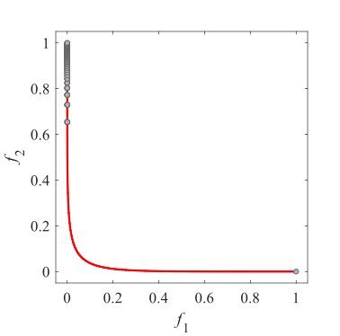
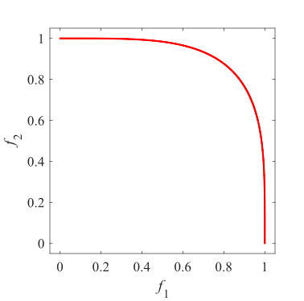
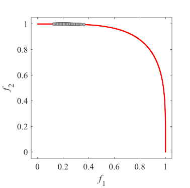
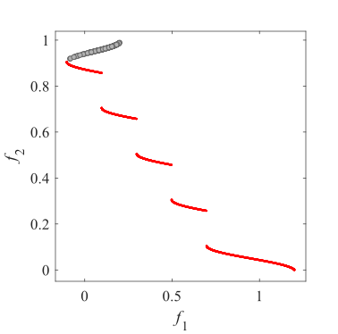
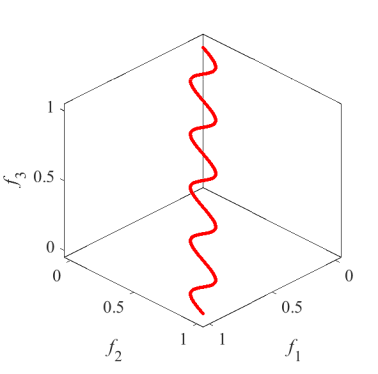
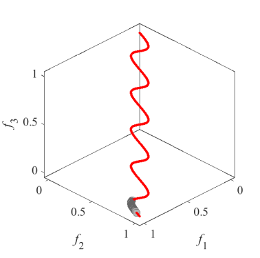
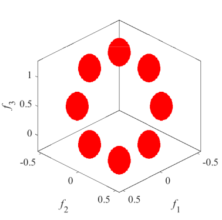
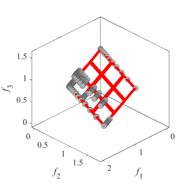
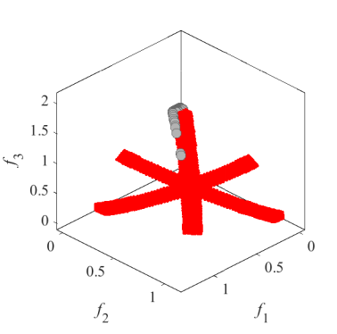
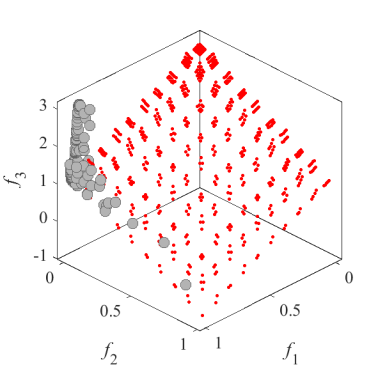

# Test_Functions_for_Multi_Objective_Optimization
test functions for multi-bjective optimization
 
## IMOP
Benchmark MOP with irregular Pareto front  
Reference  
Y. Tian, R. Cheng, X. Zhang, M. Li, and Y. Jin, Diversity assessment of
multi-objective evolutionary algorithms: Performance metric and benchmark
problems, IEEE Computational Intelligence Magazine, 2019.
 
|Pareto Front on the IMOP1 |Initial population on the IMOP1| Grid Points on the IMOP1|
|:-:|:-:|:-:|
|Pareto Front on the IMOP2 |Initial population on the IMOP2| Grid Points on the IMOP2|
|Pareto Front on the IMOP3 |Initial population on the IMOP3| Grid Points on the IMOP3|
|Pareto Front on the IMOP4 |Initial population on the IMOP4| Grid Points on the IMOP4|
|Pareto Front on the IMOP5 |Initial population on the IMOP5| Grid Points on the IMOP5|
|Pareto Front on the IMOP6 |Initial population on the IMOP6| Grid Points on the IMOP6|
|Pareto Front on the IMOP7 |Initial population on the IMOP7| Grid Points on the IMOP7|
|Pareto Front on the IMOP8 |Initial population on the IMOP8| Grid Points on the IMOP8|