# Test_Functions_for_Multi_Objective_Optimization
test functions for multi-bjective optimization
 
## MOEADDE
Benchmark MOP for MOEA/D-DE  
Reference  
H. Li and Q. Zhang, Multiobjective optimization problems with complicated
Pareto sets, MOEA/D and NSGA-II, IEEE Transactions on Evolutionary
Computation, 2009, 13(2): 284-302.
 
|Pareto Front on the MOEADDE_F1 |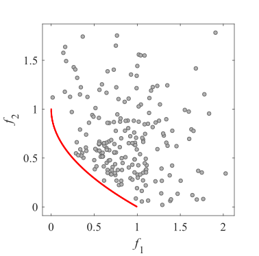Initial population on the MOEADDE_F1|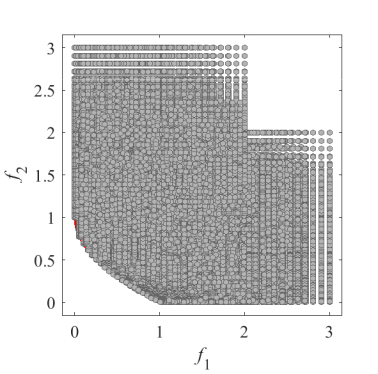 Grid Points on the MOEADDE_F1|
|:-:|:-:|:-:|
|Pareto Front on the MOEADDE_F2 |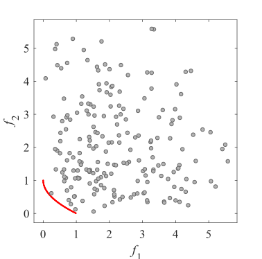Initial population on the MOEADDE_F2|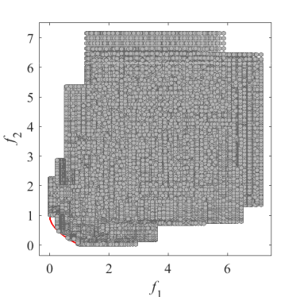 Grid Points on the MOEADDE_F2|
|Pareto Front on the MOEADDE_F3 |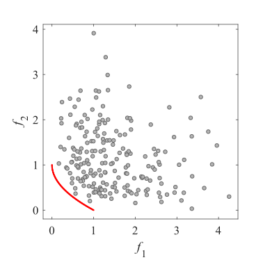Initial population on the MOEADDE_F3|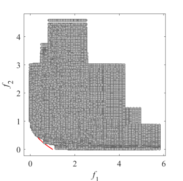 Grid Points on the MOEADDE_F3|
|Pareto Front on the MOEADDE_F4 |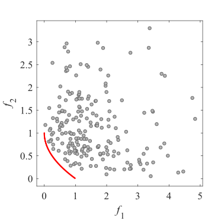Initial population on the MOEADDE_F4|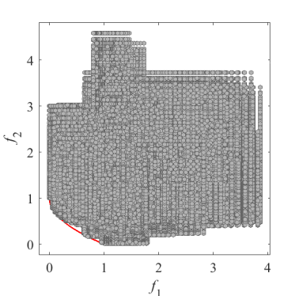 Grid Points on the MOEADDE_F4|
|Pareto Front on the MOEADDE_F5 |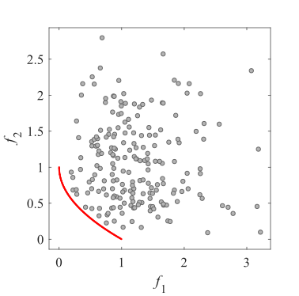Initial population on the MOEADDE_F5|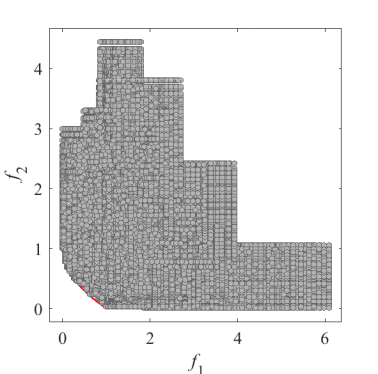 Grid Points on the MOEADDE_F5|
|Pareto Front on the MOEADDE_F6 |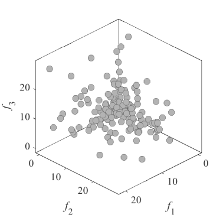Initial population on the MOEADDE_F6| Grid Points on the MOEADDE_F6|
|Pareto Front on the MOEADDE_F7 |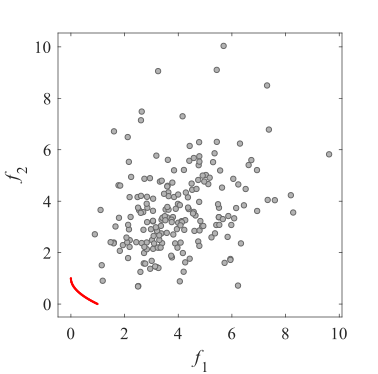Initial population on the MOEADDE_F7| Grid Points on the MOEADDE_F7|
|Pareto Front on the MOEADDE_F8 |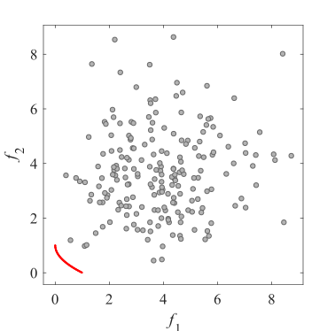Initial population on the MOEADDE_F8| Grid Points on the MOEADDE_F8|
|Pareto Front on the MOEADDE_F9 |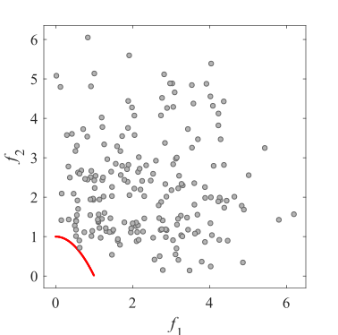Initial population on the MOEADDE_F9|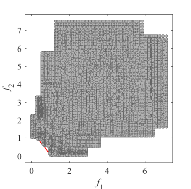 Grid Points on the MOEADDE_F9|
