# BT
### Benchmark MOP with bias feature  
Reference  
H. Li, Q. Zhang, and J. Deng, Biased multiobjective optimization and
decomposition algorithm, IEEE Transactions on Cybernetics, 2017, 47(1):
52-66.
 
|Pareto Front on the BT1|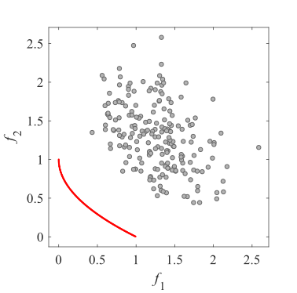Initial population on the BT1|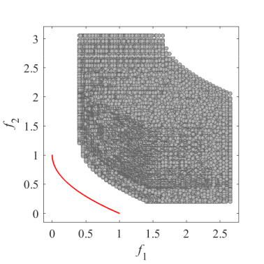Grid Points on the BT1|
|:-:|:-:|:-:|
|Pareto Front on the BT2|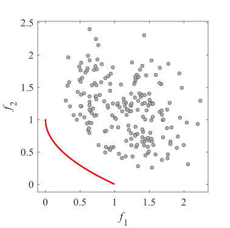Initial population on the BT2|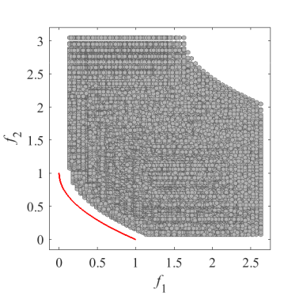Grid Points on the BT2|
|Pareto Front on the BT3|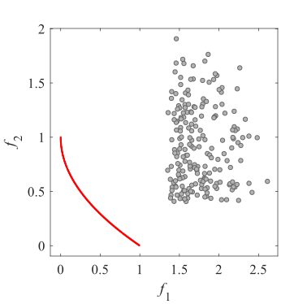Initial population on the BT3|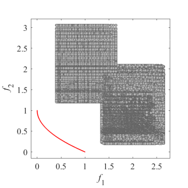Grid Points on the BT3|
|Pareto Front on the BT4|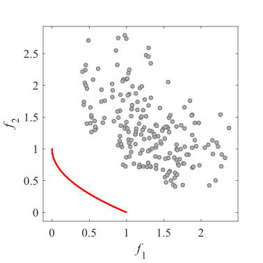Initial population on the BT4|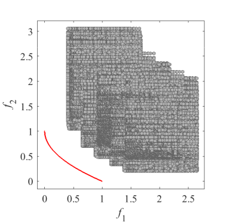Grid Points on the BT4|
|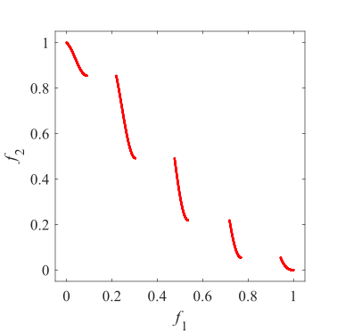Pareto Front on the BT5|Initial population on the BT5|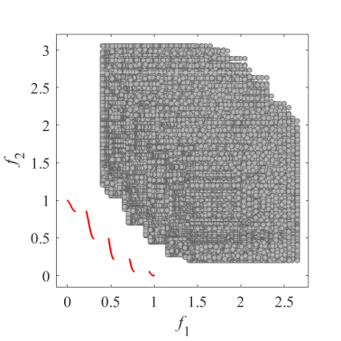Grid Points on the BT5|
|Pareto Front on the BT6|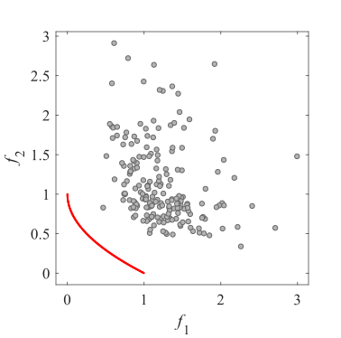Initial population on the BT6|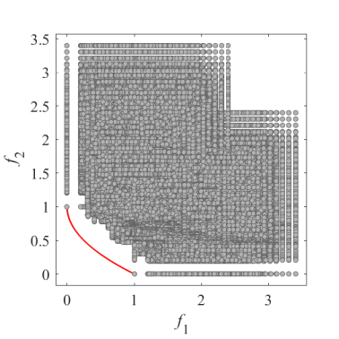Grid Points on the BT6|
|Pareto Front on the BT7|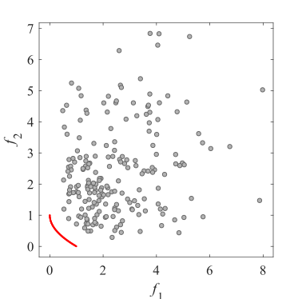Initial population on the BT7|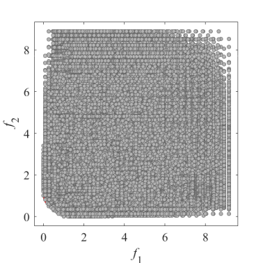Grid Points on the BT7|
|Pareto Front on the BT8|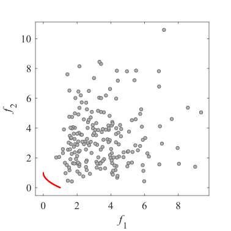Initial population on the BT8|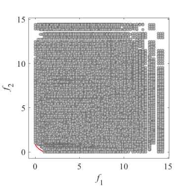Grid Points on the BT8|
|Pareto Front on the BT9|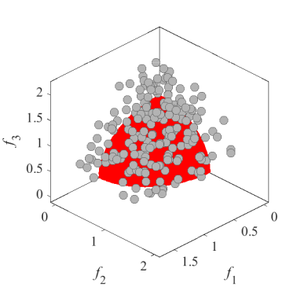Initial population on the BT9|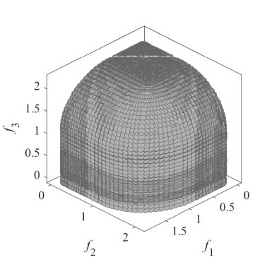Grid Points on the BT9|
