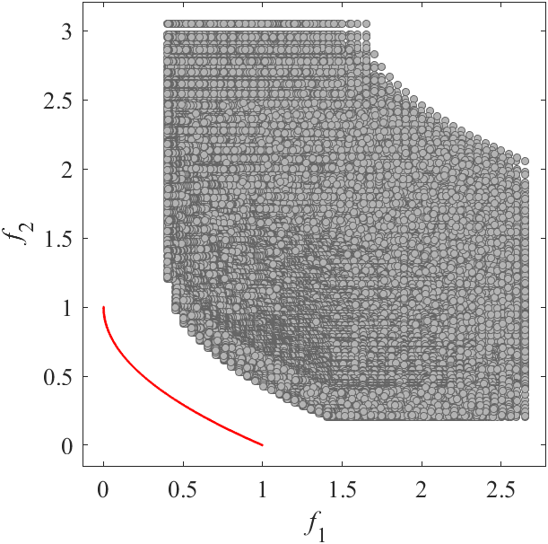

# BT: Benchmark MOP with bias feature  
Reference  
H. Li, Q. Zhang, and J. Deng, Biased multiobjective optimization and decomposition algorithm, IEEE Transactions on Cybernetics, 2017, 47(1): 52-66.

||||
|:-:|:-:|:-:|
||||
|Pareto Front on the BT1 (_M_=2)|Random points on the BT1 (_M_=2)|Grid Points on the BT1 (_M_=2)|
||||
|Pareto Front on the BT2 (_M_=2)|Random points on the BT2 (_M_=2)|Grid Points on the BT2 (_M_=2)|
||||
|Pareto Front on the BT3 (_M_=2)|Random points on the BT3 (_M_=2)|Grid Points on the BT3 (_M_=2)|
||||
|Pareto Front on the BT4 (_M_=2)|Random points on the BT4 (_M_=2)|Grid Points on the BT4 (_M_=2)|
||||
|Pareto Front on the BT5 (_M_=2)|Random points on the BT5 (_M_=2)|Grid Points on the BT5 (_M_=2)|
||||
|Pareto Front on the BT6 (_M_=2)|Random points on the BT6 (_M_=2)|Grid Points on the BT6 (_M_=2)|
||||
|Pareto Front on the BT7 (_M_=2)|Random points on the BT7 (_M_=2)|Grid Points on the BT7 (_M_=2)|
||||
|Pareto Front on the BT8 (_M_=2)|Random points on the BT8 (_M_=2)|Grid Points on the BT8 (_M_=2)|
||||
|Pareto Front on the BT9 (_M_=3)|Random points on the BT9 (_M_=3)|Grid Points on the BT9 (_M_=3)|
