# CF
### Constrained benchmark MOP  
Reference  
Q. Zhang, A. Zhou, S. Zhao, P. N. Suganthan, W. Liu, and S. Tiwari,
Multiobjective optimization test instances for the CEC 2009 special
session and competition, School of CS & EE, University of Essex, Working
Report CES-487, 2009.
 
|Pareto Front on the CF1|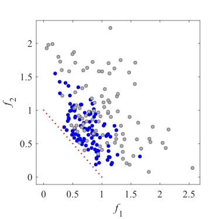Initial population on the CF1|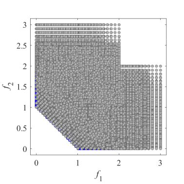Grid Points on the CF1|
|:-:|:-:|:-:|
|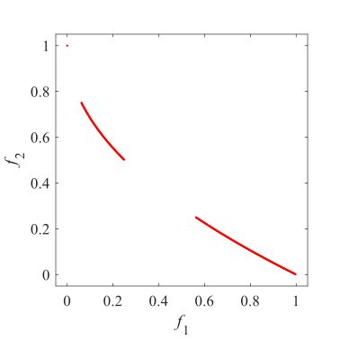Pareto Front on the CF2|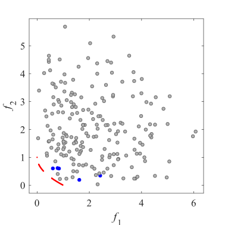Initial population on the CF2|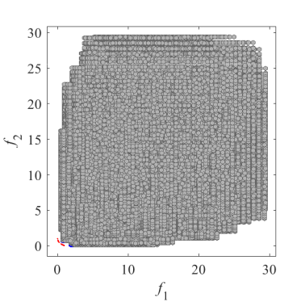Grid Points on the CF2|
|Pareto Front on the CF3|Initial population on the CF3|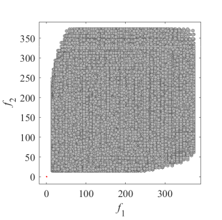Grid Points on the CF3|
|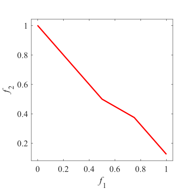Pareto Front on the CF4|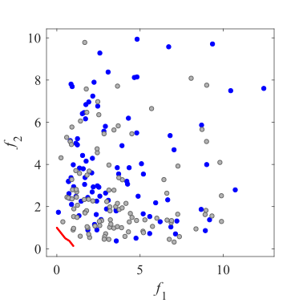Initial population on the CF4|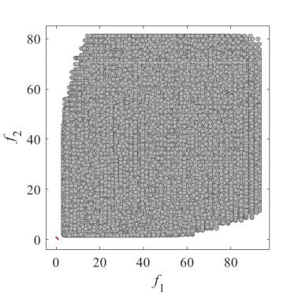Grid Points on the CF4|
|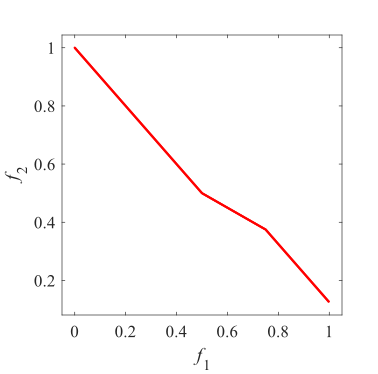Pareto Front on the CF5|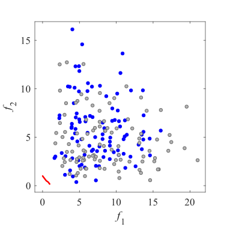Initial population on the CF5|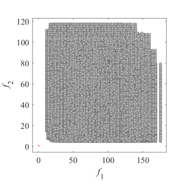Grid Points on the CF5|
|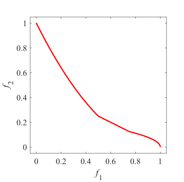Pareto Front on the CF6|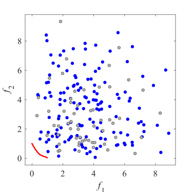Initial population on the CF6|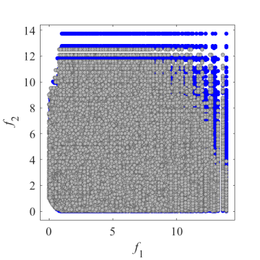Grid Points on the CF6|
|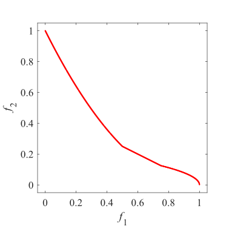Pareto Front on the CF7|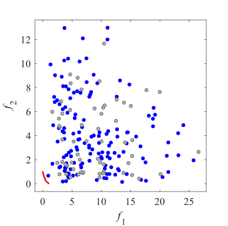Initial population on the CF7|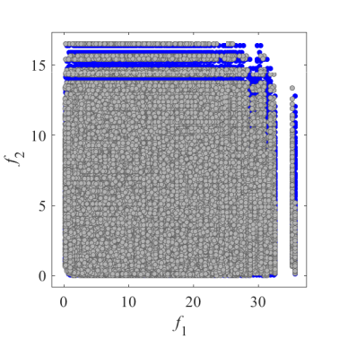Grid Points on the CF7|
|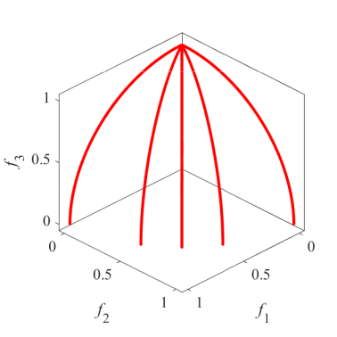Pareto Front on the CF8|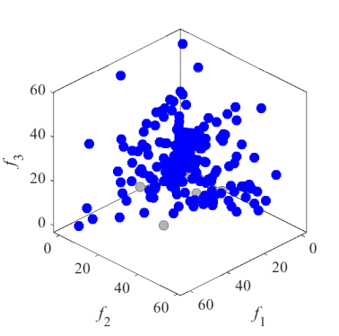Initial population on the CF8|Grid Points on the CF8|
|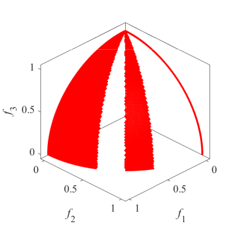Pareto Front on the CF9|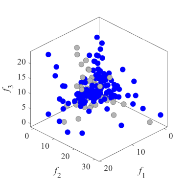Initial population on the CF9|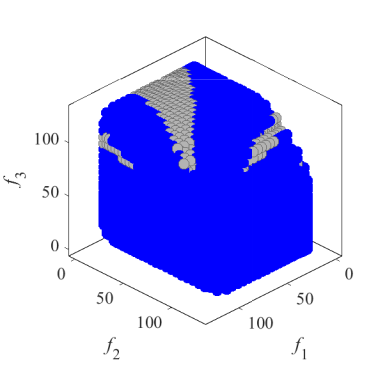Grid Points on the CF9|
|Pareto Front on the CF10|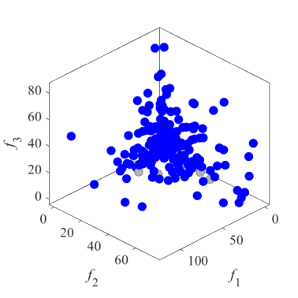Initial population on the CF10|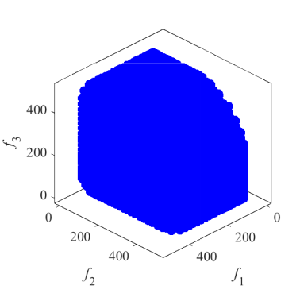Grid Points on the CF10|
