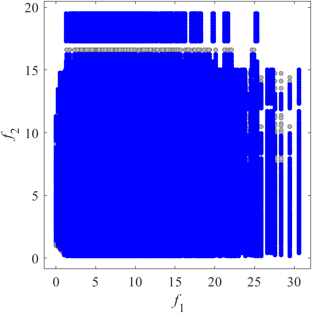

# CF: Constrained benchmark MOP  
Reference  
Q. Zhang, A. Zhou, S. Zhao, P. N. Suganthan, W. Liu, and S. Tiwari, Multiobjective optimization test instances for the CEC 2009 special session and competition, School of CS & EE, University of Essex, Working Report CES-487, 2009.

||||
|:-:|:-:|:-:|
||||
|Pareto Front on the CF1 (_M_=2)|Random points on the CF1 (_M_=2)|Grid Points on the CF1 (_M_=2)|
||||
|Pareto Front on the CF2 (_M_=2)|Random points on the CF2 (_M_=2)|Grid Points on the CF2 (_M_=2)|
||||
|Pareto Front on the CF3 (_M_=2)|Random points on the CF3 (_M_=2)|Grid Points on the CF3 (_M_=2)|
||||
|Pareto Front on the CF4 (_M_=2)|Random points on the CF4 (_M_=2)|Grid Points on the CF4 (_M_=2)|
||||
|Pareto Front on the CF5 (_M_=2)|Random points on the CF5 (_M_=2)|Grid Points on the CF5 (_M_=2)|
||||
|Pareto Front on the CF6 (_M_=2)|Random points on the CF6 (_M_=2)|Grid Points on the CF6 (_M_=2)|
||||
|Pareto Front on the CF7 (_M_=2)|Random points on the CF7 (_M_=2)|Grid Points on the CF7 (_M_=2)|
||||
|Pareto Front on the CF8 (_M_=3)|Random points on the CF8 (_M_=3)|Grid Points on the CF8 (_M_=3)|
||||
|Pareto Front on the CF9 (_M_=3)|Random points on the CF9 (_M_=3)|Grid Points on the CF9 (_M_=3)|
||||
|Pareto Front on the CF10 (_M_=3)|Random points on the CF10 (_M_=3)|Grid Points on the CF10 (_M_=3)|
