# Combinatorial MOPs  
### Combinatorial Multi-objective optimization problems  
The multi-objective knapsack problem  
Reference  
E. Zitzler and L. Thiele, Multiobjective evolutionary algorithms: A
comparative case study and the strength Pareto approach, IEEE
Transactions on Evolutionary Computation, 1999, 3(4): 257-271.

|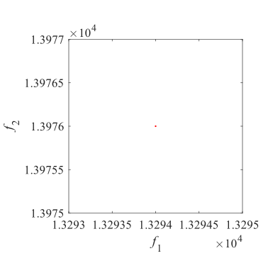Pareto Front on the MOKP|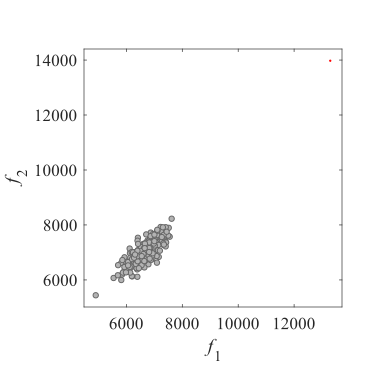Initial population on the MOKP|MOKP have binary encoding decision variables. I have no image.|
|:-:|:-:|:-:|
|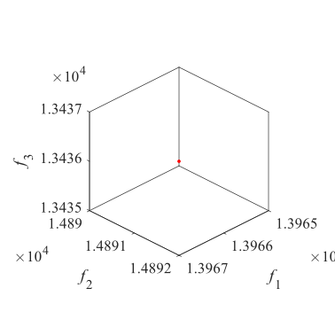Pareto Front on the MOKP|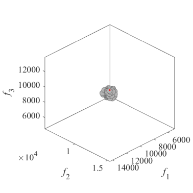Initial population on the MOKP|MOKP have binary encoding decision variables. I have no image.|

The multi-objective next release problem  
Reference  
Y. Zhang, M. Harman, and S. A. Mansouri, The multi-objective next release
problem, Proceedings of the 9th Annual Conference on Genetic and
Evolutionary Computation, 2007, 1129-1137.

|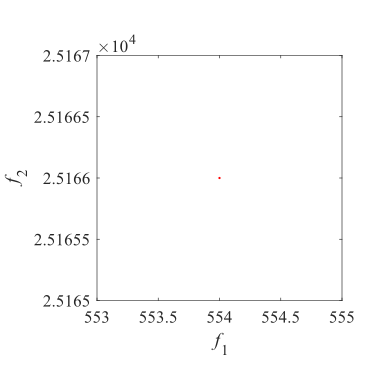Pareto Front on the MONRP|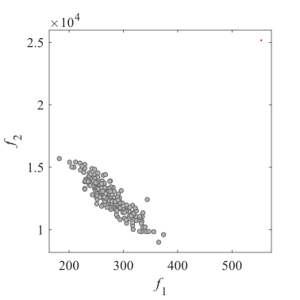Initial population on the MONRP|MONRP have binary encoding decision variables. I have no image.|

The multi-objective traveling salesman problem  
Reference  
D. Corne and J. Knowles, Techniques for highly multiobjective
optimisation: some nondominated points are better than others,
Proceedings of the 9th Annual Conference on Genetic and Evolutionary
Computation, 2007, 773-780.

|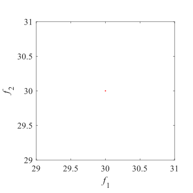Pareto Front on the MOTSP|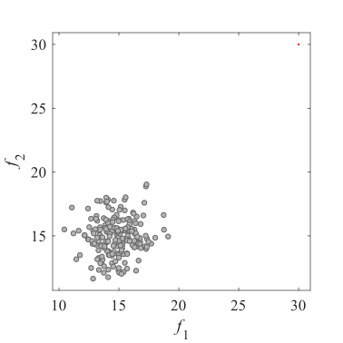Initial population on the MOTSP|MOTSP have binary encoding decision variables. I have no image.|
|:-:|:-:|:-:|
|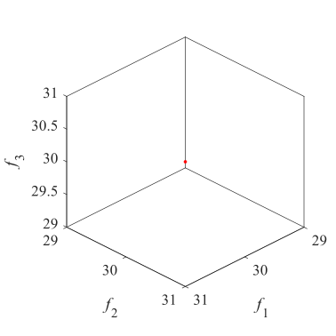Pareto Front on the MOTSP|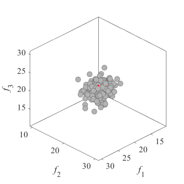Initial population on the MOTSP|MOTSP have binary encoding decision variables. I have no image.|

The multi-objective quadratic assignment problem  
Reference  
J. Knowles and D. Corne, Instance generators and test suites for the
multiobjective quadratic assignment problem, Proceedings of the
International Conference on Evolutionary Multi-Criterion Optimization,
2003, 295-310.

|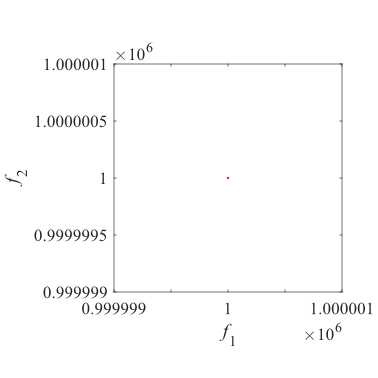Pareto Front on the mQAP|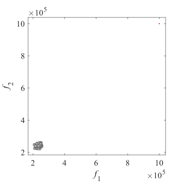Initial population on the mQAP|mQAP have binary encoding decision variables. I have no image.|
|:-:|:-:|:-:|
|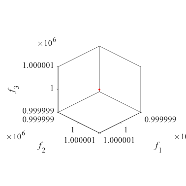Pareto Front on the mQAP|Initial population on the mQAP|mQAP have binary encoding decision variables. I have no image.|
