# DAS-CMOP: Difficulty-adjustable and scalable constrained benchmark MOP
Reference  
Z. Fan, W. Li, X. Cai, H. Li, C. Wei, Q. Zhang, K. Deb, and E. Goodman, Difficulty adjustable and scalable constrained multi-objective test problem toolkit, Evolutionary Computation, 2019.

||||
|:-:|:-:|:-:|
|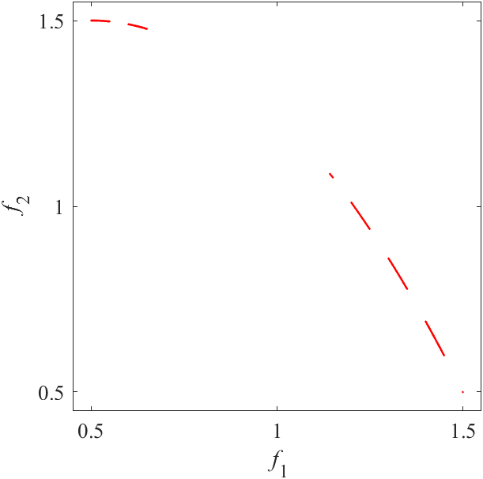|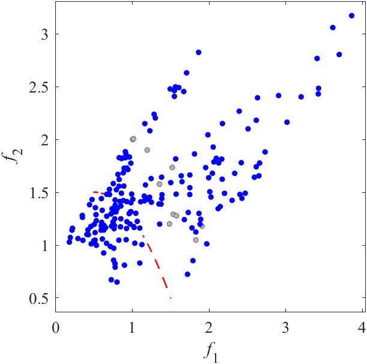|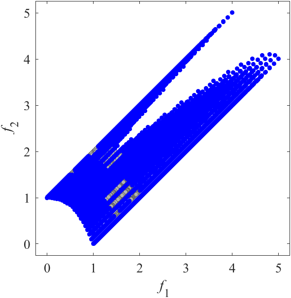|
|Pareto Front on the DASCMOP1 (_M_=2)|Random points on the DASCMOP1 (_M_=2)|Grid Points on the DASCMOP1 (_M_=2)|
|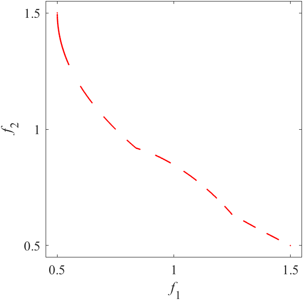|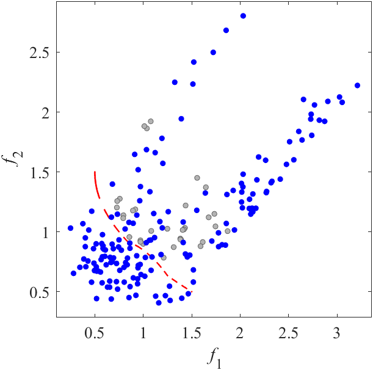|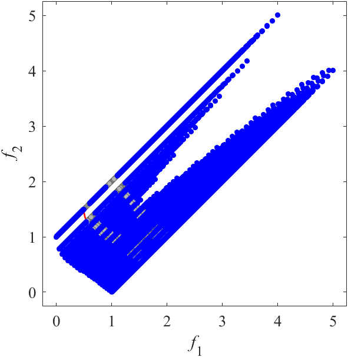|
|Pareto Front on the DASCMOP2 (_M_=2)|Random points on the DASCMOP2 (_M_=2)|Grid Points on the DASCMOP2 (_M_=2)|
|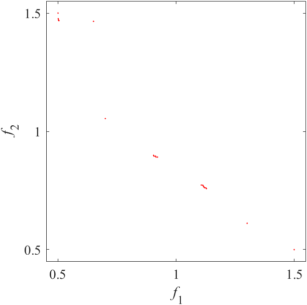|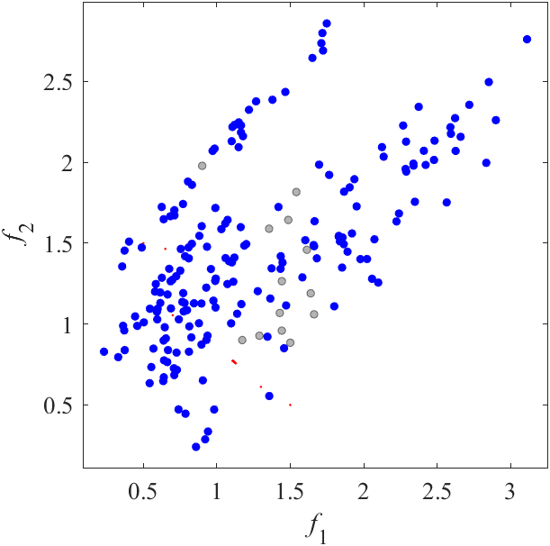|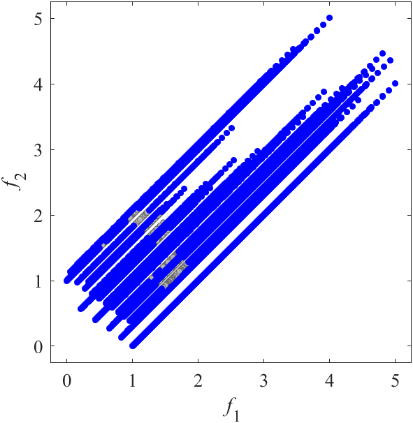|
|Pareto Front on the DASCMOP3 (_M_=2)|Random points on the DASCMOP3 (_M_=2)|Grid Points on the DASCMOP3 (_M_=2)|
||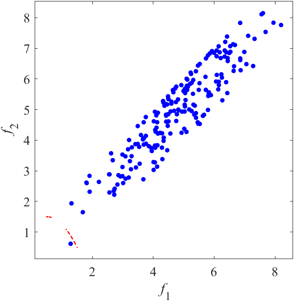|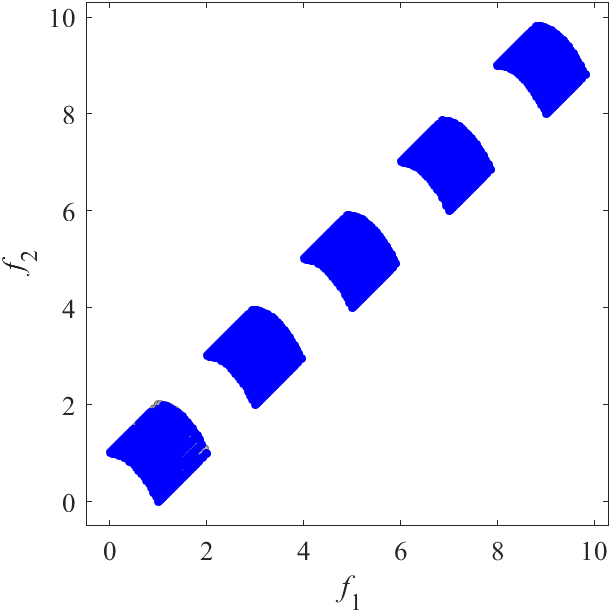|
|Pareto Front on the DASCMOP4 (_M_=2)|Random points on the DASCMOP4 (_M_=2)|Grid Points on the DASCMOP4 (_M_=2)|
||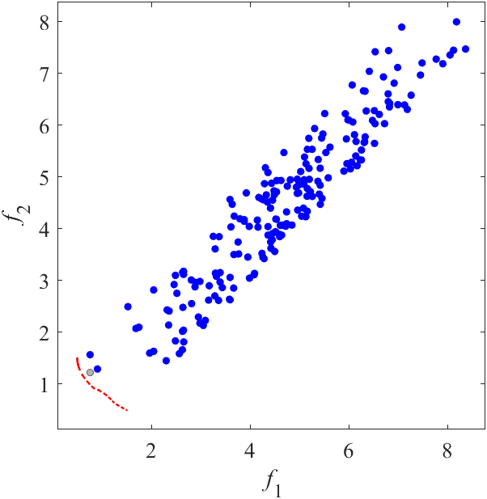|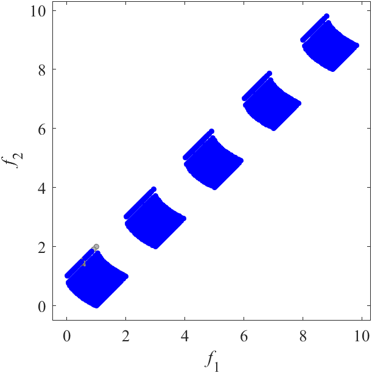|
|Pareto Front on the DASCMOP5 (_M_=2)|Random points on the DASCMOP5 (_M_=2)|Grid Points on the DASCMOP5 (_M_=2)|
||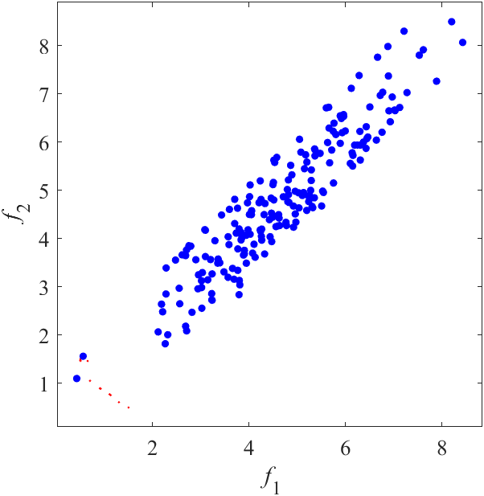|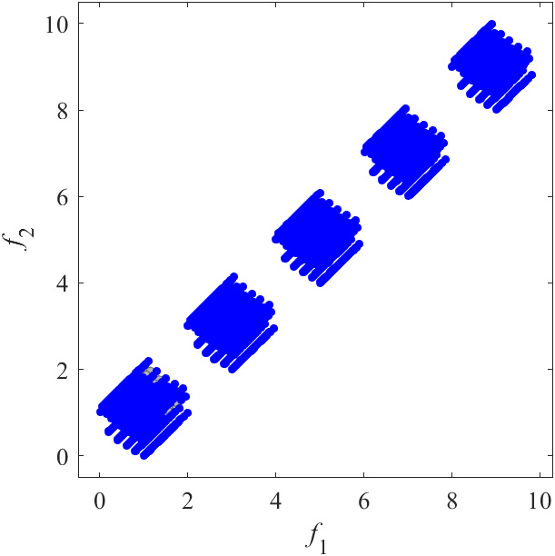|
|Pareto Front on the DASCMOP6 (_M_=2)|Random points on the DASCMOP6 (_M_=2)|Grid Points on the DASCMOP6 (_M_=2)|
|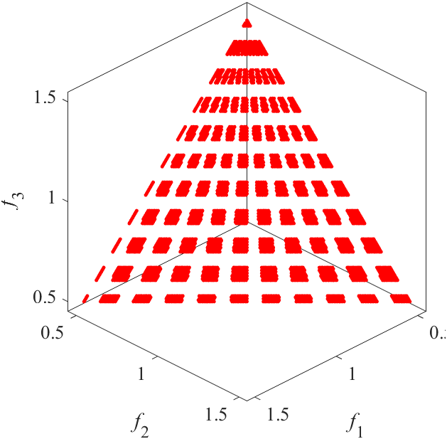|||
|Pareto Front on the DASCMOP7 (_M_=3)|Random points on the DASCMOP7 (_M_=3)|Grid Points on the DASCMOP7 (_M_=3)|
|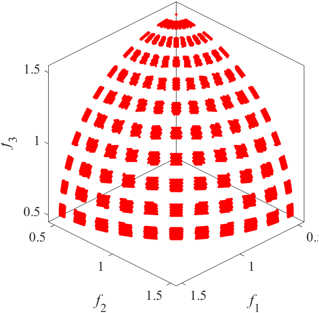|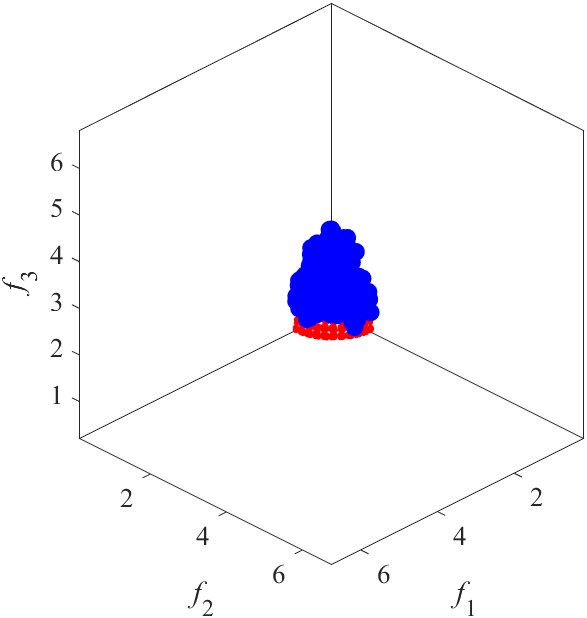||
|Pareto Front on the DASCMOP8 (_M_=3)|Random points on the DASCMOP8 (_M_=3)|Grid Points on the DASCMOP8 (_M_=3)|
||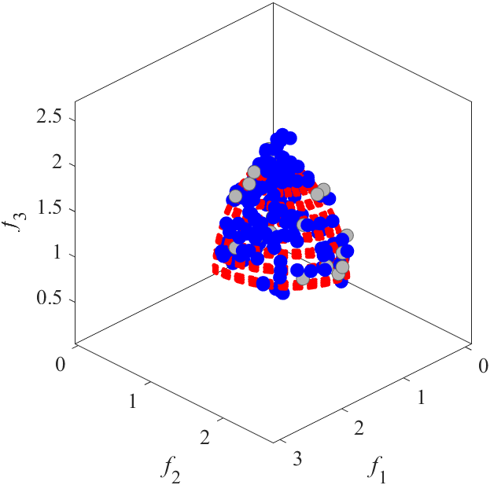|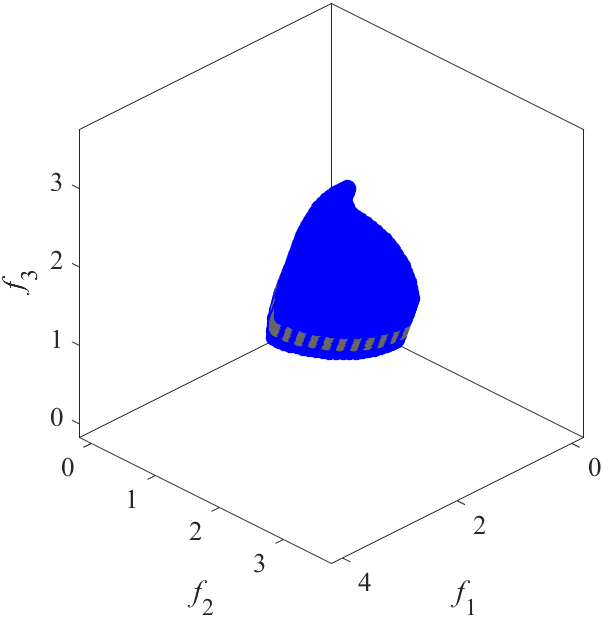|
|Pareto Front on the DASCMOP9 (_M_=3)|Random points on the DASCMOP9 (_M_=3)|Grid Points on the DASCMOP9 (_M_=3)|
