# DASCMOP
### Difficulty-adjustable and scalable constrained benchmark MOP  
Reference  
Z. Fan, W. Li, X. Cai, H. Li, C. Wei, Q. Zhang, K. Deb, and E. Goodman,
Difficulty adjustable and scalable constrained multi-objective test
problem toolkit, Evolutionary Computation, 2019.
 
|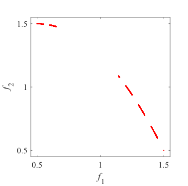Pareto Front on the DASCMOP1|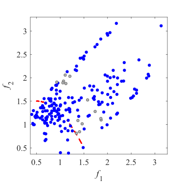Initial population on the DASCMOP1|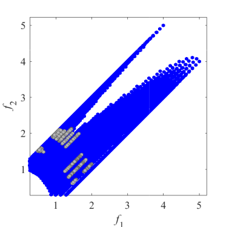Grid Points on the DASCMOP1|
|:-:|:-:|:-:|
|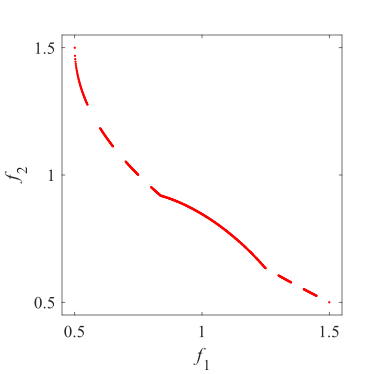Pareto Front on the DASCMOP2|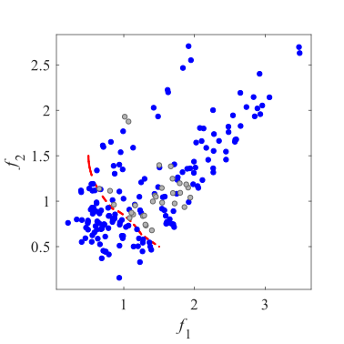Initial population on the DASCMOP2|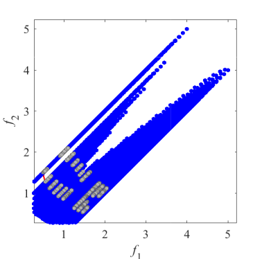Grid Points on the DASCMOP2|
|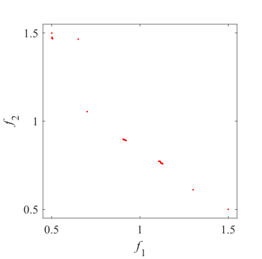Pareto Front on the DASCMOP3|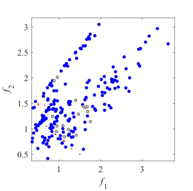Initial population on the DASCMOP3|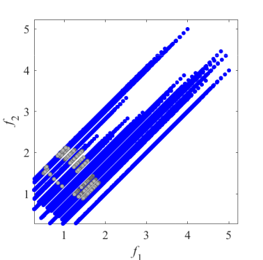Grid Points on the DASCMOP3|
|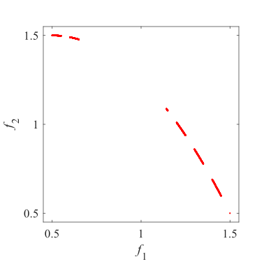Pareto Front on the DASCMOP4|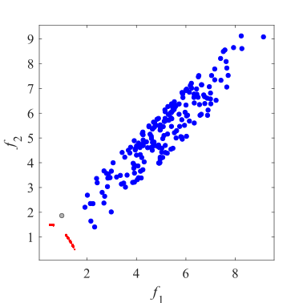Initial population on the DASCMOP4|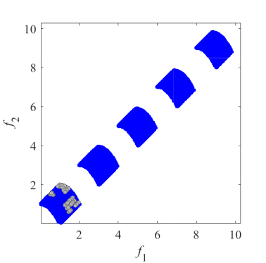Grid Points on the DASCMOP4|
|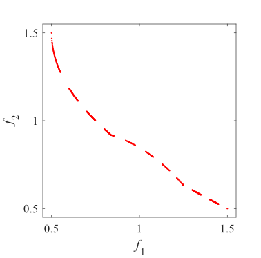Pareto Front on the DASCMOP5|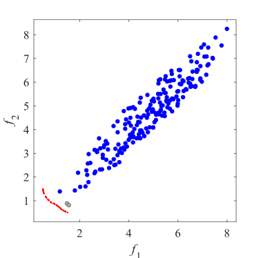Initial population on the DASCMOP5|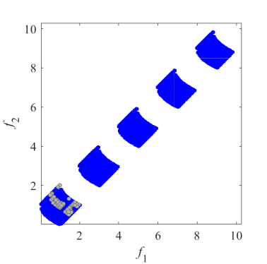Grid Points on the DASCMOP5|
|Pareto Front on the DASCMOP6|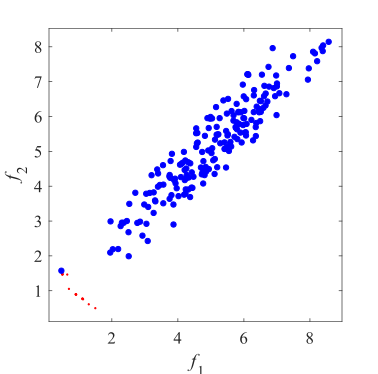Initial population on the DASCMOP6|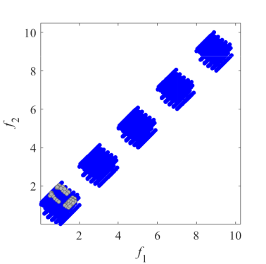Grid Points on the DASCMOP6|
|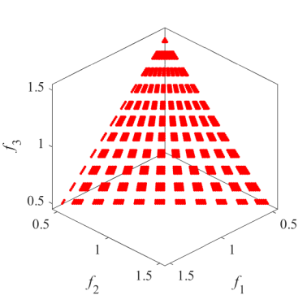Pareto Front on the DASCMOP7|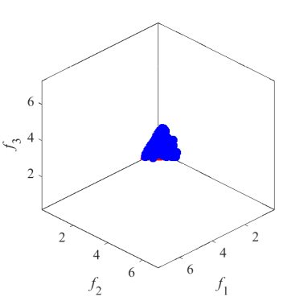Initial population on the DASCMOP7|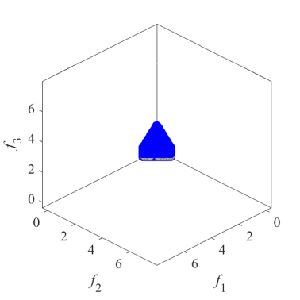Grid Points on the DASCMOP7|
|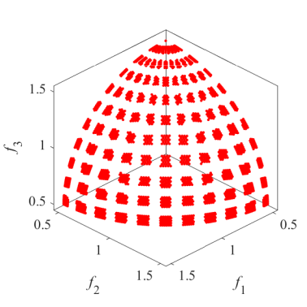Pareto Front on the DASCMOP8|Initial population on the DASCMOP8|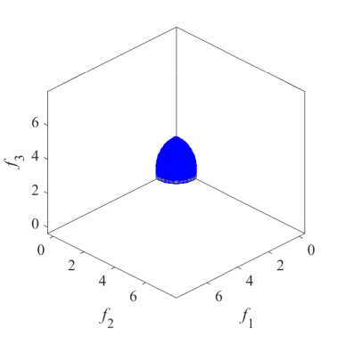Grid Points on the DASCMOP8|
|Pareto Front on the DASCMOP9|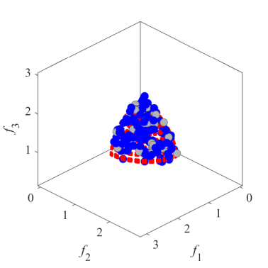Initial population on the DASCMOP9|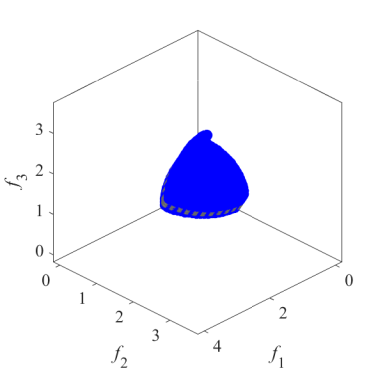Grid Points on the DASCMOP9|
