# DOC: Benchmark MOP with constraints in both decision and objective spaces  
Reference  
Z. Liu and Y. Wang, Handling constrained multiobjective optimization problems with constraints in both the decision and objective spaces, IEEE Transactions on Evolutionary Computation, 2019, 23(5): 870-884.

||||
|:-:|:-:|:-:|
|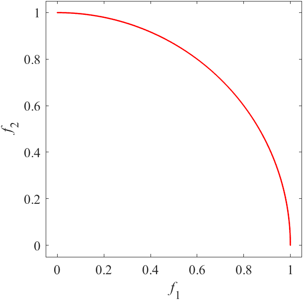|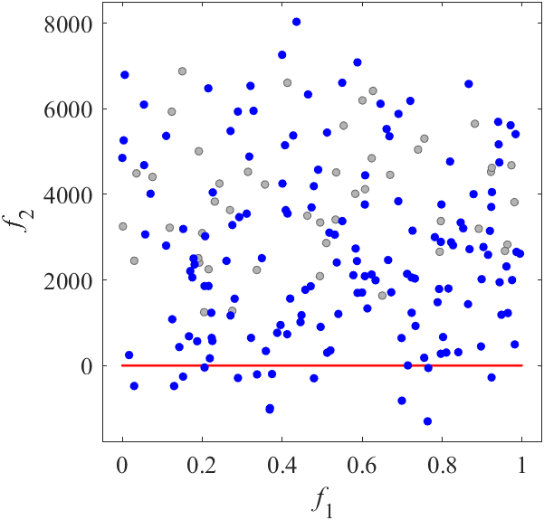|DOC1 have 6-dimensional variable space. I have no image.|
|Pareto Front on the DOC1 (_M_=2)|Random points on the DOC1 (_M_=2)|Grid Points on the DOC1 (_M_=2)|
|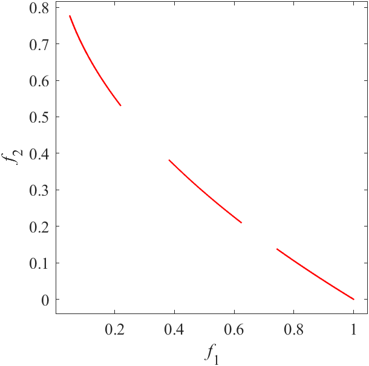|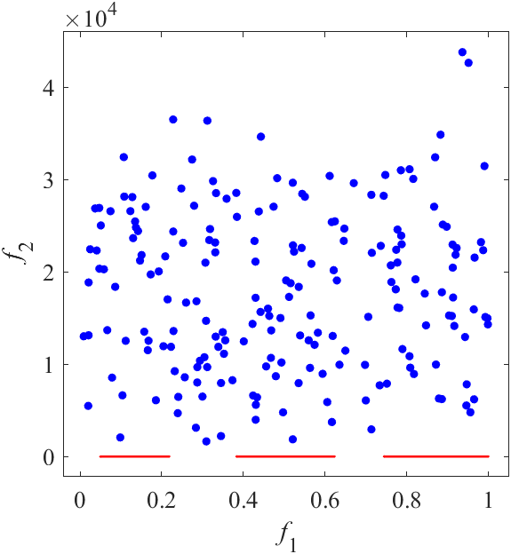|DOC2 have 16-dimensional variable space. I have no image.|
|Pareto Front on the DOC2 (_M_=2)|Random points on the DOC2 (_M_=2)|Grid Points on the DOC2 (_M_=2)|
|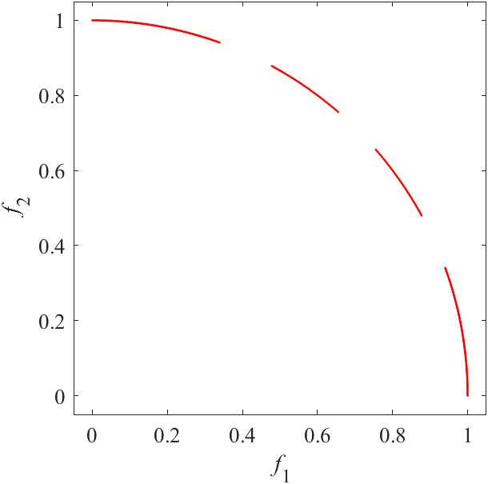|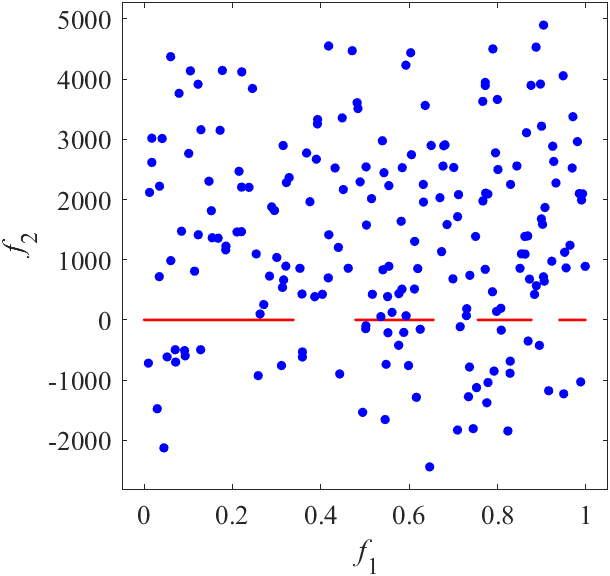|DOC3 have 10-dimensional variable space. I have no image.|
|Pareto Front on the DOC3 (_M_=2)|Random points on the DOC3 (_M_=2)|Grid Points on the DOC3 (_M_=2)|
|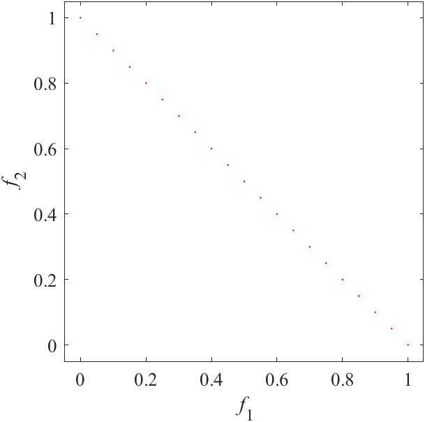|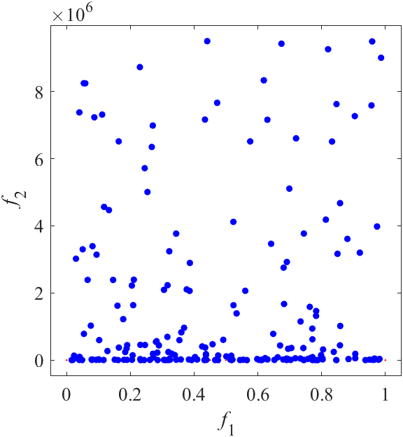|DOC4 have 8-dimensional variable space. I have no image.|
|Pareto Front on the DOC4 (_M_=2)|Random points on the DOC4 (_M_=2)|Grid Points on the DOC4 (_M_=2)|
|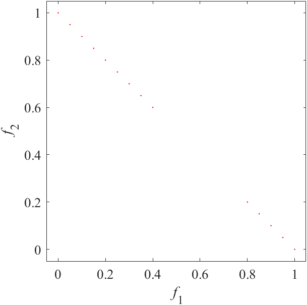|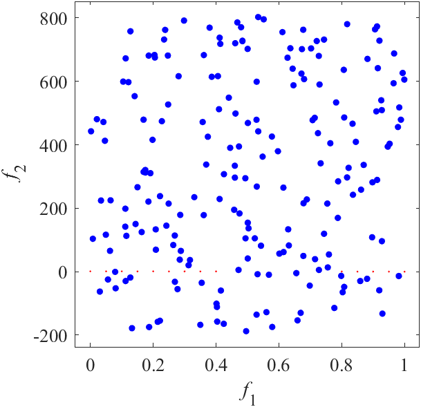|DOC5 have 8-dimensional variable space. I have no image.|
|Pareto Front on the DOC5 (_M_=2)|Random points on the DOC5 (_M_=2)|Grid Points on the DOC5 (_M_=2)|
|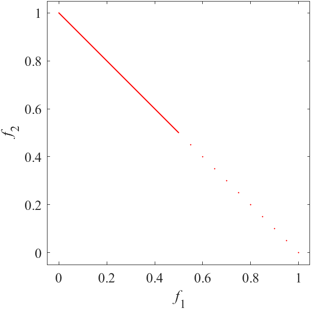|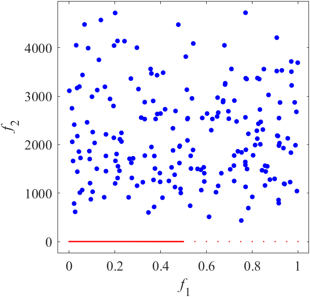|DOC6 have 11-dimensional variable space. I have no image.|
|Pareto Front on the DOC6 (_M_=2)|Random points on the DOC6 (_M_=2)|Grid Points on the DOC6 (_M_=2)|
|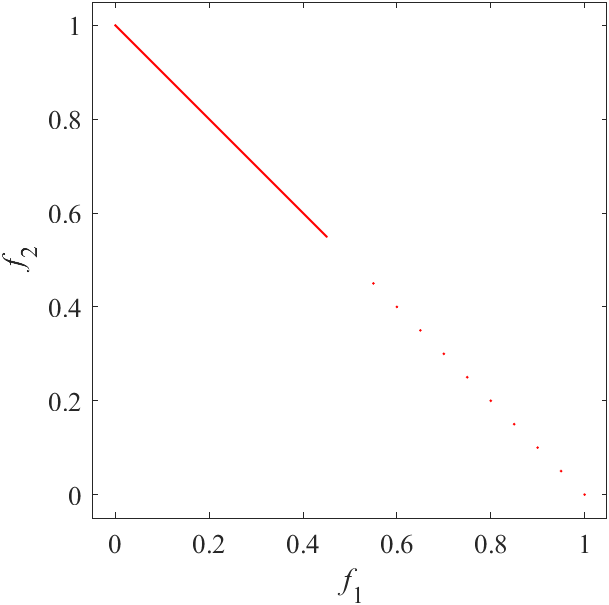|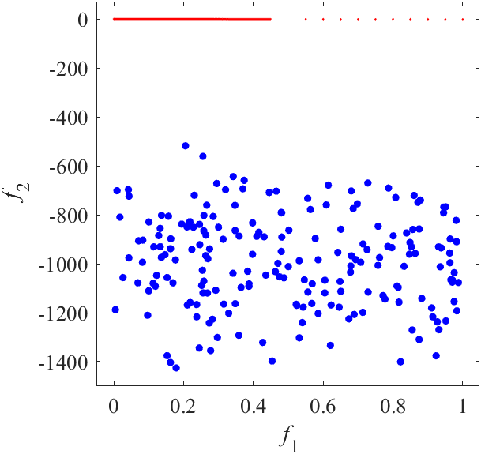|DOC7 have 11-dimensional variable space. I have no image.|
|Pareto Front on the DOC7 (_M_=2)|Random points on the DOC7 (_M_=2)|Grid Points on the DOC7 (_M_=2)|
|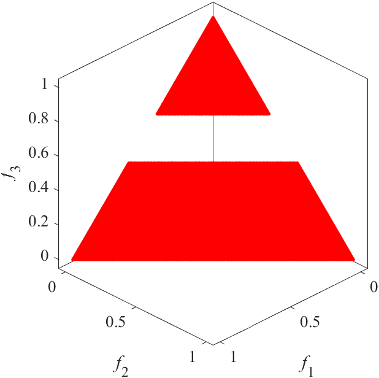|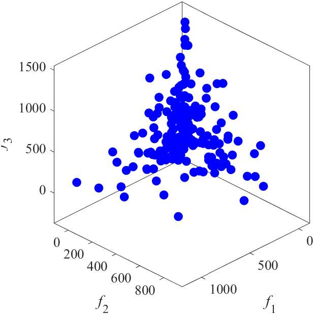|DOC8 have 10-dimensional variable space. I have no image.|
|Pareto Front on the DOC8 (_M_=3)|Random points on the DOC8 (_M_=3)|Grid Points on the DOC8 (_M_=3)|
|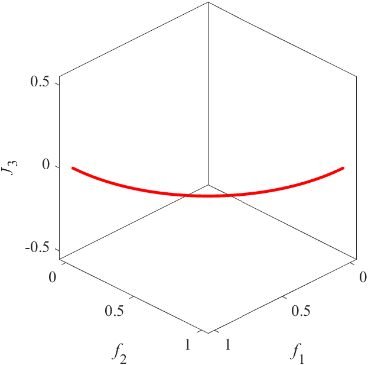|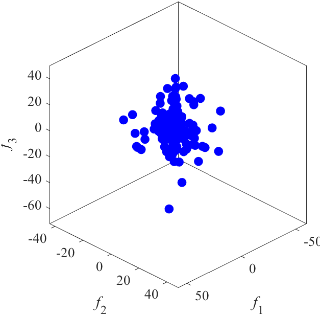|DOC9 have 11-dimensional variable space. I have no image.|
|Pareto Front on the DOC9 (_M_=3)|Random points on the DOC9 (_M_=3)|Grid Points on the DOC9 (_M_=3)|
