# DOC
### Benchmark MOP with constraints in both decision and objective spaces  
Reference  
Z. Liu and Y. Wang, Handling constrained multiobjective optimization 
problems with constraints in both the decision and objective spaces. 
IEEE Transactions on Evolutionary Computation, 2019.
 
|Pareto Front on the DOC1|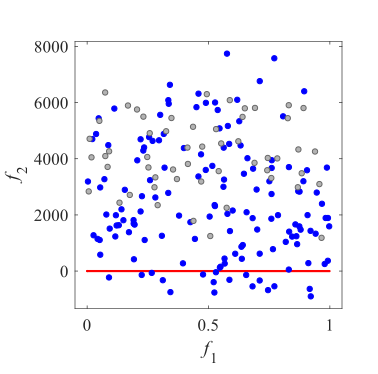Initial population on the DOC1|DOC1 have 6-dimensional variable space. I have no image.
|:-:|:-:|:-:|
|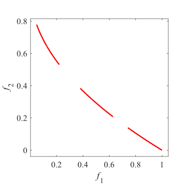Pareto Front on the DOC2|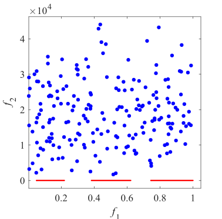Initial population on the DOC2|DOC2 have 16-dimensional variable space. I have no image.
|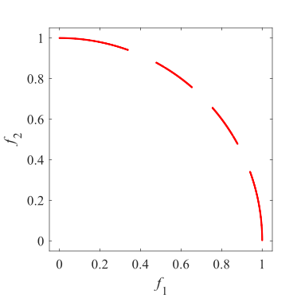Pareto Front on the DOC3|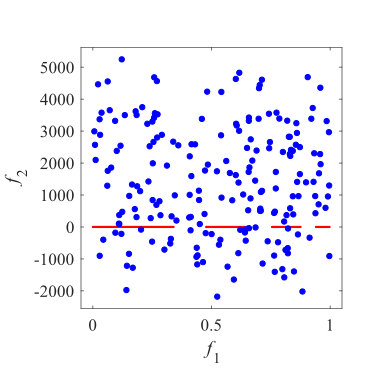Initial population on the DOC3|DOC3 have 10-dimensional variable space. I have no image.
|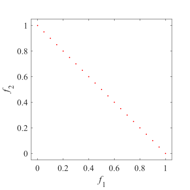Pareto Front on the DOC4|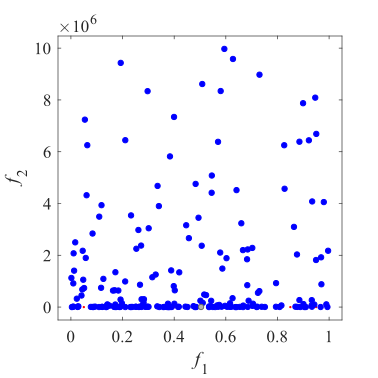Initial population on the DOC4|DOC4 have 8-dimensional variable space. I have no image.
|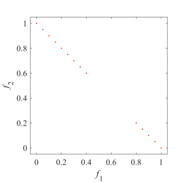Pareto Front on the DOC5|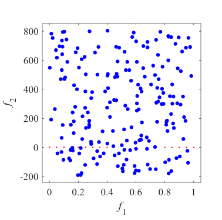Initial population on the DOC5|DOC5 have 8-dimensional variable space. I have no image.
|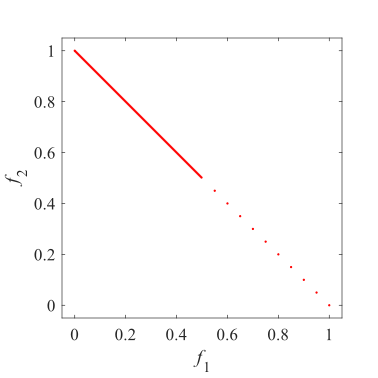Pareto Front on the DOC6|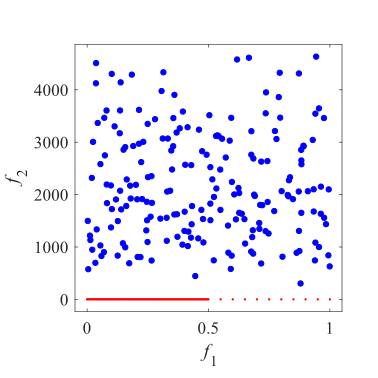Initial population on the DOC6|DOC6 have 11-dimensional variable space. I have no image.
|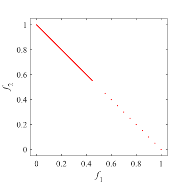Pareto Front on the DOC7|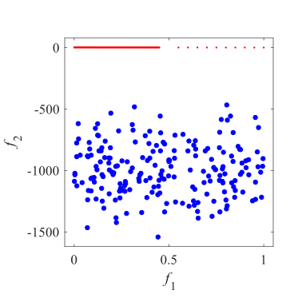Initial population on the DOC7|DOC7 have 11-dimensional variable space. I have no image.
|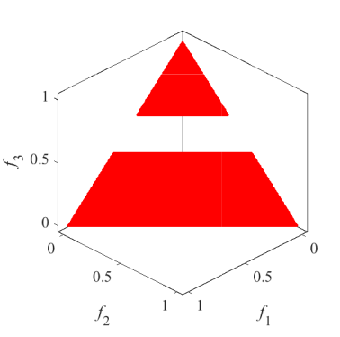Pareto Front on the DOC8|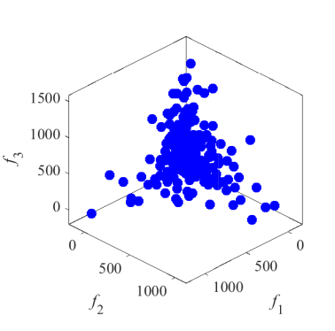Initial population on the DOC8|DOC8 have 10-dimensional variable space. I have no image.
|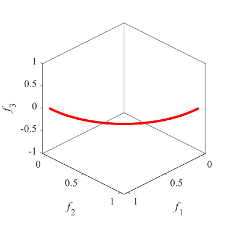Pareto Front on the DOC9|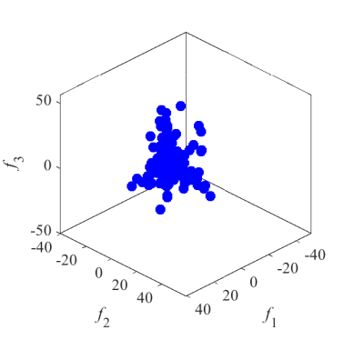Initial population on the DOC9|DOC9 have 11-dimensional variable space. I have no image.
