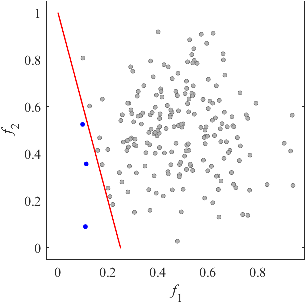
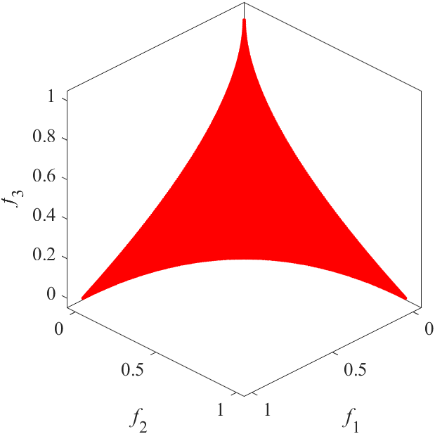
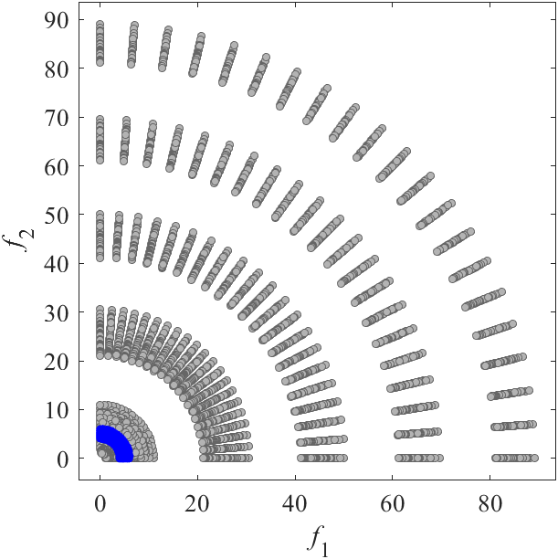
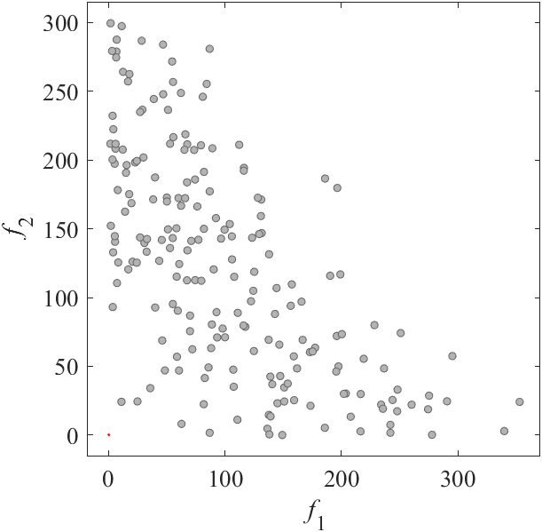
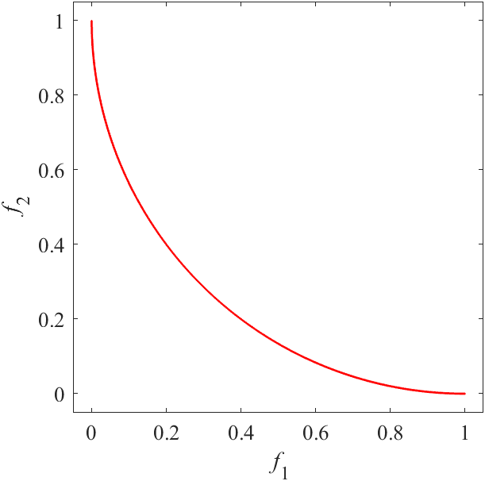
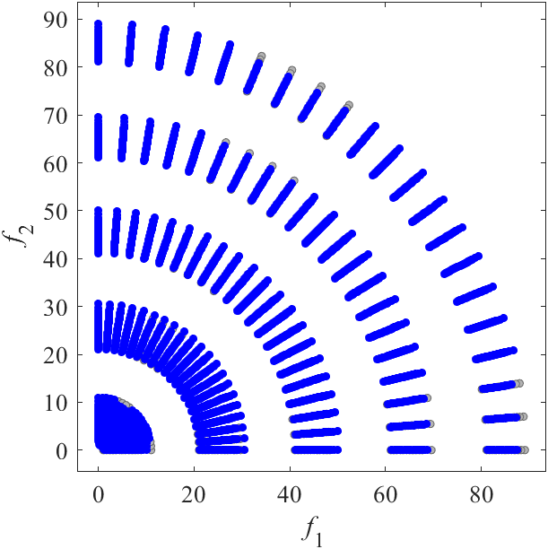

# DTLZ: Benchmark MOP proposed by Deb, Thiele, Laumanns, and Zitzler
Reference  
K. Deb, L. Thiele, M. Laumanns, and E. Zitzler, Scalable test problems for evolutionary multiobjective optimization, Evolutionary multiobjective Optimization. Theoretical Advances and Applications, 2005, 105-145.

||||
|:-:|:-:|:-:|
||||
|Pareto Front on the DTLZ1 (_M_=2)|Random points on the DTLZ1 (_M_=2)|Grid Points on the DTLZ1 (_M_=2)|
||||
|Pareto Front on the DTLZ1 (_M_=3)|Random points on the DTLZ1 (_M_=3)|Grid Points on the DTLZ1 (_M_=3)|
||||
|Pareto Front on the DTLZ2 (_M_=2)|Random points on the DTLZ2 (_M_=2)|Grid Points on the DTLZ2 (_M_=2)|
||||
|Pareto Front on the DTLZ2 (_M_=3)|Random points on the DTLZ2 (_M_=3)|Grid Points on the DTLZ2 (_M_=3)|
||||
|Pareto Front on the DTLZ3 (_M_=2)|Random points on the DTLZ3 (_M_=2)|Grid Points on the DTLZ3 (_M_=2)|
||||
|Pareto Front on the DTLZ3 (_M_=3)|Random points on the DTLZ3 (_M_=3)|Grid Points on the DTLZ3 (_M_=3)|
||||
|Pareto Front on the DTLZ4 (_M_=2)|Random points on the DTLZ4 (_M_=2)|Grid Points on the DTLZ4 (_M_=2)|
||||
|Pareto Front on the DTLZ4 (_M_=3)|Random points on the DTLZ4 (_M_=3)|Grid Points on the DTLZ4 (_M_=3)|
||||
|Pareto Front on the DTLZ5 (_M_=2)|Random points on the DTLZ5 (_M_=2)|Grid Points on the DTLZ5 (_M_=2)|
||||
|Pareto Front on the DTLZ5 (_M_=3)|Random points on the DTLZ5 (_M_=3)|Grid Points on the DTLZ5 (_M_=3)|
||||
|Pareto Front on the DTLZ6 (_M_=2)|Random points on the DTLZ6 (_M_=2)|Grid Points on the DTLZ6 (_M_=2)|
||||
|Pareto Front on the DTLZ6 (_M_=3)|Random points on the DTLZ6 (_M_=3)|Grid Points on the DTLZ6 (_M_=3)|
||||
|Pareto Front on the DTLZ7 (_M_=2)|Random points on the DTLZ7 (_M_=2)|Grid Points on the DTLZ7 (_M_=2)|
||||
|Pareto Front on the DTLZ7 (_M_=3)|Random points on the DTLZ7 (_M_=3)|Grid Points on the DTLZ7 (_M_=3)|
||||
|Pareto Front on the DTLZ8 (_M_=2)|Random points on the DTLZ8 (_M_=2)|Grid Points on the DTLZ8 (_M_=2)|
||||
|Pareto Front on the DTLZ8 (_M_=3)|Random points on the DTLZ8 (_M_=3)|Grid Points on the DTLZ8 (_M_=3)|
||||
|Pareto Front on the DTLZ9 (_M_=2)|Random points on the DTLZ9 (_M_=2)|Grid Points on the DTLZ9 (_M_=2)|
||||
|Pareto Front on the DTLZ9 (_M_=3)|Random points on the DTLZ9 (_M_=3)|Grid Points on the DTLZ9 (_M_=3)|

### Extended DTLZ5
Reference  
K. Deb and D. K. Saxena, On finding Pareto-optimal solutions through dimensionality reduction for certain large-dimensional multi-objective optimization problems, KanGAL Report 2005011, 2005.

||||
|:-:|:-:|:-:|
||||
|Pareto Front on the DTLZ5IM (_M_=2)|Random points on the DTLZ5IM (_M_=2)|Grid Points on the DTLZ5IM (_M_=2)|
||||
|Pareto Front on the DTLZ5IM (_M_=3)|Random points on the DTLZ5 (_M_=3)|Grid Points on the DTLZ5IM (_M_=3)|

### Scaled DTLZ and Convex DTLZ2
Reference  
K. Deb and H. Jain, An evolutionary many-objective optimization algorithm using reference-point based non-dominated sorting approach, part I: Solving problems with box constraints, IEEE Transactions on Evolutionary Computation, 2014, 18(4): 577-601.

||||
|:-:|:-:|:-:|
||||
|Pareto Front on the SDTLZ1 (_M_=2)|Random points on the SDTLZ1 (_M_=2)|Grid Points on the SDTLZ1 (_M_=2)|
||||
|Pareto Front on the SDTLZ1 (_M_=3)|Random points on the SDTLZ1 (_M_=3)|Grid Points on the SDTLZ1 (_M_=3)|
||||
|Pareto Front on the SDTLZ2 (_M_=2)|Random points on the SDTLZ2 (_M_=2)|Grid Points on the SDTLZ2 (_M_=2)|
||||
|Pareto Front on the SDTLZ2 (_M_=3)|Random points on the SDTLZ2 (_M_=3)|Grid Points on the SDTLZ2 (_M_=3)|
||||
|Pareto Front on the CDTLZ2 (_M_=2)|Random points on the CDTLZ2 (_M_=2)|Grid Points on the CDTLZ2 (_M_=2)|
||||
|Pareto Front on the CDTLZ2 (_M_=3)|Random points on the CDTLZ2 (_M_=3)|Grid Points on the CDTLZ2 (_M_=3)|

### Constrained DTLZ and Inverted DTLZ
Reference  
H. Jain and K. Deb, An evolutionary many-objective optimization algorithm using reference-point based non-dominated sorting approach, part II: Handling constraints and extending to an adaptive approach, IEEE Transactions on Evolutionary Computation, 2014, 18(4): 602-622.

||||
|:-:|:-:|:-:|
||||
|Pareto Front on the C1_DTLZ1 (_M_=2)|Random points on the C1_DTLZ1 (_M_=2)|Grid Points on the C1_DTLZ1 (_M_=2)|
||||
|Pareto Front on the C1_DTLZ1 (_M_=3)|Random points on the C1_DTLZ1 (_M_=3)|Grid Points on the C1_DTLZ1 (_M_=3)|
||||
|Pareto Front on the C1_DTLZ3 (_M_=2)|Random points on the C1_DTLZ3 (_M_=2)|Grid Points on the C1_DTLZ3 (_M_=2)|
||||
|Pareto Front on the C1_DTLZ3 (_M_=3)|Random points on the C1_DTLZ3 (_M_=3)|Grid Points on the C1_DTLZ3 (_M_=3)|
||||
|Pareto Front on the C2_DTLZ2 (_M_=2)|Random points on the C2_DTLZ2 (_M_=2)|Grid Points on the C2_DTLZ2 (_M_=2)|
||||
|Pareto Front on the C2_DTLZ2 (_M_=3)|Random points on the C2_DTLZ2 (_M_=3)|Grid Points on the C2_DTLZ2 (_M_=3)|
||||
|Pareto Front on the C3_DTLZ4 (_M_=2)|Random points on the C3_DTLZ4 (_M_=2)|Grid Points on the C3_DTLZ4 (_M_=2)|
||||
|Pareto Front on the C3_DTLZ4 (_M_=3)|Random points on the C3_DTLZ4 (_M_=3)|Grid Points on the C3_DTLZ4 (_M_=3)|
||||
|Pareto Front on the IDTLZ1 (_M_=2)|Random points on the IDTLZ1 (_M_=2)|Grid Points on the IDTLZ1 (_M_=2)|
||||
|Pareto Front on the IDTLZ1 (_M_=3)|Random points on the IDTLZ1 (_M_=3)|Grid Points on the IDTLZ1 (_M_=3)|
||||
|Pareto Front on the IDTLZ2 (_M_=2)|Random points on the IDTLZ2 (_M_=2)|Grid Points on the IDTLZ2 (_M_=2)|
||||
|Pareto Front on the IDTLZ2 (_M_=3)|Random points on the IDTLZ2 (_M_=3)|Grid Points on the IDTLZ2 (_M_=3)|

### DTLZ with constrains in decision space
Reference  
K. Li, R. Chen, G. Fu, and X. Yao, Two-archive evolutionary algorithm for constrained multi-objective optimization, IEEE Transactions on Evolutionary Computation, 2018, 23(2): 303-315.

||||
|:-:|:-:|:-:|
||||
|Pareto Front on the DC1_DTLZ1 (_M_=2)|Random points on the DC1_DTLZ1 (_M_=2)|Grid Points on the DC1_DTLZ1 (_M_=2)|
||||
|Pareto Front on the DC1_DTLZ1 (_M_=3)|Random points on the DC1_DTLZ1 (_M_=3)|Grid Points on the DC1_DTLZ1 (_M_=3)|
||||
|Pareto Front on the DC1_DTLZ3 (_M_=2)|Random points on the DC1_DTLZ3 (_M_=2)|Grid Points on the DC1_DTLZ3 (_M_=2)|
||||
|Pareto Front on the DC1_DTLZ3 (_M_=3)|Random points on the DC1_DTLZ3 (_M_=3)|Grid Points on the DC1_DTLZ3 (_M_=3)|
||||
|Pareto Front on the DC2_DTLZ1 (_M_=2)|Random points on the DC2_DTLZ1 (_M_=2)|Grid Points on the DC2_DTLZ1 (_M_=2)|
||||
|Pareto Front on the DC2_DTLZ1 (_M_=3)|Random points on the DC2_DTLZ1 (_M_=3)|Grid Points on the DC2_DTLZ1 (_M_=3)|
||||
|Pareto Front on the DC2_DTLZ3 (_M_=2)|Random points on the DC2_DTLZ3 (_M_=2)|Grid Points on the DC2_DTLZ3 (_M_=2)|
||||
|Pareto Front on the DC2_DTLZ3 (_M_=3)|Random points on the DC2_DTLZ3 (_M_=3)|Grid Points on the DC2_DTLZ3 (_M_=3)|
||||
|Pareto Front on the DC3_DTLZ1 (_M_=2)|Random points on the DC3_DTLZ1 (_M_=2)|Grid Points on the DC3_DTLZ1 (_M_=2)|
||||
|Pareto Front on the DC3_DTLZ1 (_M_=3)|Random points on the DC3_DTLZ1 (_M_=3)|Grid Points on the DC3_DTLZ1 (_M_=3)|
||||
|Pareto Front on the DC3_DTLZ3 (_M_=2)|Random points on the DC3_DTLZ3 (_M_=2)|Grid Points on the DC3_DTLZ3 (_M_=2)|
||||
|Pareto Front on the DC3_DTLZ3 (_M_=3)|Random points on the DC3_DTLZ3 (_M_=3)|Grid Points on the DC3_DTLZ3 (_M_=3)|
