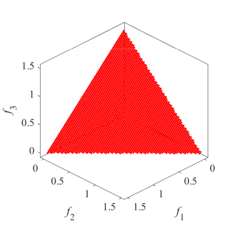
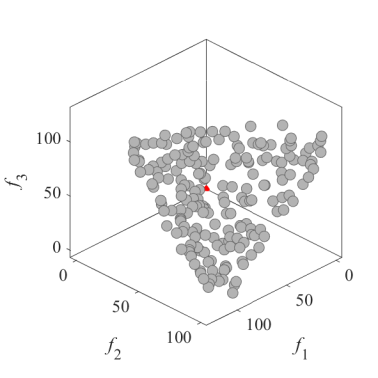
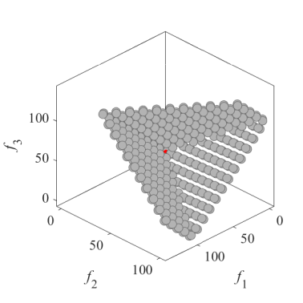
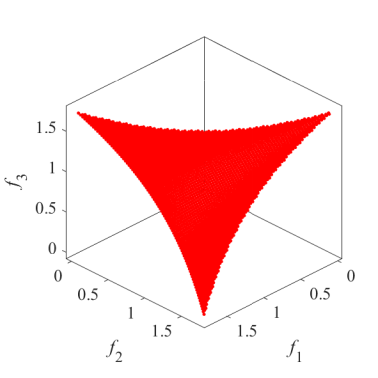
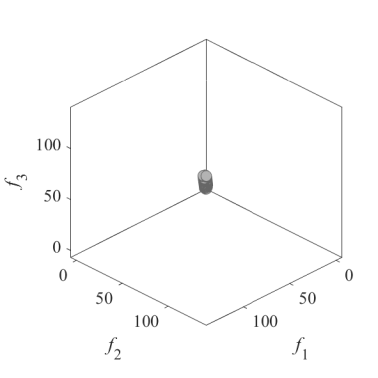
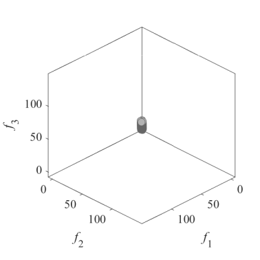

# Distance minimization problems  
### Distance minimization problems    
The multi-line distance minimization problem  
Reference  
M. Li, C. Grosan, S. Yang, X. Liu, and X. Yao, Multiline distance
minimization: A visualized many-objective test problem suite, IEEE
Transactions on Evolutionary Computation, 2018, 22(1): 61-78.

|Pareto Front on the MLDMP|Initial population on the MLDMP|Grid Points on the MLDMP|
|:-:|:-:|:-:|

The multi-point distance minimization problem  
Reference  
M. Koppen and K. Yoshida, Substitute distance assignments in NSGA-II for
handling many-objective optimization problems, Proceedings of the
International Conference on Evolutionary Multi-Criterion Optimization,
2007, 727-741.

|Pareto Front on the MPDMP|Initial population on the MPDMP|Grid Points on the MPDMP|
|:-:|:-:|:-:|