# IMOP: Benchmark MOP with irregular Pareto front
Reference  
Y. Tian, R. Cheng, X. Zhang, M. Li, and Y. Jin, Diversity assessment of multi-objective evolutionary algorithms: Performance metric and benchmark problems, IEEE Computational Intelligence Magazine, 2019, 14(3): 61-74.

||||
|:-:|:-:|:-:|
|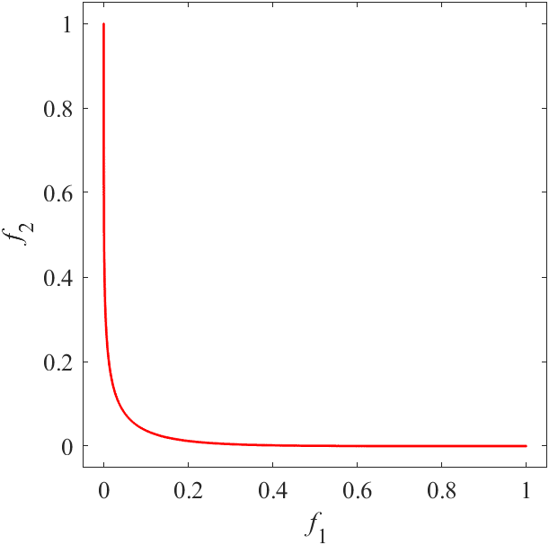|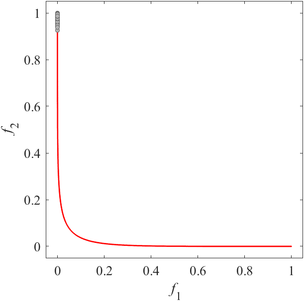|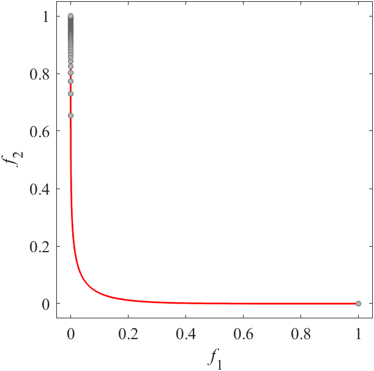|
|Pareto Front on the IMOP1 (_M_=2)|Random points on the IMOP1 (_M_=2)|Grid Points on the IMOP1 (_M_=2)|
|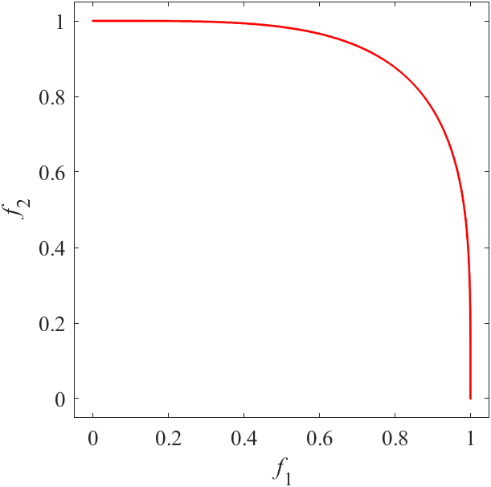|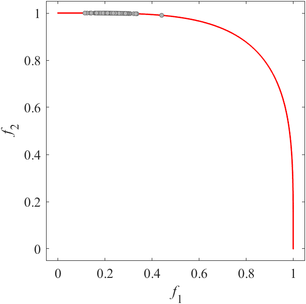|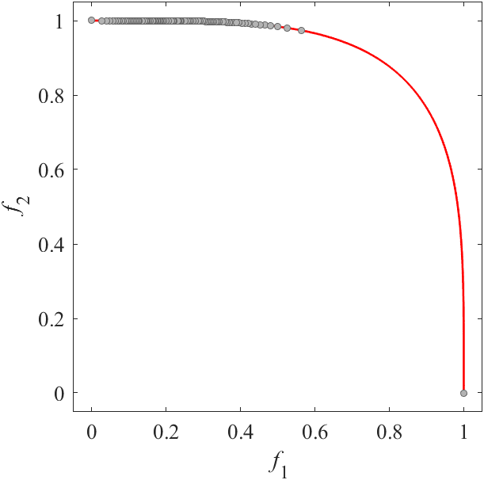|
|Pareto Front on the IMOP2 (_M_=2)|Random points on the IMOP2 (_M_=2)|Grid Points on the IMOP2 (_M_=2)|
|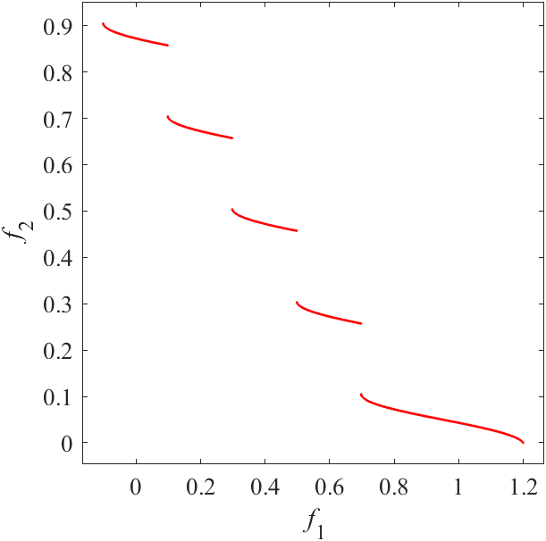|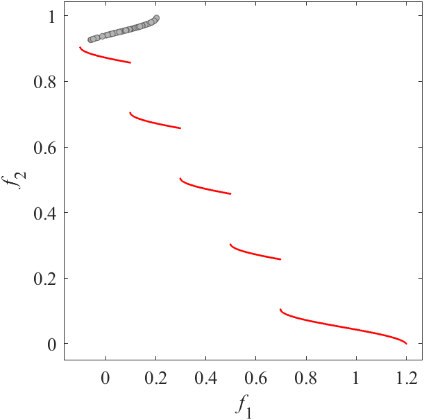|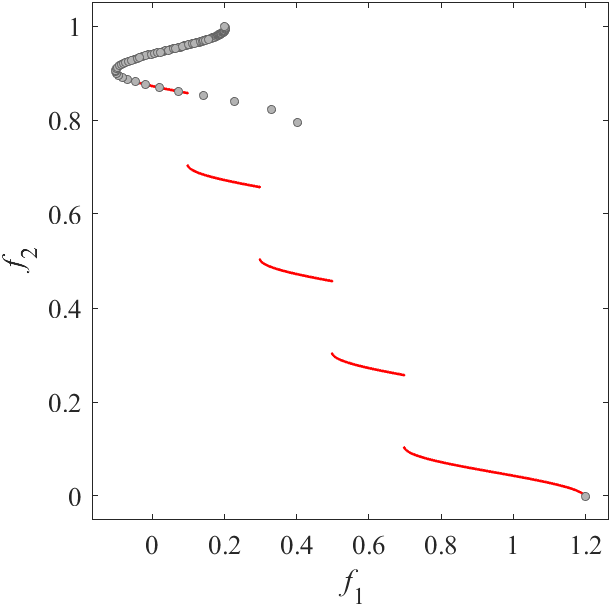|
|Pareto Front on the IMOP3 (_M_=2)|Random points on the IMOP3 (_M_=2)|Grid Points on the IMOP3 (_M_=2)|
|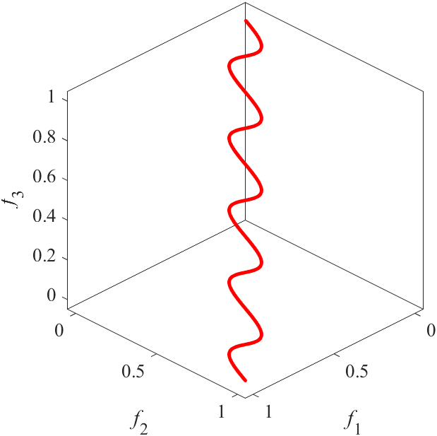|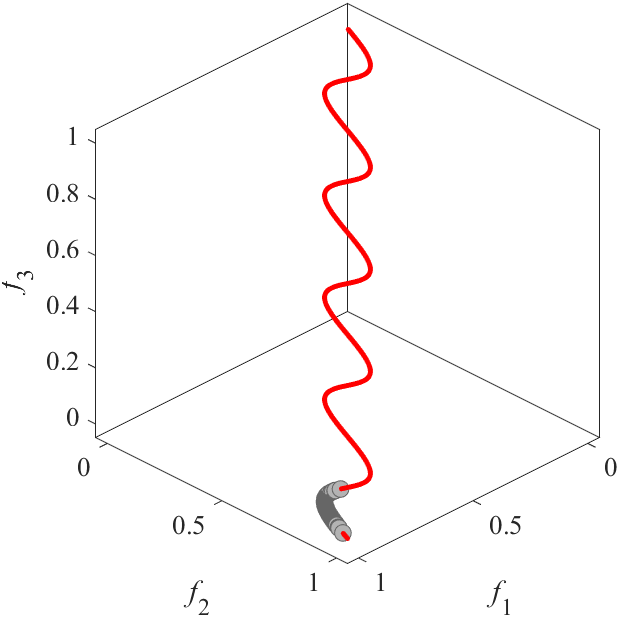|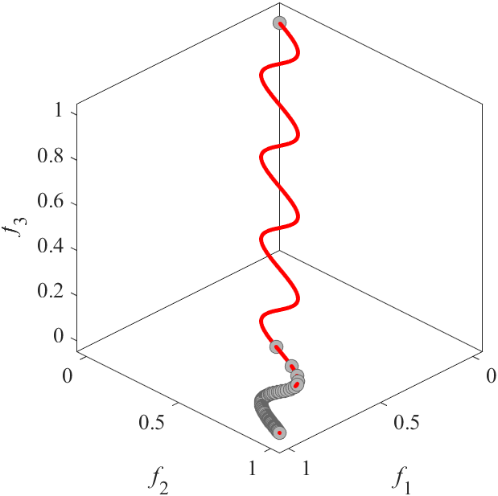|
|Pareto Front on the IMOP4 (_M_=3)|Random points on the IMOP4 (_M_=3)|Grid Points on the IMOP4 (_M_=3)|
|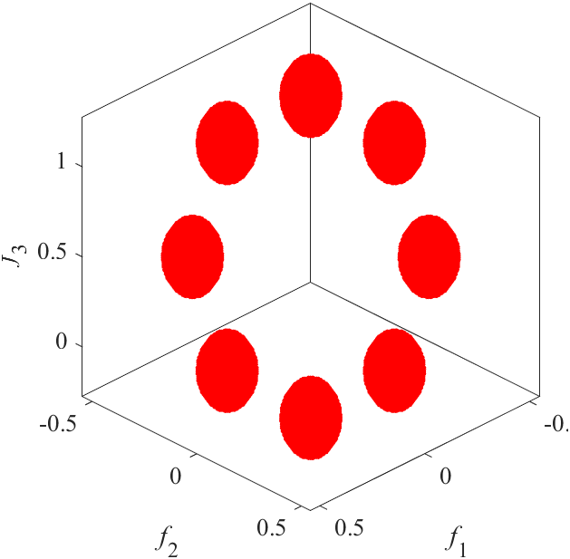|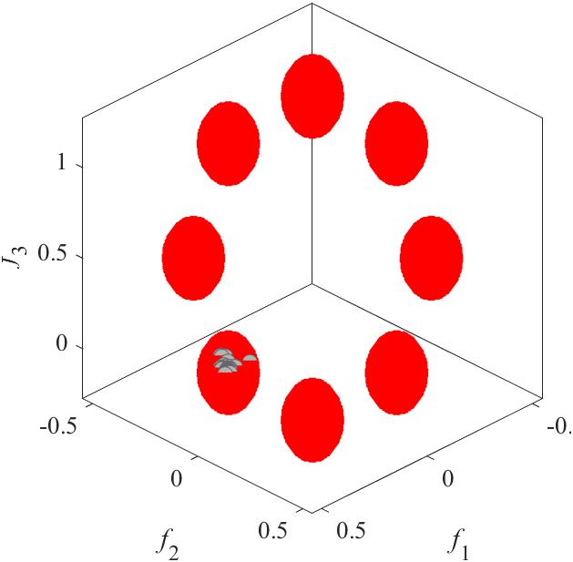|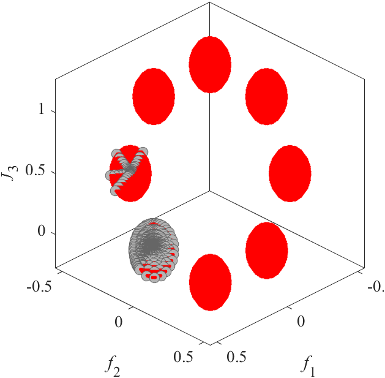|
|Pareto Front on the IMOP5 (_M_=3)|Random points on the IMOP5 (_M_=3)|Grid Points on the IMOP5 (_M_=3)|
|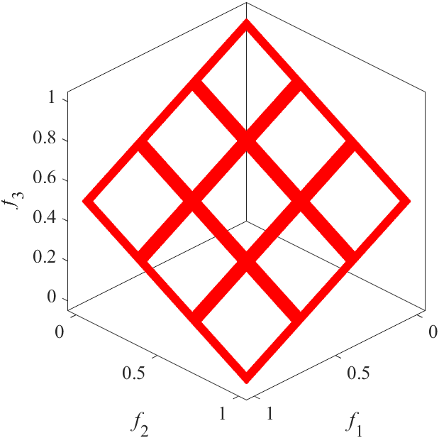|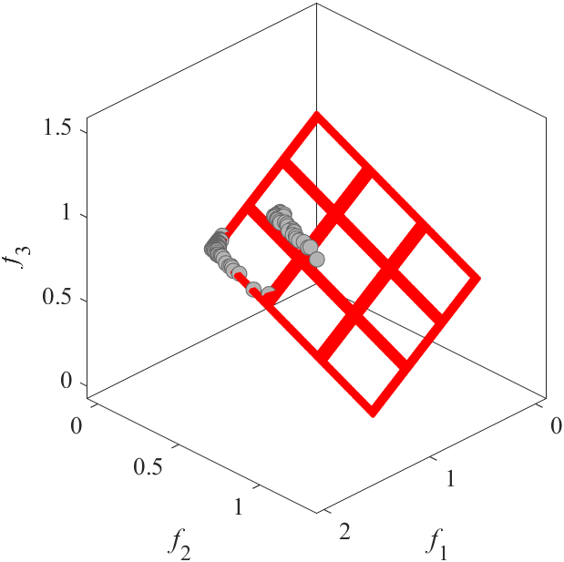|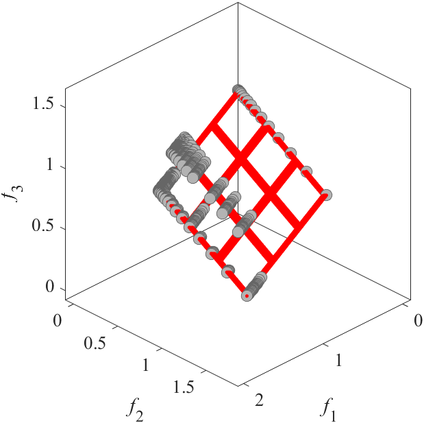|
|Pareto Front on the IMOP6 (_M_=3)|Random points on the IMOP6 (_M_=3)|Grid Points on the IMOP6 (_M_=3)|
|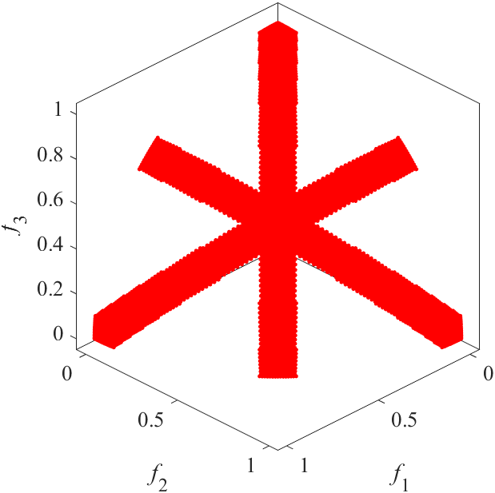|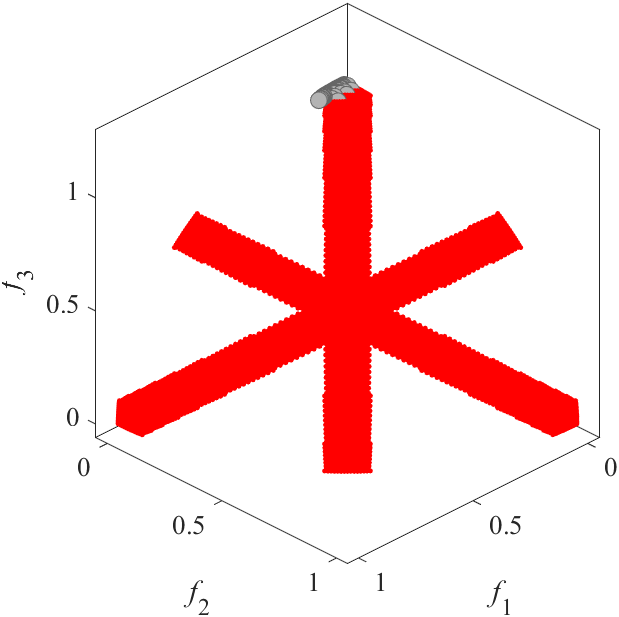|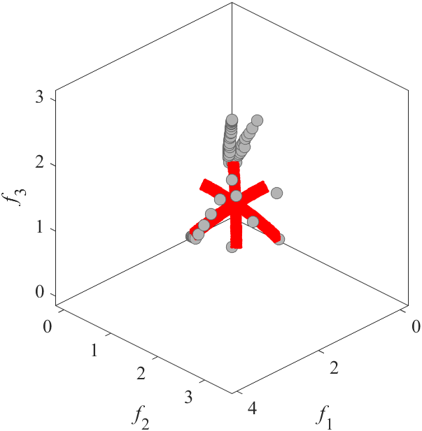|
|Pareto Front on the IMOP7 (_M_=3)|Random points on the IMOP7 (_M_=3)|Grid Points on the IMOP7 (_M_=3)|
|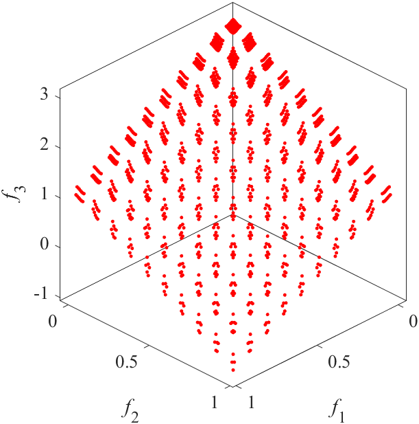|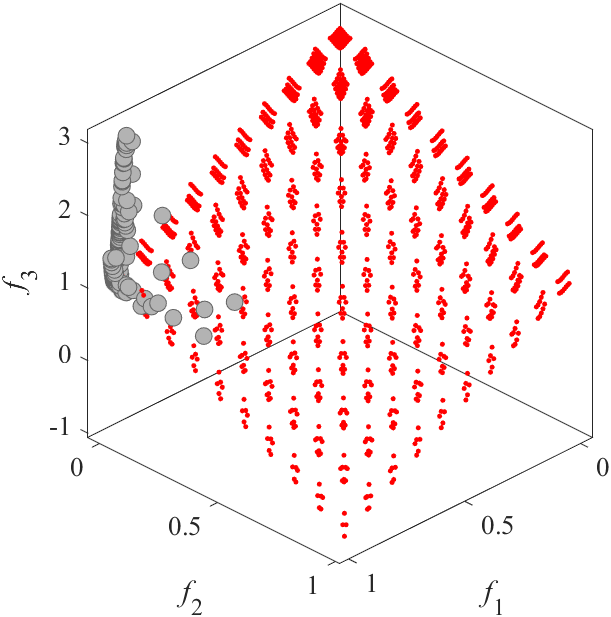|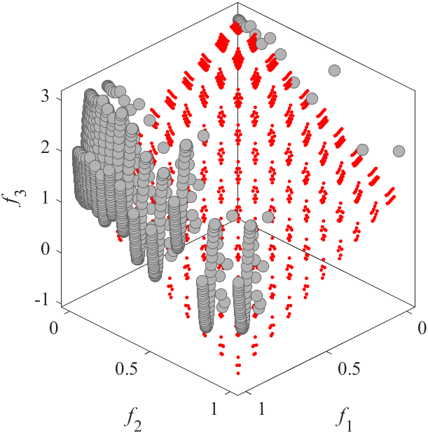|
|Pareto Front on the IMOP8 (_M_=3)|Random points on the IMOP8 (_M_=3)|Grid Points on the IMOP8 (_M_=3)|
