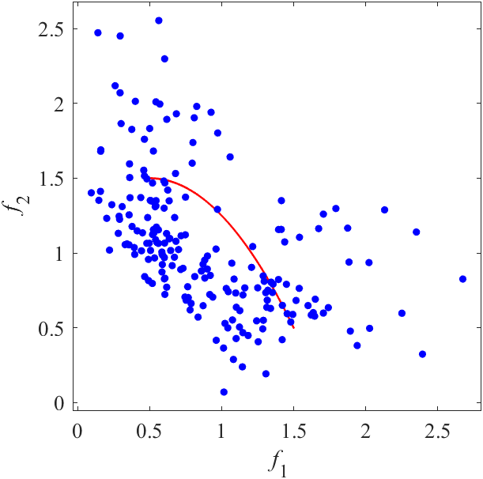
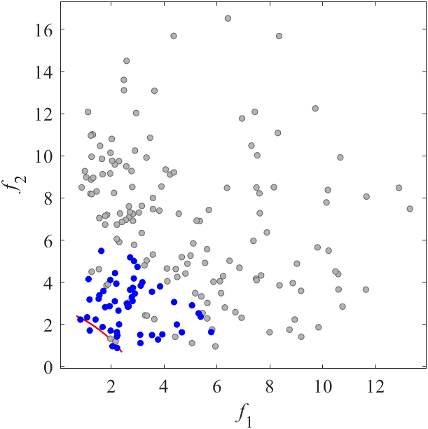
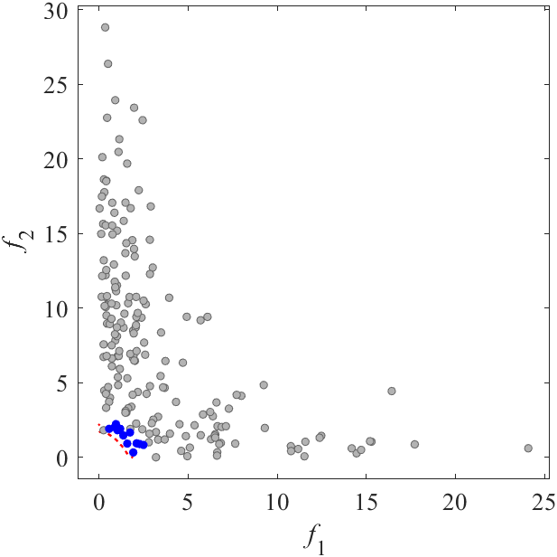

# LIR-CMOP: Constrained benchmark MOP with large infeasible regions
Reference  
Z. Fan, W. Li, X. Cai, H. Huang, Y. Fang, Y. You, J. Mo, C. Wei, and E. Goodman, An improved epsilon constraint-handling method in MOEA/D for CMOPs with large infeasible regions, Soft Computing, 2019, 23(23): 12491-12510.

||||
|:-:|:-:|:-:|
||||
|Pareto Front on the LIRCMOP1 (_M_=2)|Random points on the LIRCMOP1 (_M_=2)|Grid Points on the LIRCMOP1 (_M_=2)|
||||
|Pareto Front on the LIRCMOP2 (_M_=2)|Random points on the LIRCMOP2 (_M_=2)|Grid Points on the LIRCMOP2 (_M_=2)|
||||
|Pareto Front on the LIRCMOP3 (_M_=2)|Random points on the LIRCMOP3 (_M_=2)|Grid Points on the LIRCMOP3 (_M_=2)|
||||
|Pareto Front on the LIRCMOP4 (_M_=2)|Random points on the LIRCMOP4 (_M_=2)|Grid Points on the LIRCMOP4 (_M_=2)|
||||
|Pareto Front on the LIRCMOP5 (_M_=2)|Random points on the LIRCMOP5 (_M_=2)|Grid Points on the LIRCMOP5 (_M_=2)|
||||
|Pareto Front on the LIRCMOP6 (_M_=2)|Random points on the LIRCMOP6 (_M_=2)|Grid Points on the LIRCMOP6 (_M_=2)|
||||
|Pareto Front on the LIRCMOP7 (_M_=2)|Random points on the LIRCMOP7 (_M_=2)|Grid Points on the LIRCMOP7 (_M_=2)|
||||
|Pareto Front on the LIRCMOP8 (_M_=2)|Random points on the LIRCMOP8 (_M_=2)|Grid Points on the LIRCMOP8 (_M_=2)|
||||
|Pareto Front on the LIRCMOP9 (_M_=2)|Random points on the LIRCMOP9 (_M_=2)|Grid Points on the LIRCMOP9 (_M_=2)|
||||
|Pareto Front on the LIRCMOP10 (_M_=2)|Random points on the LIRCMOP10 (_M_=2)|Grid Points on the LIRCMOP10 (_M_=2)|
||||
|Pareto Front on the LIRCMOP11 (_M_=2)|Random points on the LIRCMOP11 (_M_=2)|Grid Points on the LIRCMOP11 (_M_=2)|
||||
|Pareto Front on the LIRCMOP12 (_M_=2)|Random points on the LIRCMOP12 (_M_=2)|Grid Points on the LIRCMOP12 (_M_=2)|
||||
|Pareto Front on the LIRCMOP13 (_M_=3)|Random points on the LIRCMOP13 (_M_=3)|Grid Points on the LIRCMOP13 (_M_=3)|
||||
|Pareto Front on the LIRCMOP14 (_M_=3)|Random points on the LIRCMOP14 (_M_=3)|Grid Points on the LIRCMOP14 (_M_=3)|
