# LIRCMOP
### Constrained benchmark MOP with large infeasible regions  
Reference  
Z. Fan, W. Li, X. Cai, H. Huang, Y. Fang, Y. You, J. Mo, C. Wei, and E.
Goodman, An improved epsilon constraint-handling method in MOEA/D for
CMOPs with large infeasible regions, Soft Computing, 2019.
 
|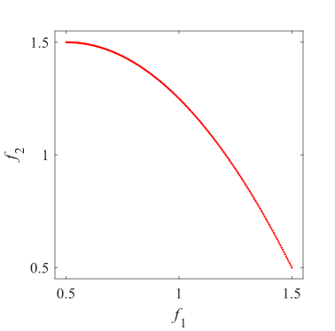Pareto Front on the LIRCMOP1|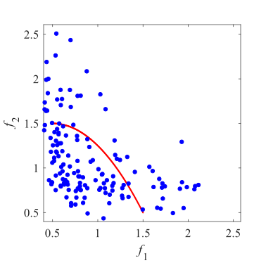Initial population on the LIRCMOP1|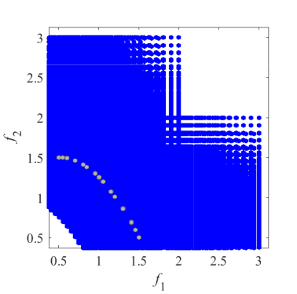Grid Points on the LIRCMOP1|
|:-:|:-:|:-:|
|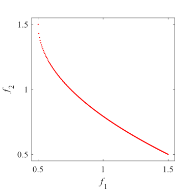Pareto Front on the LIRCMOP2|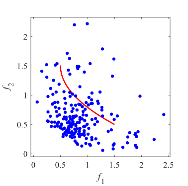Initial population on the LIRCMOP2|Grid Points on the LIRCMOP2|
|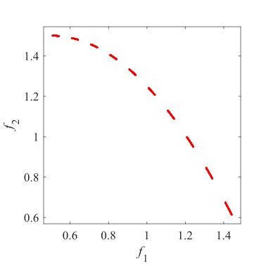Pareto Front on the LIRCMOP3|Initial population on the LIRCMOP3|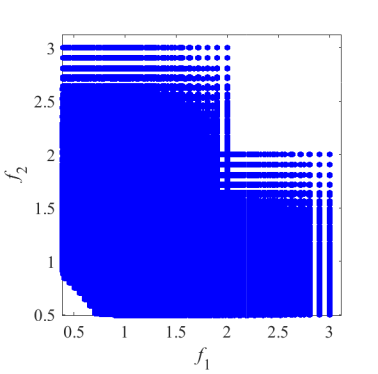Grid Points on the LIRCMOP3|
|Pareto Front on the LIRCMOP4|Initial population on the LIRCMOP4|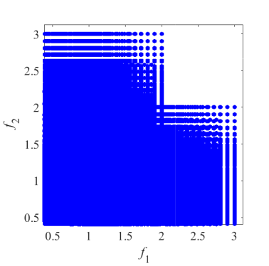Grid Points on the LIRCMOP4|
|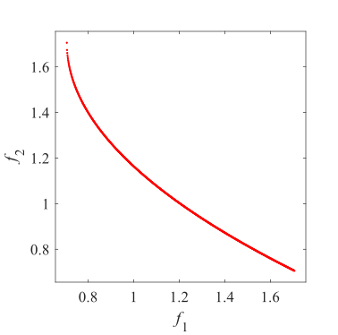Pareto Front on the LIRCMOP5|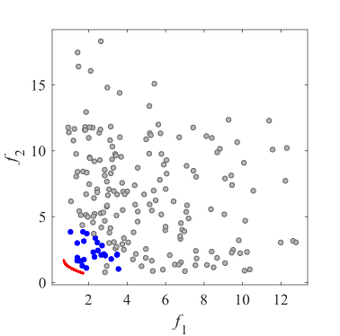Initial population on the LIRCMOP5|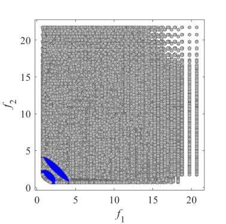Grid Points on the LIRCMOP5|
|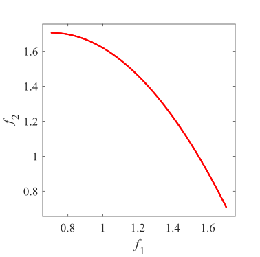Pareto Front on the LIRCMOP6|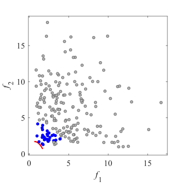Initial population on the LIRCMOP6|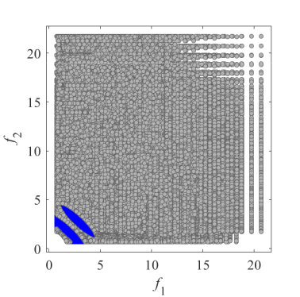Grid Points on the LIRCMOP6|
|Pareto Front on the LIRCMOP7|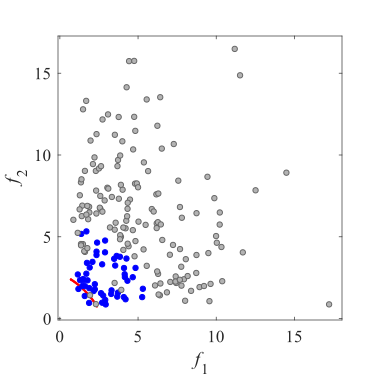Initial population on the LIRCMOP7|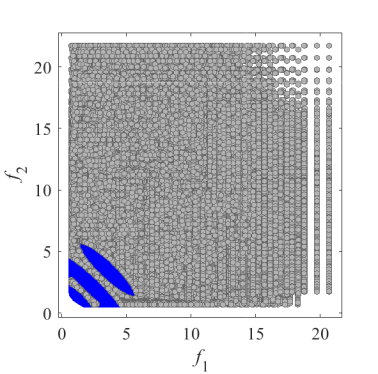Grid Points on the LIRCMOP7|
|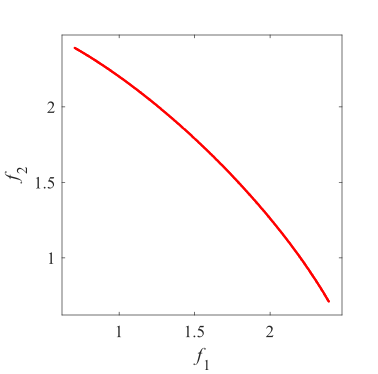Pareto Front on the LIRCMOP8|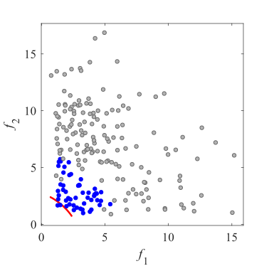Initial population on the LIRCMOP8|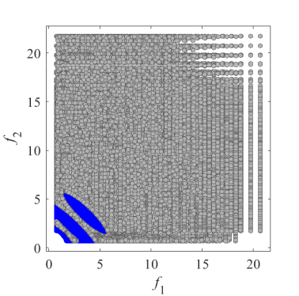Grid Points on the LIRCMOP8|
|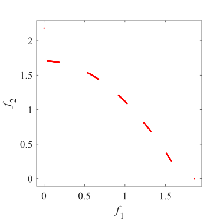Pareto Front on the LIRCMOP9|Initial population on the LIRCMOP9|Grid Points on the LIRCMOP9|
|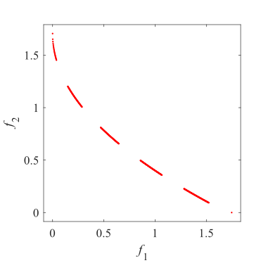Pareto Front on the LIRCMOP10|Initial population on the LIRCMOP10|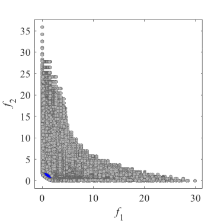Grid Points on the LIRCMOP10|
|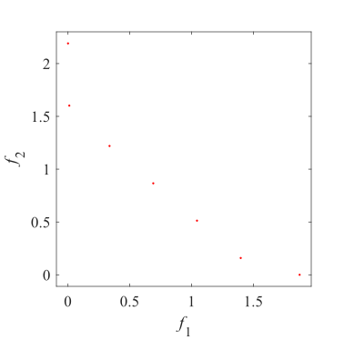Pareto Front on the LIRCMOP11|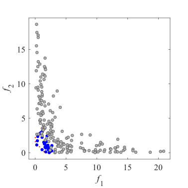Initial population on the LIRCMOP11|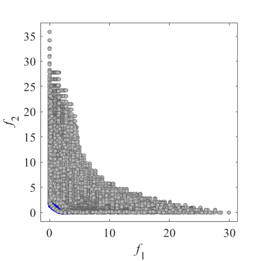Grid Points on the LIRCMOP11|
|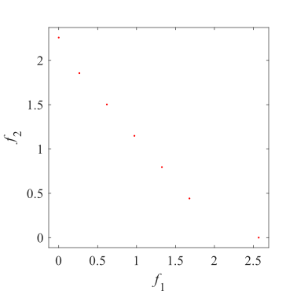Pareto Front on the LIRCMOP12|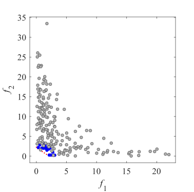Initial population on the LIRCMOP12|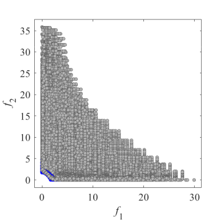Grid Points on the LIRCMOP12|
|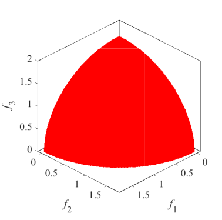Pareto Front on the LIRCMOP13|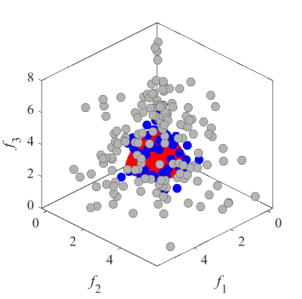Initial population on the LIRCMOP13|Grid Points on the LIRCMOP13|
|Pareto Front on the LIRCMOP14|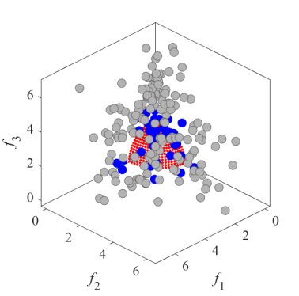Initial population on the LIRCMOP14|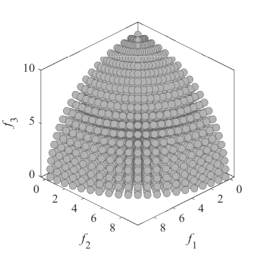Grid Points on the LIRCMOP14|
