# LSMOP: Large-scale benchmark MOP
Reference  
R. Cheng, Y. Jin, and M. Olhofer, Test problems for large-scale multiobjective and many-objective optimization, IEEE Transactions on Cybernetics, 2017, 47(12): 4108-4121.

||||
|:-:|:-:|:-:|
|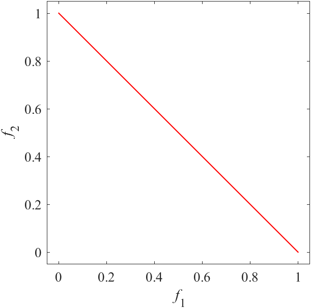|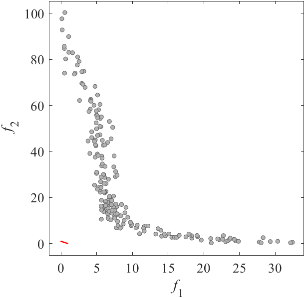|LSMOP1 have too many decision variables. I have no image.|
|Pareto Front on the LSMOP1 (_M_=2)|Random points on the LSMOP1 (_M_=2)|Grid Points on the LSMOP1 (_M_=2)|
|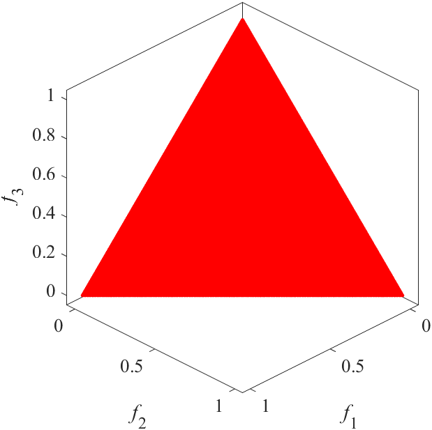|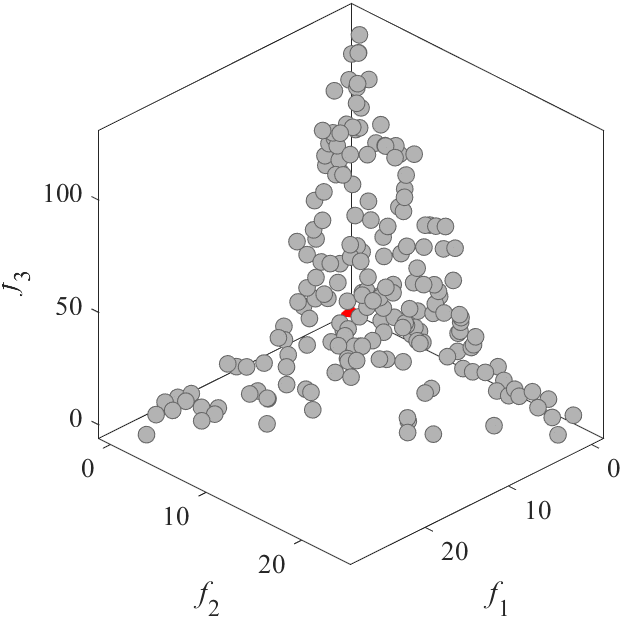|LSMOP1 have too many decision variables. I have no image.|
|Pareto Front on the LSMOP1 (_M_=3)|Random points on the LSMOP1 (_M_=3)|Grid Points on the LSMOP1 (_M_=3)|
||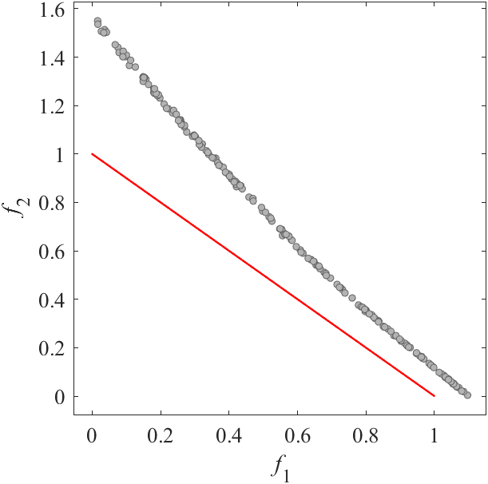|LSMOP2 have too many decision variables. I have no image.|
|Pareto Front on the LSMOP2 (_M_=2)|Random points on the LSMOP2 (_M_=2)|Grid Points on the LSMOP2 (_M_=2)|
||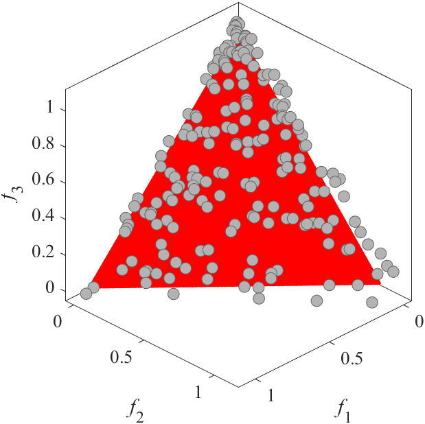|LSMOP2 have too many decision variables. I have no image.|
|Pareto Front on the LSMOP2 (_M_=3)|Random points on the LSMOP2 (_M_=3)|Grid Points on the LSMOP2 (_M_=3)|
||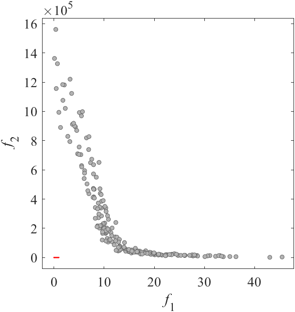|LSMOP3 have too many decision variables. I have no image.|
|Pareto Front on the LSMOP3 (_M_=2)|Random points on the LSMOP3 (_M_=2)|Grid Points on the LSMOP3 (_M_=2)|
||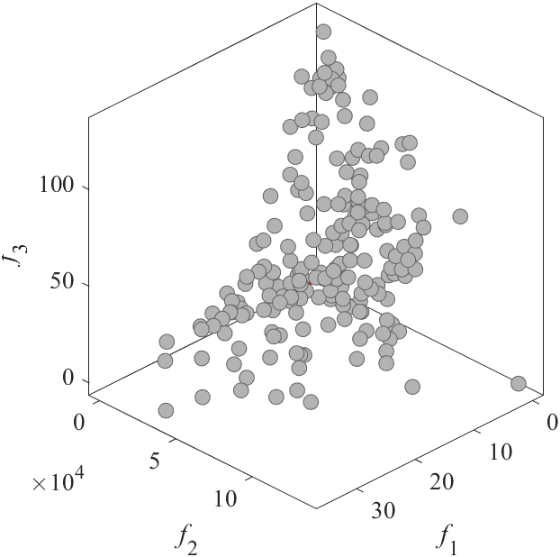|LSMOP3 have too many decision variables. I have no image.|
|Pareto Front on the LSMOP3 (_M_=3)|Random points on the LSMOP3 (_M_=3)|Grid Points on the LSMOP3 (_M_=3)|
||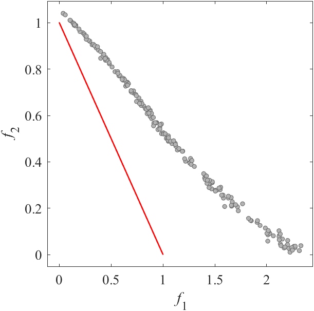|LSMOP4 have too many decision variables. I have no image.|
|Pareto Front on the LSMOP4 (_M_=2)|Random points on the LSMOP4 (_M_=2)|Grid Points on the LSMOP4 (_M_=2)|
||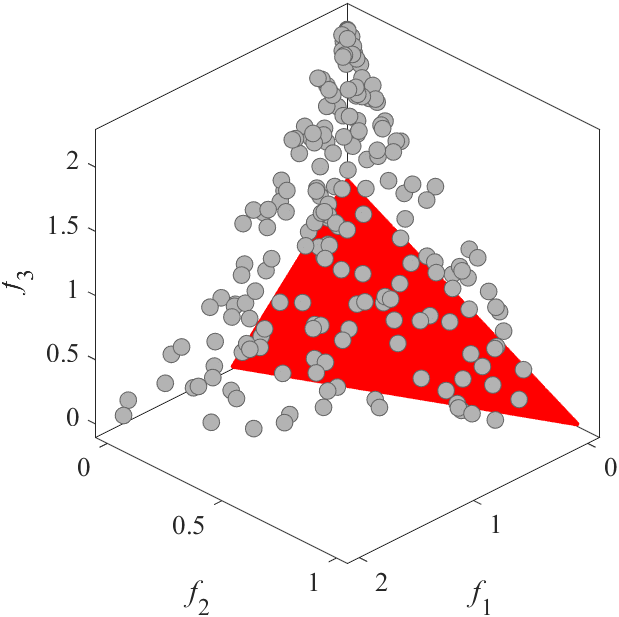|LSMOP4 have too many decision variables. I have no image.|
|Pareto Front on the LSMOP4 (_M_=3)|Random points on the LSMOP4 (_M_=3)|Grid Points on the LSMOP4 (_M_=3)|
|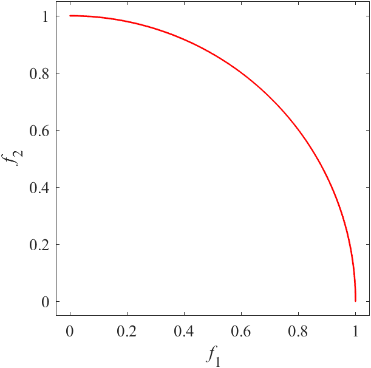|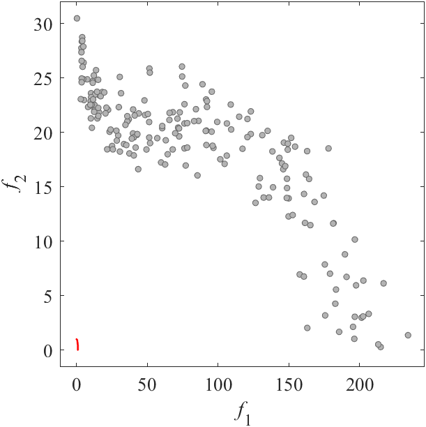|LSMOP5 have too many decision variables. I have no image.|
|Pareto Front on the LSMOP5 (_M_=2)|Random points on the LSMOP5 (_M_=2)|Grid Points on the LSMOP5 (_M_=2)|
|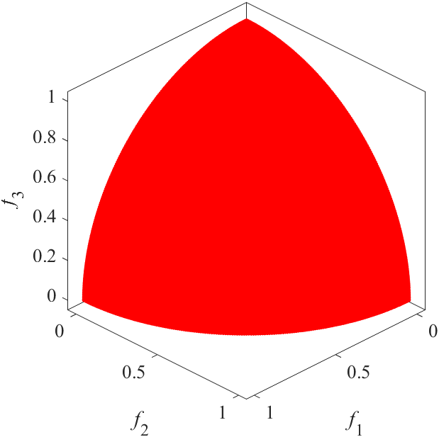|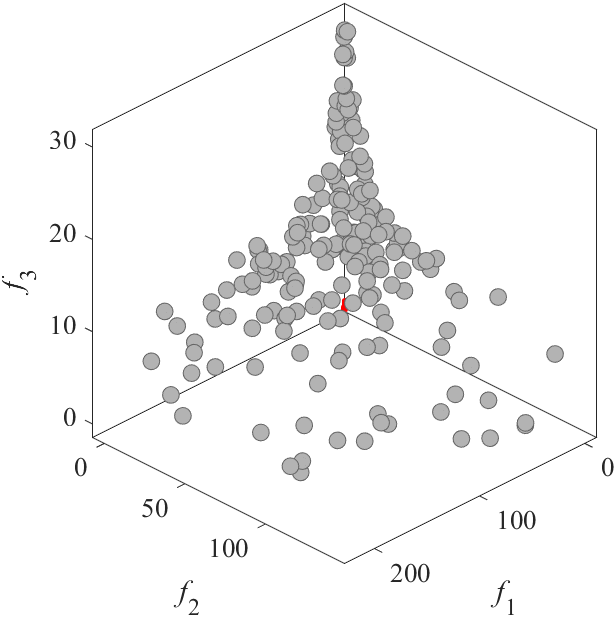|LSMOP5 have too many decision variables. I have no image.|
|Pareto Front on the LSMOP5 (_M_=3)|Random points on the LSMOP5 (_M_=3)|Grid Points on the LSMOP5 (_M_=3)|
||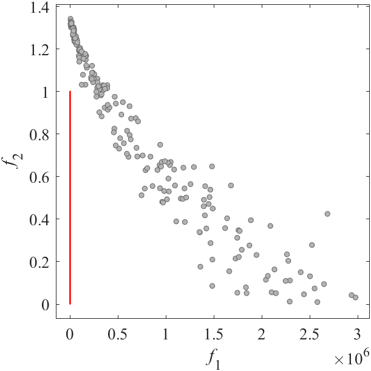|LSMOP6 have too many decision variables. I have no image.|
|Pareto Front on the LSMOP6 (_M_=2)|Random points on the LSMOP6 (_M_=2)|Grid Points on the LSMOP6 (_M_=2)|
||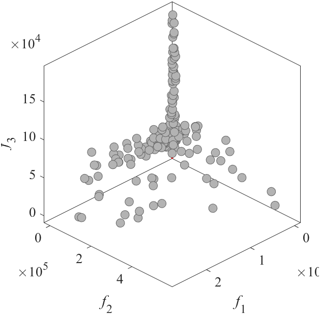|LSMOP6 have too many decision variables. I have no image.|
|Pareto Front on the LSMOP6 (_M_=3)|Random points on the LSMOP6 (_M_=3)|Grid Points on the LSMOP6 (_M_=3)|
||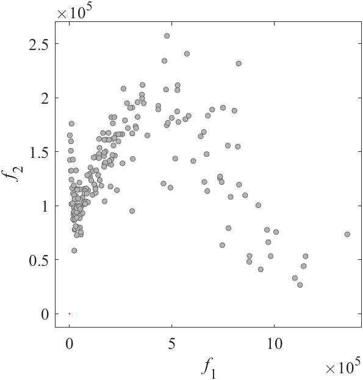|LSMOP7 have too many decision variables. I have no image.|
|Pareto Front on the LSMOP7 (_M_=2)|Random points on the LSMOP7 (_M_=2)|Grid Points on the LSMOP7 (_M_=2)|
||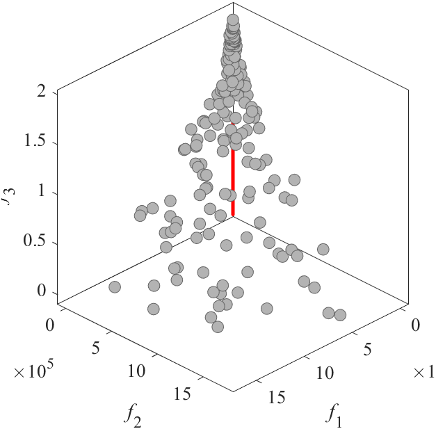|LSMOP7 have too many decision variables. I have no image.|
|Pareto Front on the LSMOP7 (_M_=3)|Random points on the LSMOP7 (_M_=3)|Grid Points on the LSMOP7 (_M_=3)|
||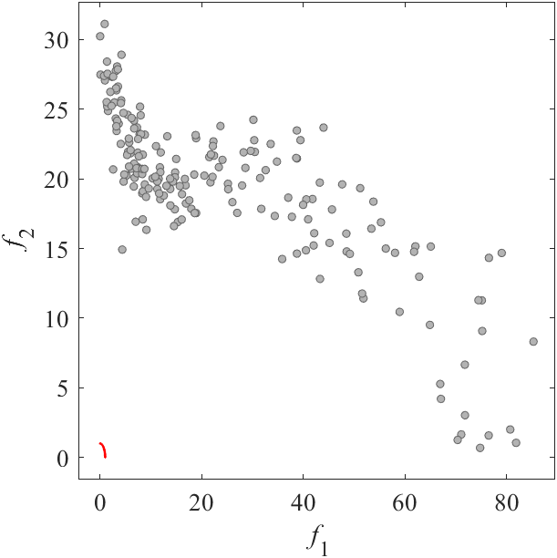|LSMOP8 have too many decision variables. I have no image.|
|Pareto Front on the LSMOP8 (_M_=2)|Random points on the LSMOP8 (_M_=2)|Grid Points on the LSMOP8 (_M_=2)|
||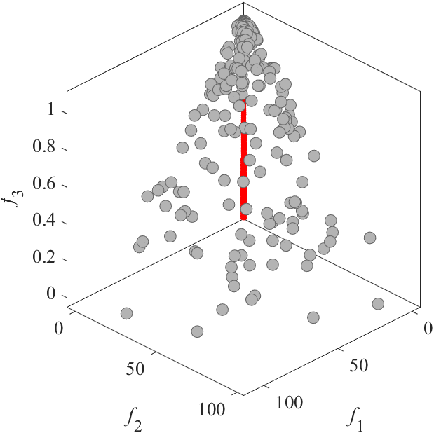|LSMOP8 have too many decision variables. I have no image.|
|Pareto Front on the LSMOP8 (_M_=3)|Random points on the LSMOP8 (_M_=3)|Grid Points on the LSMOP8 (_M_=3)|
|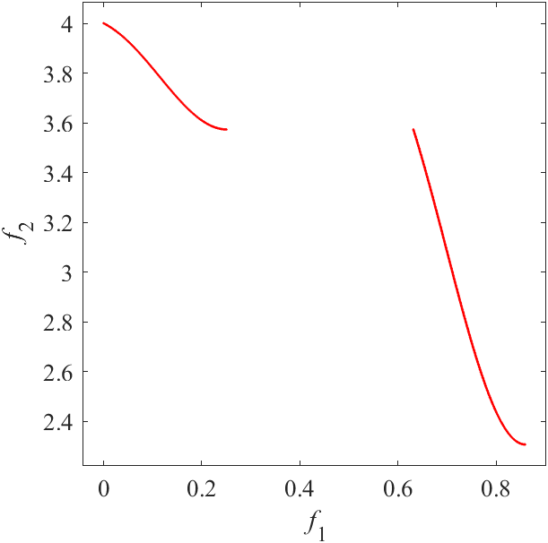|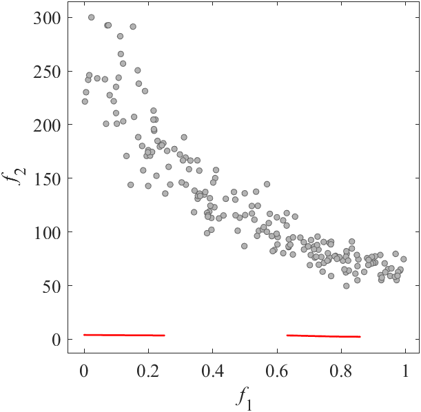|LSMOP9 have too many decision variables. I have no image.|
|Pareto Front on the LSMOP9 (_M_=2)|Random points on the LSMOP9 (_M_=2)|Grid Points on the LSMOP9 (_M_=2)|
|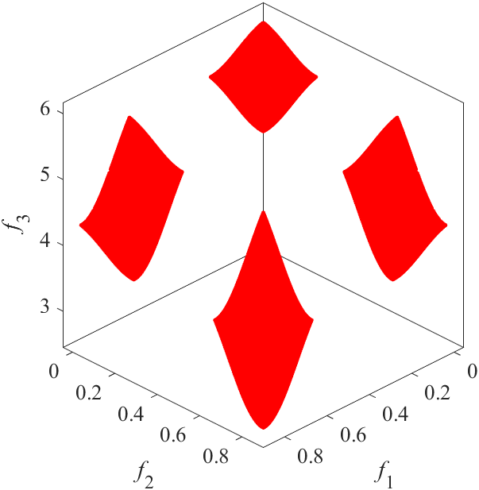|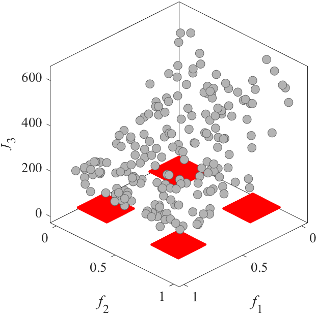|LSMOP9 have too many decision variables. I have no image.|
|Pareto Front on the LSMOP9 (_M_=3)|Random points on the LSMOP9 (_M_=3)|Grid Points on the LSMOP9 (_M_=3)|
