# LSMOP  
### Large-scale benchmark MOP  
Reference  
R. Cheng, Y. Jin, and M. Olhofer, Test problems for large-scale
multiobjective and many-objective optimization, IEEE Transactions on
Cybernetics, 2017, 47(12): 4108-4121.

|Pareto Front on the LSMOP1|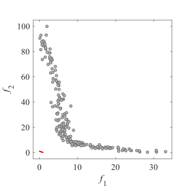Initial population on the LSMOP1|LSMO have too many decision variables.  I have no image.|
|:-:|:-:|:-:|
|Pareto Front on the LSMOP1|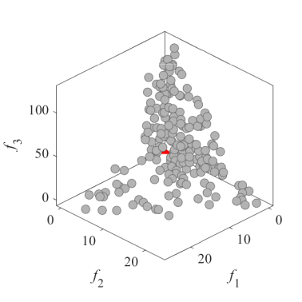Initial population on the LSMOP1|LSMO have too many decision variables.  I have no image.|
|Pareto Front on the LSMOP2|Initial population on the LSMOP2|LSMO have too many decision variables.  I have no image.|
|Pareto Front on the LSMOP2|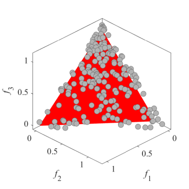Initial population on the LSMOP2|LSMO have too many decision variables.  I have no image.|
|Pareto Front on the LSMOP3|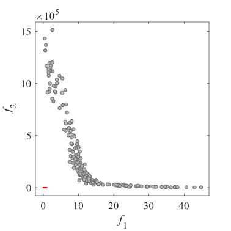Initial population on the LSMOP3|LSMO have too many decision variables.  I have no image.|
|Pareto Front on the LSMOP3|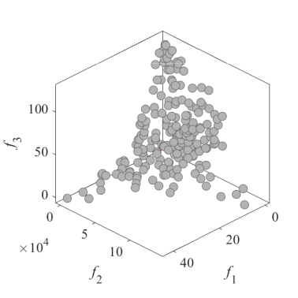Initial population on the LSMOP3|LSMO have too many decision variables.  I have no image.|
|Pareto Front on the LSMOP4|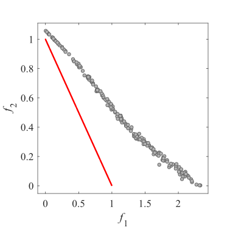Initial population on the LSMOP4|LSMO have too many decision variables.  I have no image.|
|Pareto Front on the LSMOP4|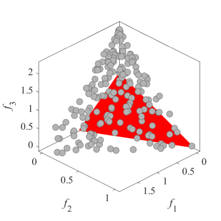Initial population on the LSMOP4|LSMO have too many decision variables.  I have no image.|
|Pareto Front on the LSMOP5|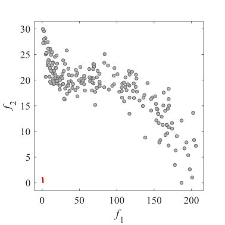Initial population on the LSMOP5|LSMO have too many decision variables.  I have no image.|
|Pareto Front on the LSMOP5|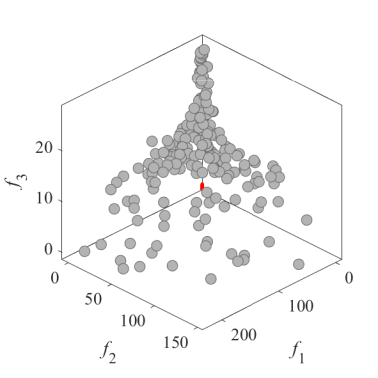Initial population on the LSMOP5|LSMO have too many decision variables.  I have no image.|
|Pareto Front on the LSMOP6|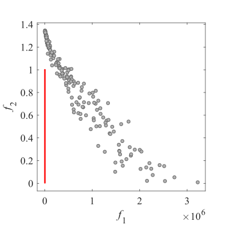Initial population on the LSMOP6|LSMO have too many decision variables.  I have no image.|
|Pareto Front on the LSMOP6|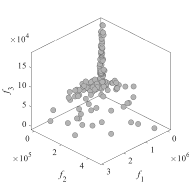Initial population on the LSMOP6|LSMO have too many decision variables.  I have no image.|
|Pareto Front on the LSMOP7|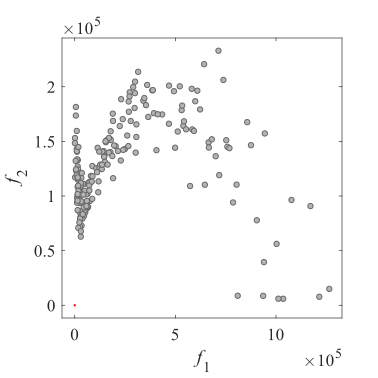Initial population on the LSMOP7|LSMO have too many decision variables.  I have no image.|
|Pareto Front on the LSMOP7|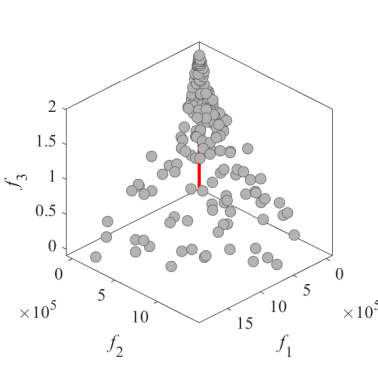Initial population on the LSMOP7|LSMO have too many decision variables.  I have no image.|
|Pareto Front on the LSMOP8|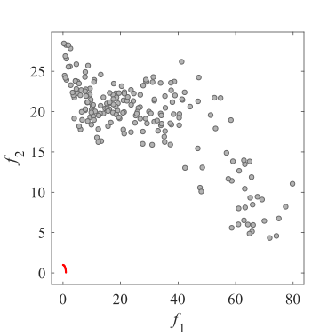Initial population on the LSMOP8|LSMO have too many decision variables.  I have no image.|
|Pareto Front on the LSMOP8|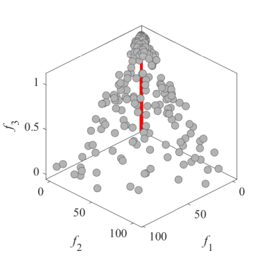Initial population on the LSMOP8|LSMO have too many decision variables.  I have no image.|
|Pareto Front on the LSMOP9|Initial population on the LSMOP9|LSMO have too many decision variables.  I have no image.|
|Pareto Front on the LSMOP9|Initial population on the LSMOP9|LSMO have too many decision variables.  I have no image.|

have too many decision variables.  I have no image.

These problems have too many decision variables.  
I have no image.