# IMMOEA: Benchmark MOP for Inverse Modeling - MOEA
Reference  
R. Cheng, Y. Jin, K. Narukawa, and B. Sendhoff, A multiobjective evolutionary algorithm using Gaussian process-based inverse modeling, IEEE Transactions on Evolutionary Computation, 2015, 19(6): 838-856.

||||
|:-:|:-:|:-:|
|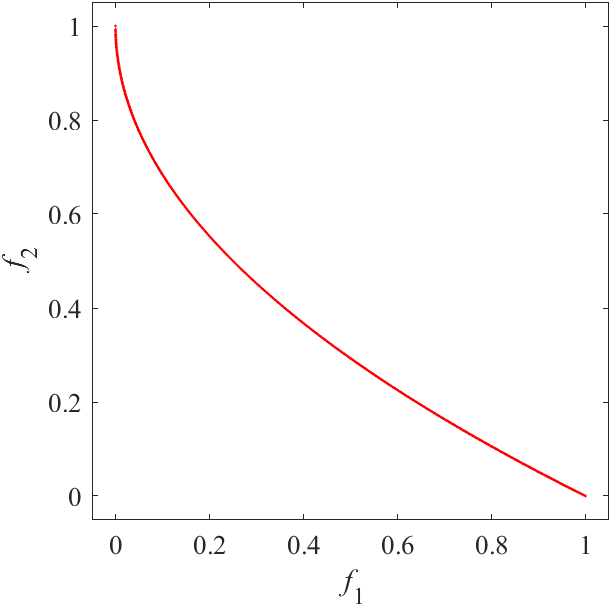|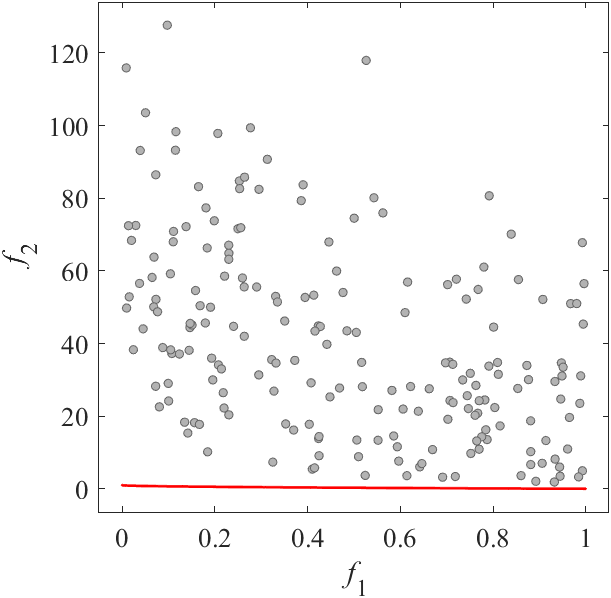|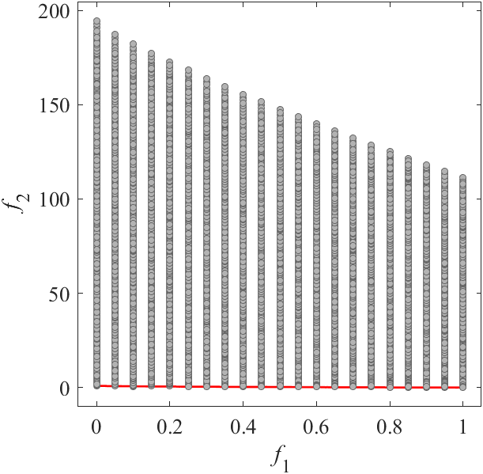|
|Pareto Front on the IMMOEA_F1 (_M_=2)|Random points on the IMMOEA_F1 (_M_=2)|Grid Points on the IMMOEA_F1 (_M_=2)|
|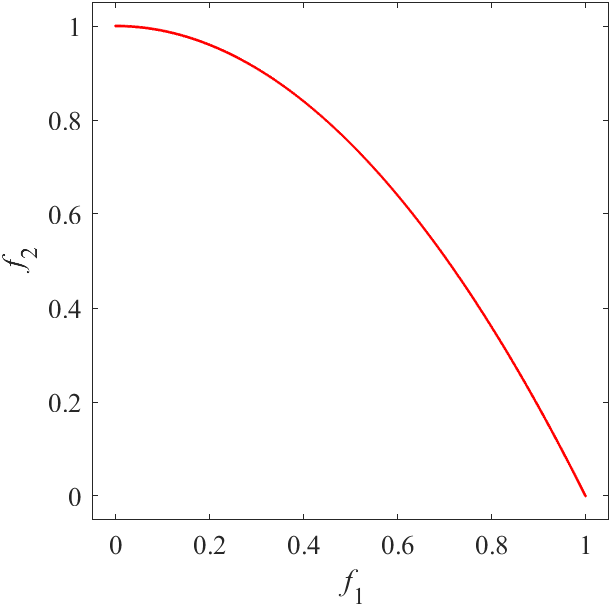|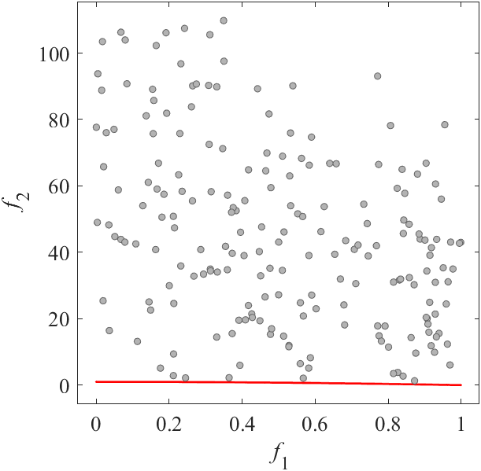|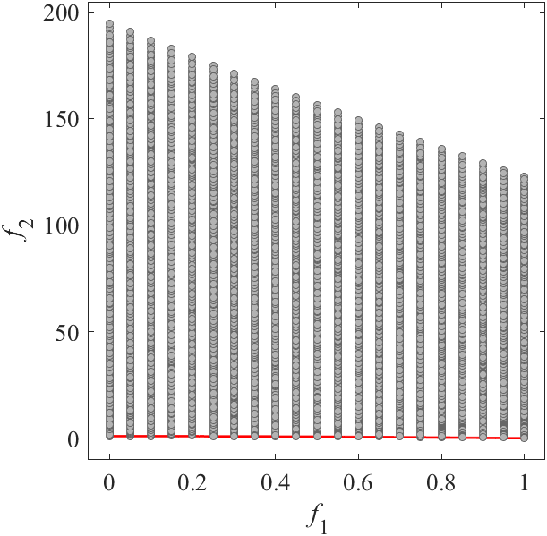|
|Pareto Front on the IMMOEA_F2 (_M_=2)|Random points on the IMMOEA_F2 (_M_=2)|Grid Points on the IMMOEA_F2 (_M_=2)|
|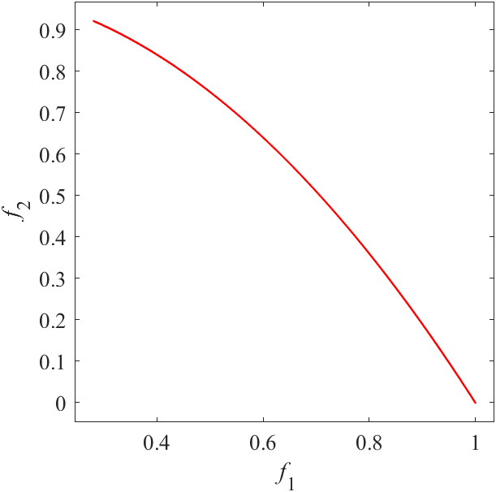|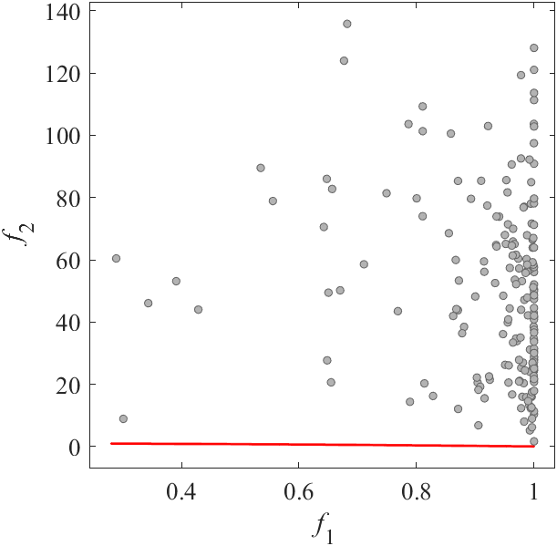|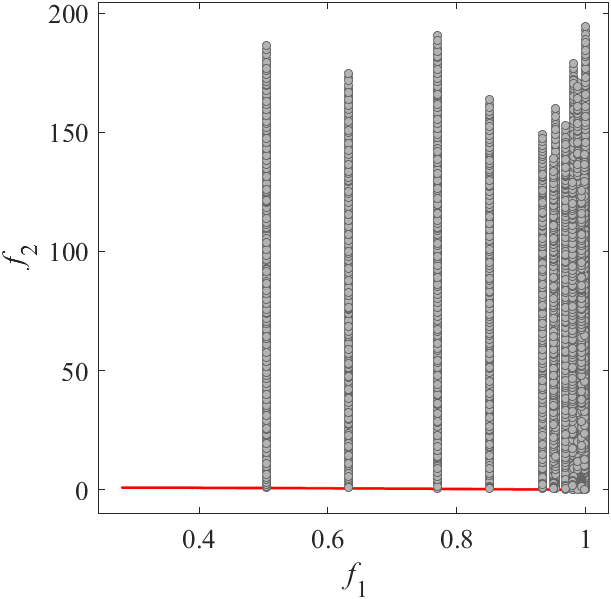|
|Pareto Front on the IMMOEA_F3 (_M_=2)|Random points on the IMMOEA_F3 (_M_=2)|Grid Points on the IMMOEA_F3 (_M_=2)|
|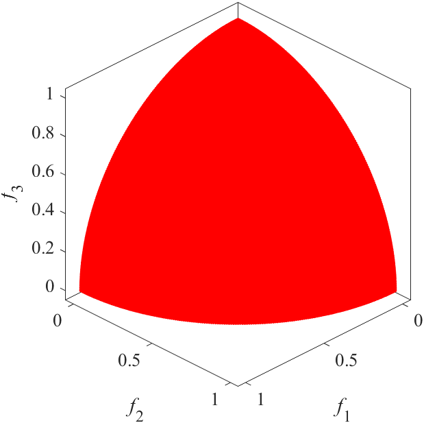|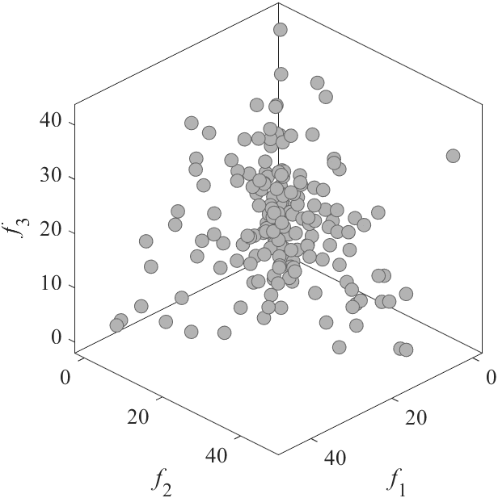|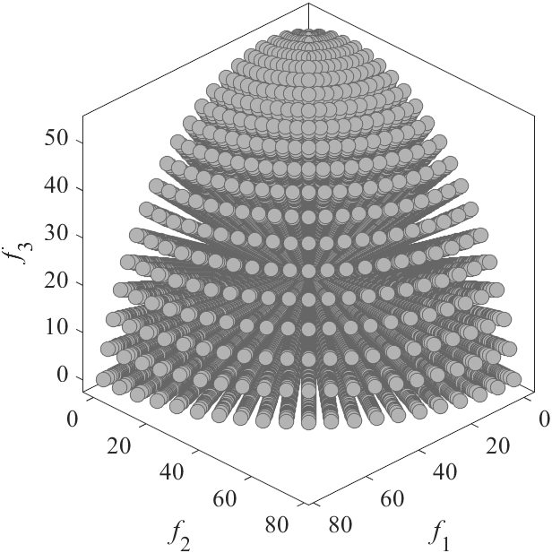|
|Pareto Front on the IMMOEA_F4 (_M_=3)|Random points on the IMMOEA_F4 (_M_=3)|Grid Points on the IMMOEA_F4 (_M_=3)|
||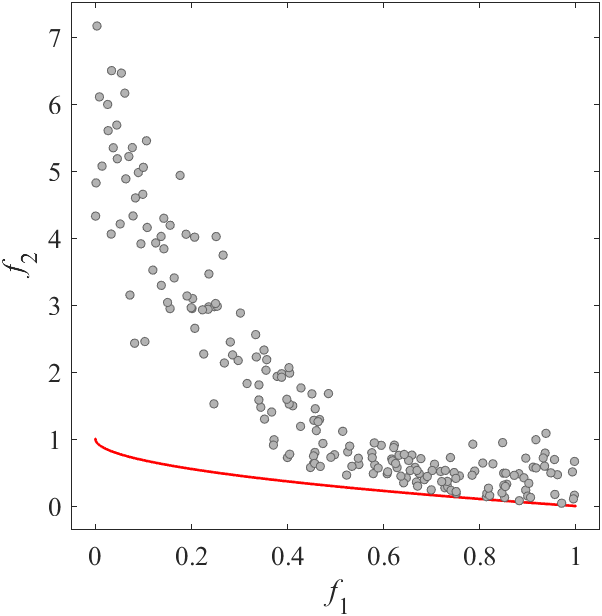|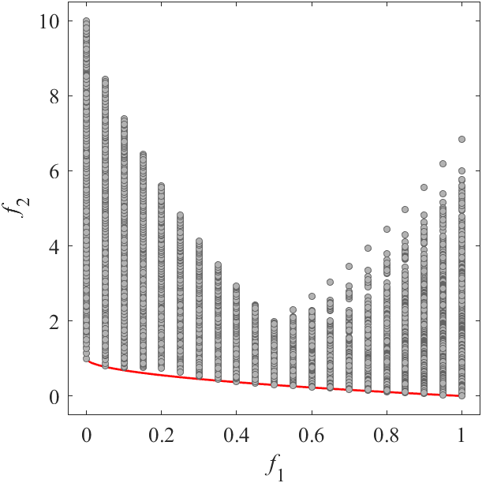|
|Pareto Front on the IMMOEA_F5 (_M_=2)|Random points on the IMMOEA_F5 (_M_=2)|Grid Points on the IMMOEA_F5 (_M_=2)|
||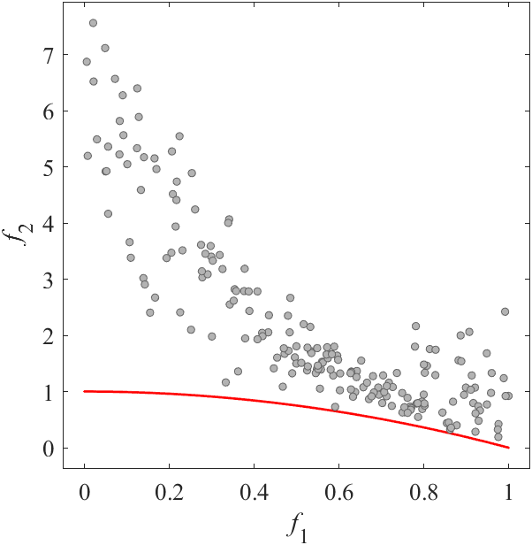|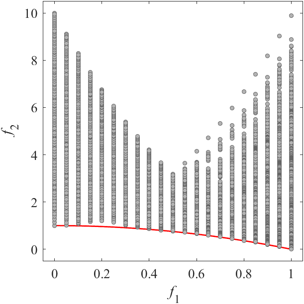|
|Pareto Front on the IMMOEA_F6 (_M_=2)|Random points on the IMMOEA_F6 (_M_=2)|Grid Points on the IMMOEA_F6 (_M_=2)|
||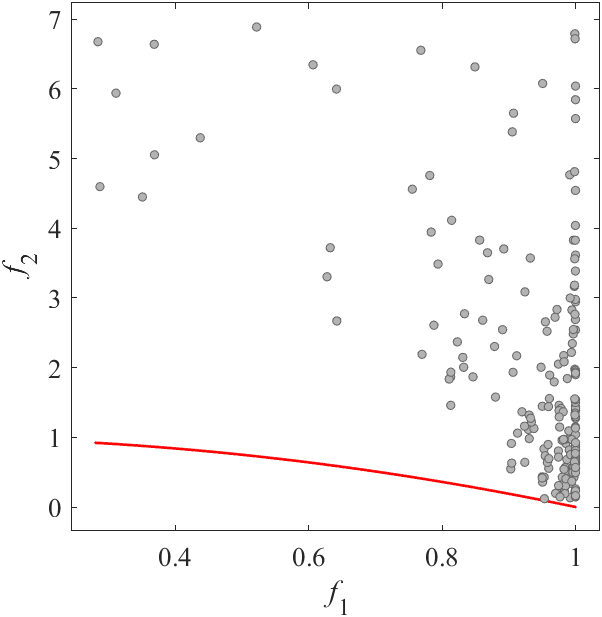|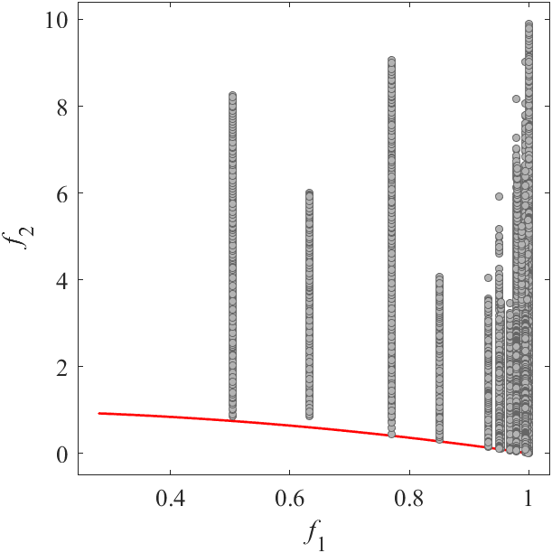|
|Pareto Front on the IMMOEA_F7 (_M_=2)|Random points on the IMMOEA_F7 (_M_=2)|Grid Points on the IMMOEA_F7 (_M_=2)|
||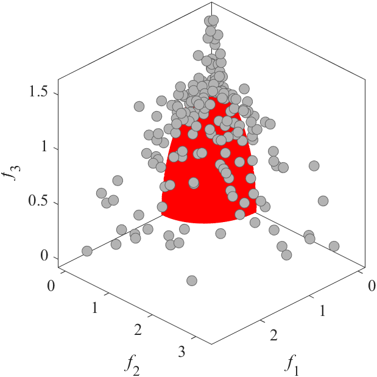|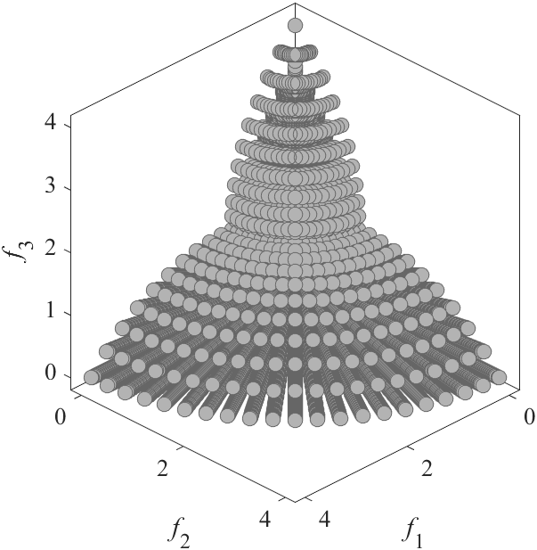|
|Pareto Front on the IMMOEA_F8 (_M_=3)|Random points on the IMMOEA_F8 (_M_=3)|Grid Points on the IMMOEA_F8 (_M_=3)|
||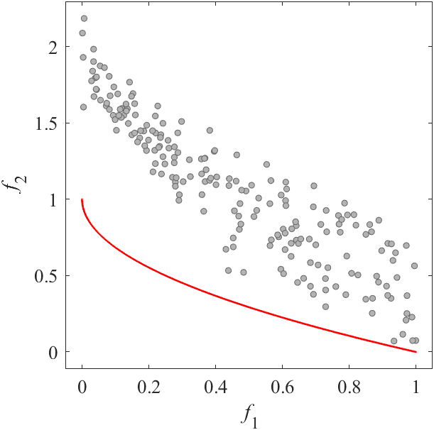|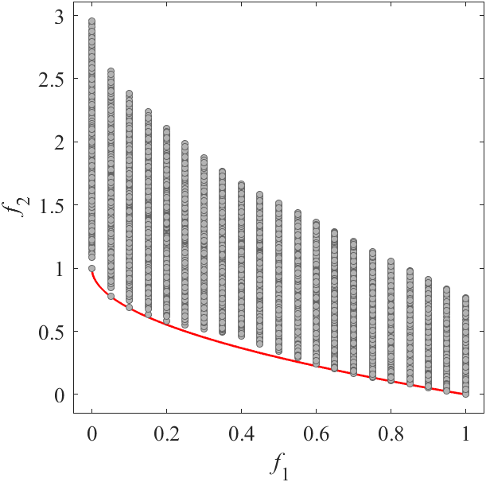|
|Pareto Front on the IMMOEA_F9 (_M_=2)|Random points on the IMMOEA_F9 (_M_=2)|Grid Points on the IMMOEA_F9 (_M_=2)|
||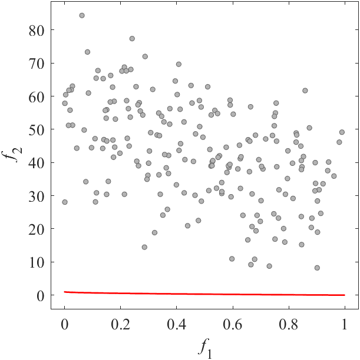|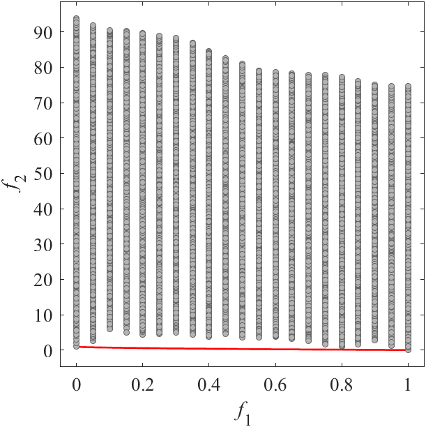|
|Pareto Front on the IMMOEA_F10 (_M_=2)|Random points on the IMMOEA_F10 (_M_=2)|Grid Points on the IMMOEA_F10 (_M_=2)|
