# MOEADDE
### Benchmark MOP for MOEA/D-DE  
Reference  
H. Li and Q. Zhang, Multiobjective optimization problems with complicated
Pareto sets, MOEA/D and NSGA-II, IEEE Transactions on Evolutionary
Computation, 2009, 13(2): 284-302.
 
|Pareto Front on the MOEADDE_F1|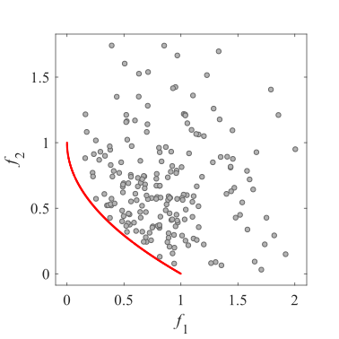Initial population on the MOEADDE_F1|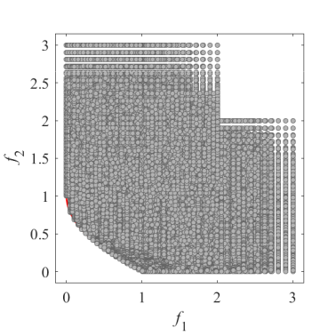Grid Points on the MOEADDE_F1|
|:-:|:-:|:-:|
|Pareto Front on the MOEADDE_F2|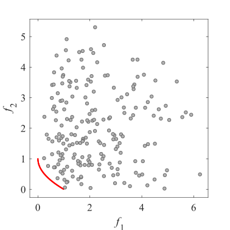Initial population on the MOEADDE_F2|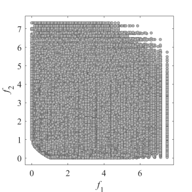Grid Points on the MOEADDE_F2|
|Pareto Front on the MOEADDE_F3|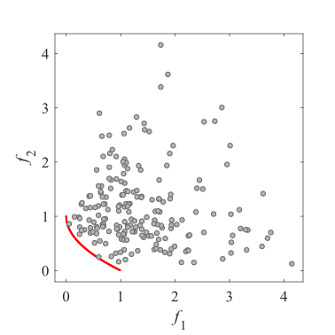Initial population on the MOEADDE_F3|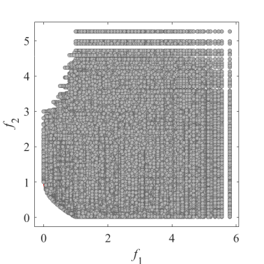Grid Points on the MOEADDE_F3|
|Pareto Front on the MOEADDE_F4|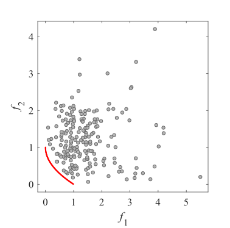Initial population on the MOEADDE_F4|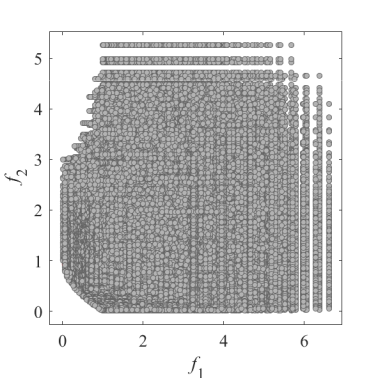Grid Points on the MOEADDE_F4|
|Pareto Front on the MOEADDE_F5|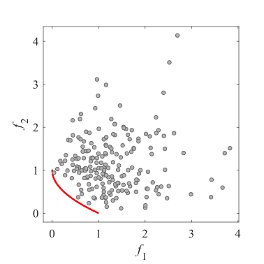Initial population on the MOEADDE_F5|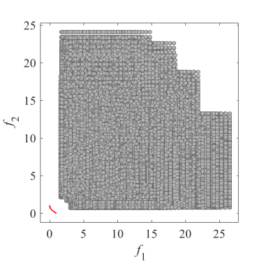Grid Points on the MOEADDE_F5|
|Pareto Front on the MOEADDE_F6|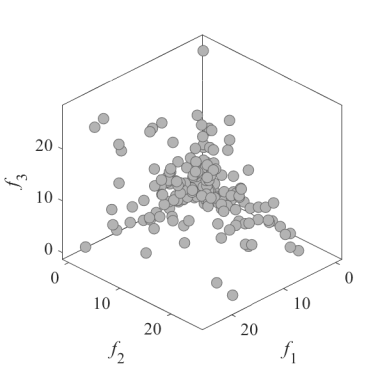Initial population on the MOEADDE_F6|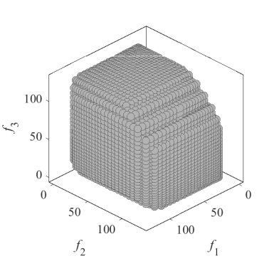Grid Points on the MOEADDE_F6|
|Pareto Front on the MOEADDE_F7|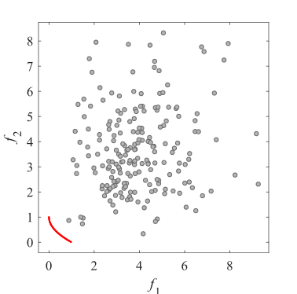Initial population on the MOEADDE_F7|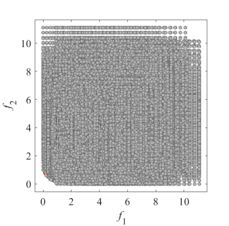Grid Points on the MOEADDE_F7|
|Pareto Front on the MOEADDE_F8|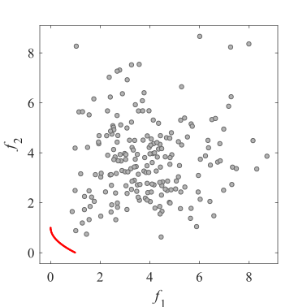Initial population on the MOEADDE_F8|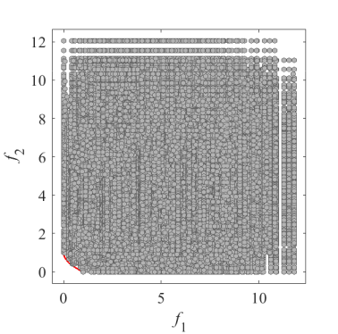Grid Points on the MOEADDE_F8|
|Pareto Front on the MOEADDE_F9|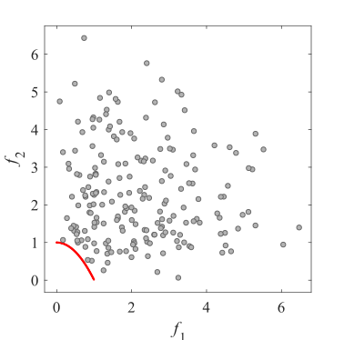Initial population on the MOEADDE_F9|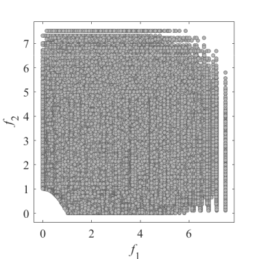Grid Points on the MOEADDE_F9|
|Pareto Front on the MOEADDE_F10|Initial population on the MOEADDE_F10|Grid Points on the MOEADDE_F10|
