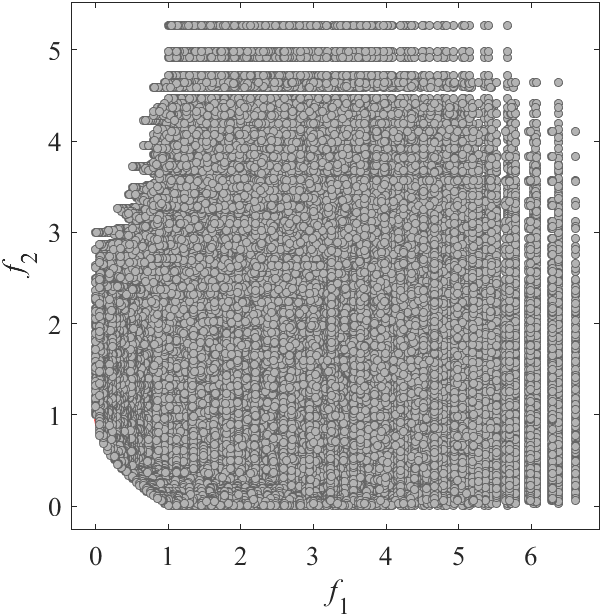

# MOEADDE: Benchmark MOP for MOEA/D-DE
Reference  
H. Li and Q. Zhang, Multiobjective optimization problems with complicated Pareto sets, MOEA/D and NSGA-II, IEEE Transactions on Evolutionary Computation, 2009, 13(2): 284-302.

||||
|:-:|:-:|:-:|
||||
|Pareto Front on the MOEADDE_F1 (_M_=2)|Random points on the MOEADDE_F1 (_M_=2)|Grid Points on the MOEADDE_F1 (_M_=2)|
||||
|Pareto Front on the MOEADDE_F2 (_M_=2)|Random points on the MOEADDE_F2 (_M_=2)|Grid Points on the MOEADDE_F2 (_M_=2)|
||||
|Pareto Front on the MOEADDE_F3 (_M_=2)|Random points on the MOEADDE_F3 (_M_=2)|Grid Points on the MOEADDE_F3 (_M_=2)|
||||
|Pareto Front on the MOEADDE_F4 (_M_=2)|Random points on the MOEADDE_F4 (_M_=2)|Grid Points on the MOEADDE_F4 (_M_=2)|
||||
|Pareto Front on the MOEADDE_F5 (_M_=2)|Random points on the MOEADDE_F5 (_M_=2)|Grid Points on the MOEADDE_F5 (_M_=2)|
||||
|Pareto Front on the MOEADDE_F6 (_M_=3)|Random points on the MOEADDE_F6 (_M_=3)|Grid Points on the MOEADDE_F6 (_M_=3)|
||||
|Pareto Front on the MOEADDE_F7 (_M_=2)|Random points on the MOEADDE_F7 (_M_=2)|Grid Points on the MOEADDE_F7 (_M_=2)|
||||
|Pareto Front on the MOEADDE_F8 (_M_=2)|Random points on the MOEADDE_F8 (_M_=2)|Grid Points on the MOEADDE_F8 (_M_=2)|
||||
|Pareto Front on the MOEADDE_F9 (_M_=2)|Random points on the MOEADDE_F9 (_M_=2)|Grid Points on the MOEADDE_F9 (_M_=2)|
