# MOEADM2M
### Benchmark MOP for MOEA/D-M2M
Reference  
H. Liu, F. Gu, and Q. Zhang, Decomposition of a multiobjective
optimization problem into a number of simple multiobjective subproblems,
IEEE Transactions on Evolutionary Computation, 2014, 18(3): 450-455.
 
|Pareto Front on the MOEADM2M_F1|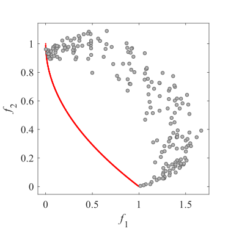Initial population on the MOEADM2M_F1|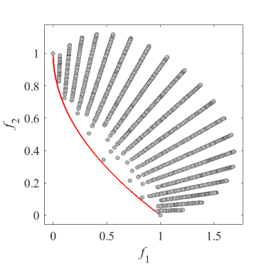Grid Points on the MOEADM2M_F1|
|:-:|:-:|:-:|
|Pareto Front on the MOEADM2M_F2|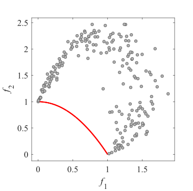Initial population on the MOEADM2M_F2|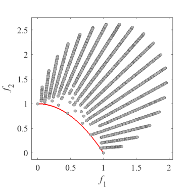Grid Points on the MOEADM2M_F2|
|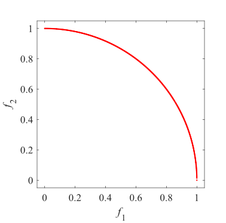Pareto Front on the MOEADM2M_F3|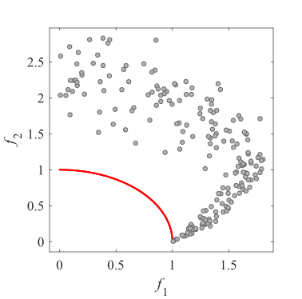Initial population on the MOEADM2M_F3|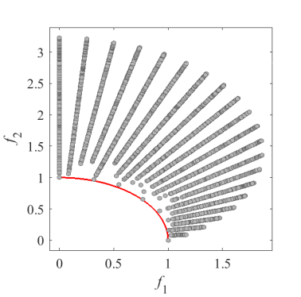Grid Points on the MOEADM2M_F3|
|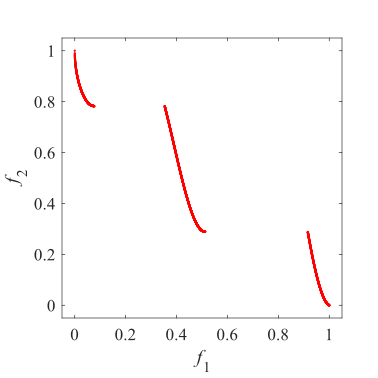Pareto Front on the MOEADM2M_F4|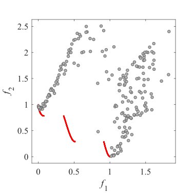Initial population on the MOEADM2M_F4|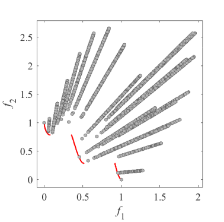Grid Points on the MOEADM2M_F4|
|Pareto Front on the MOEADM2M_F5|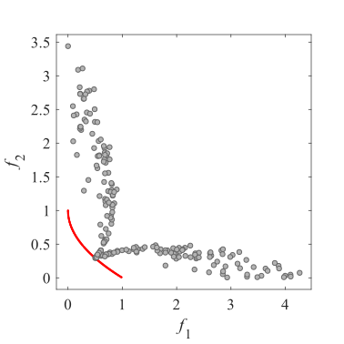Initial population on the MOEADM2M_F5|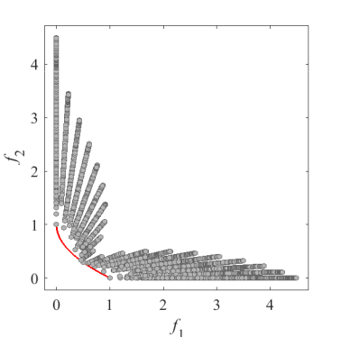Grid Points on the MOEADM2M_F5|
|Pareto Front on the MOEADM2M_F6|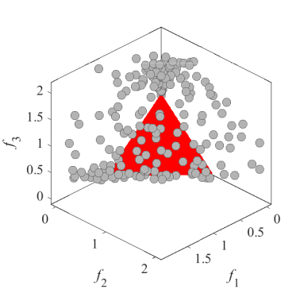Initial population on the MOEADM2M_F6|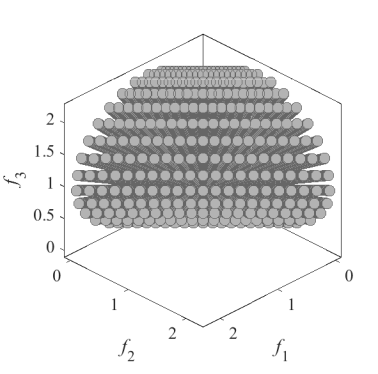Grid Points on the MOEADM2M_F6|
|Pareto Front on the MOEADM2M_F7|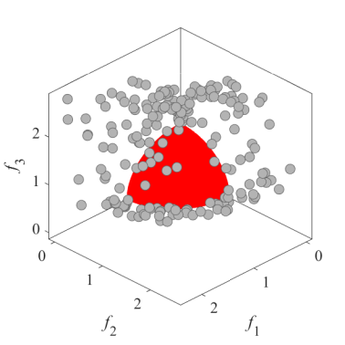Initial population on the MOEADM2M_F7|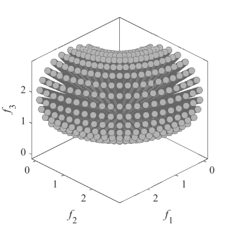Grid Points on the MOEADM2M_F7|