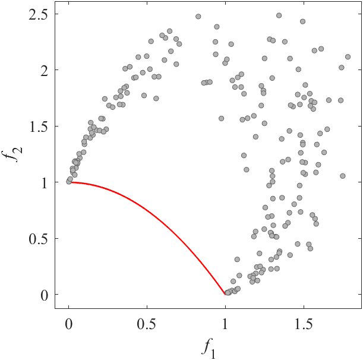
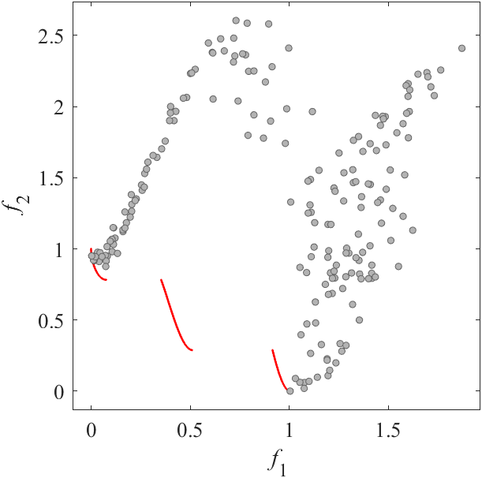
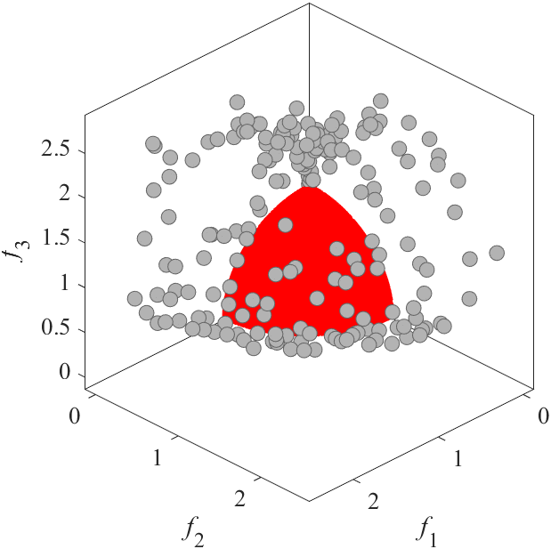
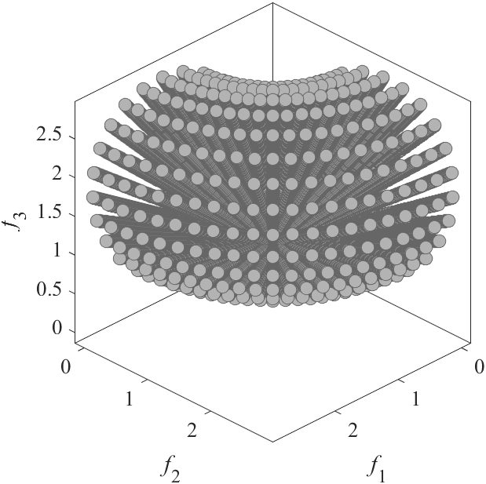

# MOEADM2M: Benchmark MOP for MOEA/D-M2M
Reference  
H. Liu, F. Gu, and Q. Zhang, Decomposition of a multiobjective optimization problem into a number of simple multiobjective subproblems, IEEE Transactions on Evolutionary Computation, 2014, 18(3): 450-455.

||||
|:-:|:-:|:-:|
||||
|Pareto Front on the MOEADM2M_F1 (_M_=2)|Random points on the MOEADM2M_F1 (_M_=2)|Grid Points on the MOEADM2M_F1 (_M_=2)|
||||
|Pareto Front on the MOEADM2M_F2 (_M_=2)|Random points on the MOEADM2M_F2 (_M_=2)|Grid Points on the MOEADM2M_F2 (_M_=2)|
||||
|Pareto Front on the MOEADM2M_F3 (_M_=2)|Random points on the MOEADM2M_F3 (_M_=2)|Grid Points on the MOEADM2M_F3 (_M_=2)|
||||
|Pareto Front on the MOEADM2M_F4 (_M_=2)|Random points on the MOEADM2M_F4 (_M_=2)|Grid Points on the MOEADM2M_F4 (_M_=2)|
||||
|Pareto Front on the MOEADM2M_F5 (_M_=2)|Random points on the MOEADM2M_F5 (_M_=2)|Grid Points on the MOEADM2M_F5 (_M_=2)|
||||
|Pareto Front on the MOEADM2M_F6 (_M_=3)|Random points on the MOEADM2M_F6 (_M_=3)|Grid Points on the MOEADM2M_F6 (_M_=3)|
||||
|Pareto Front on the MOEADM2M_F7 (_M_=3)|Random points on the MOEADM2M_F7 (_M_=3)|Grid Points on the MOEADM2M_F7 (_M_=3)|
