# RMMEDA
###Benchmark MOP for Regularity Model-based - MEDA
Reference  
Q. Zhang, A. Zhou, and Y. Jin, RM-MEDA: A regularity model-based
multiobjective estimation of distribution algorithm, IEEE Transactions on
Evolutionary Computation, 2008, 12(1): 41-63.
 
|Pareto Front on the RMMEDA_F1|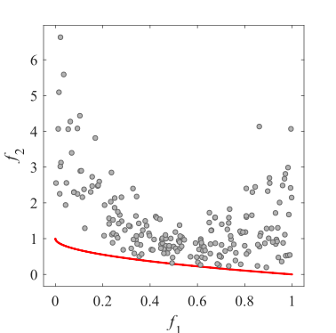Initial population on the RMMEDA_F1|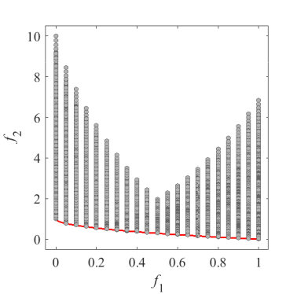Grid Points on the RMMEDA_F1|
|:-:|:-:|:-:|
|Pareto Front on the RMMEDA_F2|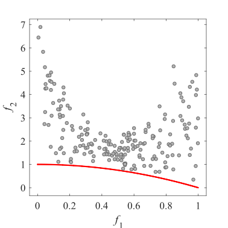Initial population on the RMMEDA_F2|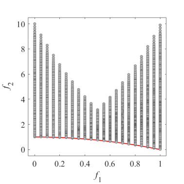Grid Points on the RMMEDA_F2|
|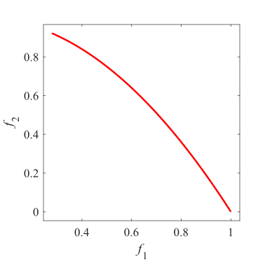Pareto Front on the RMMEDA_F3|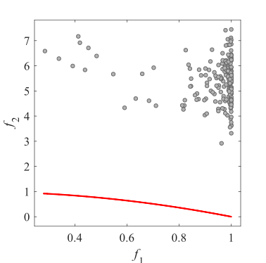Initial population on the RMMEDA_F3|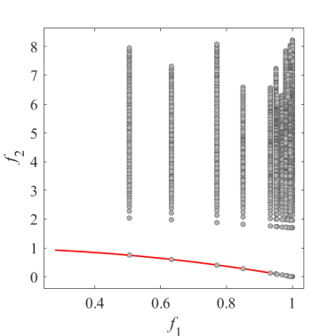Grid Points on the RMMEDA_F3|
|Pareto Front on the RMMEDA_F4|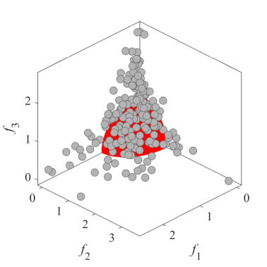Initial population on the RMMEDA_F4|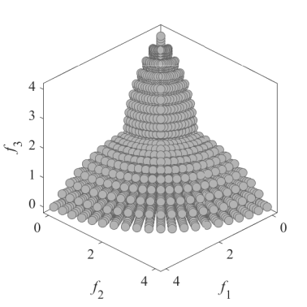Grid Points on the RMMEDA_F4|
|Pareto Front on the RMMEDA_F5|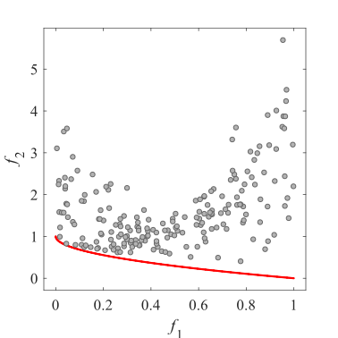Initial population on the RMMEDA_F5|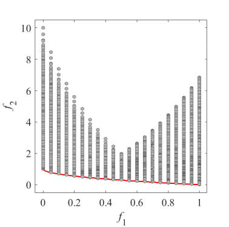Grid Points on the RMMEDA_F5|
|Pareto Front on the RMMEDA_F6|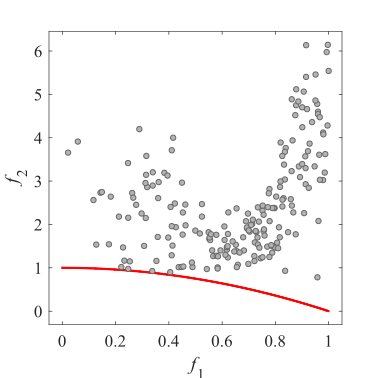Initial population on the RMMEDA_F6|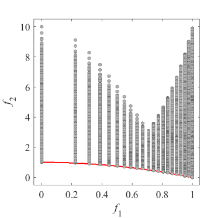Grid Points on the RMMEDA_F6|
|Pareto Front on the RMMEDA_F7|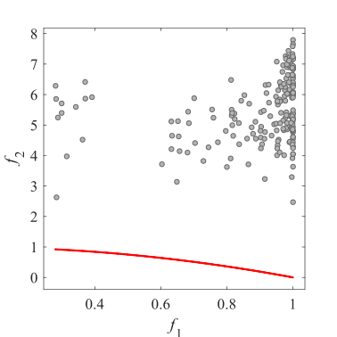Initial population on the RMMEDA_F7|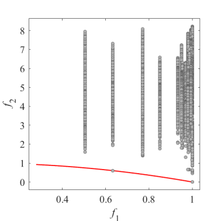Grid Points on the RMMEDA_F7|
|Pareto Front on the RMMEDA_F8|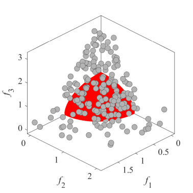Initial population on the RMMEDA_F8|Grid Points on the RMMEDA_F8|
|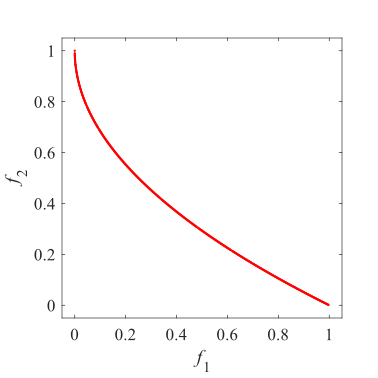Pareto Front on the RMMEDA_F9|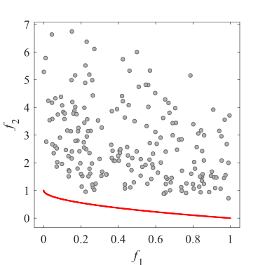Initial population on the RMMEDA_F9|Grid Points on the RMMEDA_F9|
|Pareto Front on the RMMEDA_F10|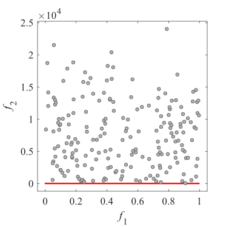Initial population on the RMMEDA_F10|Grid Points on the RMMEDA_F10|
