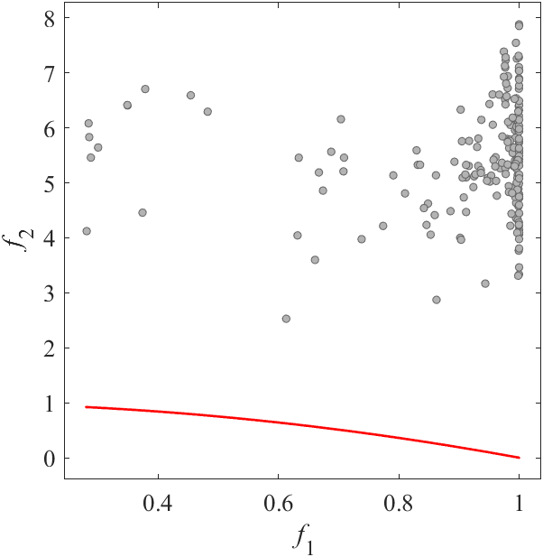
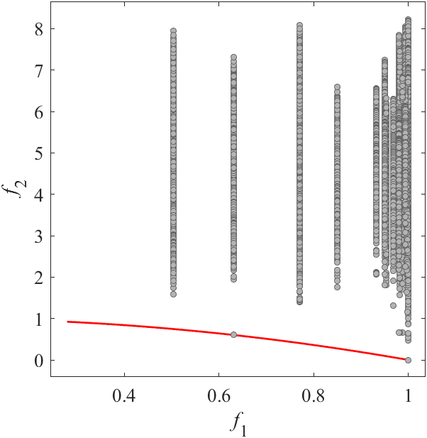

# RMMEDA: Benchmark MOP for RM-MEDA
Reference  
Q. Zhang, A. Zhou, and Y. Jin, RM-MEDA: A regularity model-based multiobjective estimation of distribution algorithm, IEEE Transactions on Evolutionary Computation, 2008, 12(1): 41-63.

||||
|:-:|:-:|:-:|
||||
|Pareto Front on the RMMEDA_F1 (_M_=2)|Random points on the RMMEDA_F1 (_M_=2)|Grid Points on the RMMEDA_F1 (_M_=2)|
||||
|Pareto Front on the RMMEDA_F2 (_M_=2)|Random points on the RMMEDA_F2 (_M_=2)|Grid Points on the RMMEDA_F2 (_M_=2)|
||||
|Pareto Front on the RMMEDA_F3 (_M_=2)|Random points on the RMMEDA_F3 (_M_=2)|Grid Points on the RMMEDA_F3 (_M_=2)|
||||
|Pareto Front on the RMMEDA_F4 (_M_=3)|Random points on the RMMEDA_F4 (_M_=3)|Grid Points on the RMMEDA_F4 (_M_=3)|
||||
|Pareto Front on the RMMEDA_F5 (_M_=2)|Random points on the RMMEDA_F5 (_M_=2)|Grid Points on the RMMEDA_F5 (_M_=2)|
||||
|Pareto Front on the RMMEDA_F6 (_M_=2)|Random points on the RMMEDA_F6 (_M_=2)|Grid Points on the RMMEDA_F6 (_M_=2)|
||||
|Pareto Front on the RMMEDA_F7 (_M_=2)|Random points on the RMMEDA_F7 (_M_=2)|Grid Points on the RMMEDA_F7 (_M_=2)|
||||
|Pareto Front on the RMMEDA_F8 (_M_=3)|Random points on the RMMEDA_F8 (_M_=3)|Grid Points on the RMMEDA_F8 (_M_=3)|
||||
|Pareto Front on the RMMEDA_F9 (_M_=2)|Random points on the RMMEDA_F9 (_M_=2)|Grid Points on the RMMEDA_F9 (_M_=2)|
||||
|Pareto Front on the RMMEDA_F10 (_M_=2)|Random points on the RMMEDA_F10 (_M_=2)|Grid Points on the RMMEDA_F10 (_M_=2)|
