# MW
### Constrained benchmark MOP proposed by Ma and Wang  
Reference  
Z. Ma and Y. Wang, Evolutionary constrained multiobjective optimization: 
Test suite construction and performance comparisons. IEEE Transactions on 
Evolutionary Computation, 2019.
 
|Pareto Front on the MW1|Initial population on the MW1|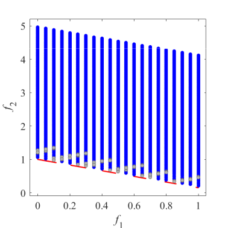Grid Points on the MW1|
|:-:|:-:|:-:|
|Pareto Front on the MW2|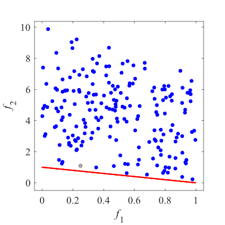Initial population on the MW2|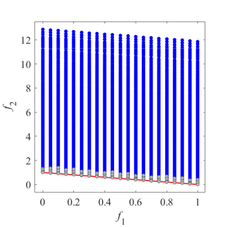Grid Points on the MW2|
|Pareto Front on the MW3|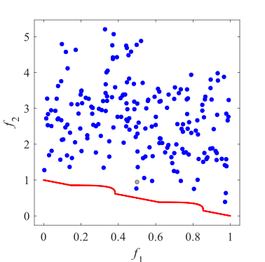Initial population on the MW3|Grid Points on the MW3|
|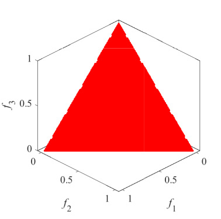Pareto Front on the MW4|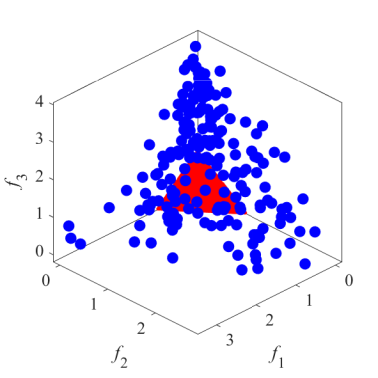Initial population on the MW4|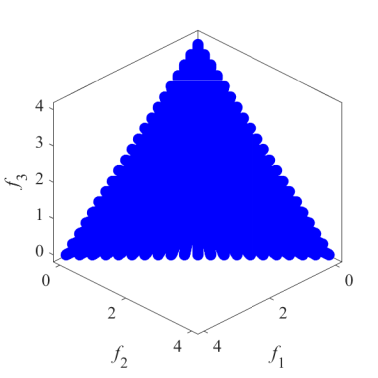Grid Points on the MW4|
|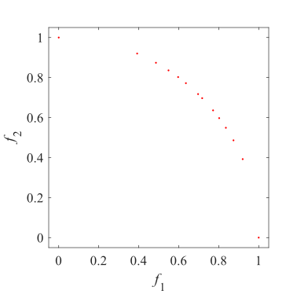Pareto Front on the MW5|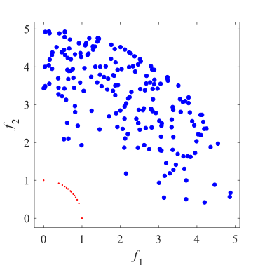Initial population on the MW5|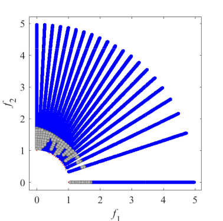Grid Points on the MW5|
|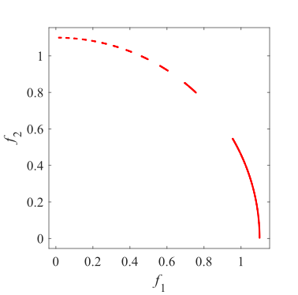Pareto Front on the MW6|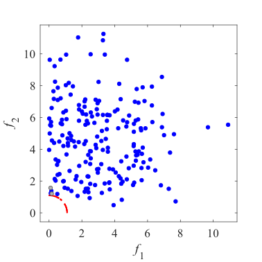Initial population on the MW6|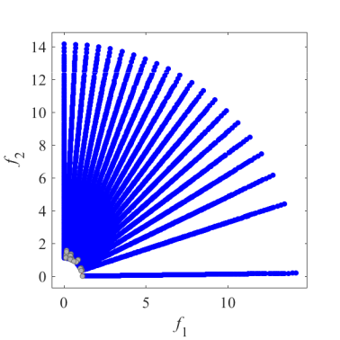Grid Points on the MW6|
|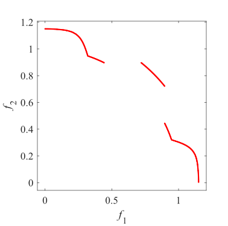Pareto Front on the MW7|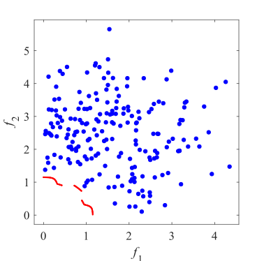Initial population on the MW7|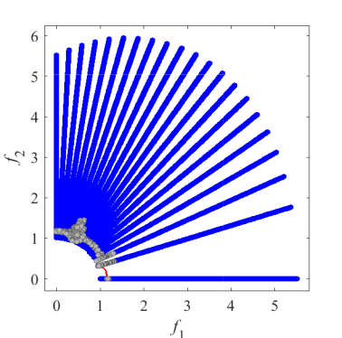Grid Points on the MW7|
|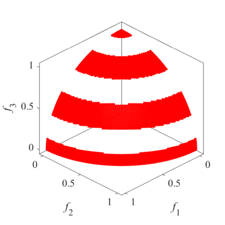Pareto Front on the MW8|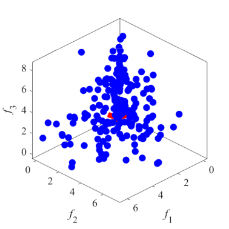Initial population on the MW8|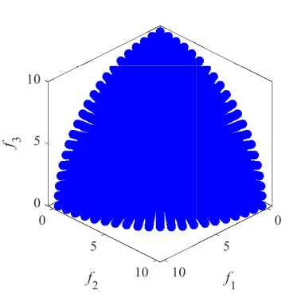Grid Points on the MW8|
|Pareto Front on the MW9|Initial population on the MW9|Grid Points on the MW9|
|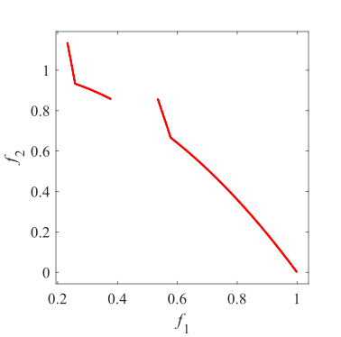Pareto Front on the MW10|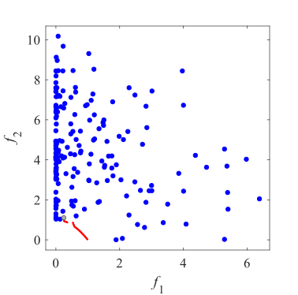Initial population on the MW10|Grid Points on the MW10|
|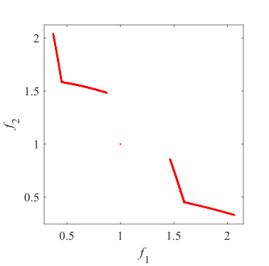Pareto Front on the MW11|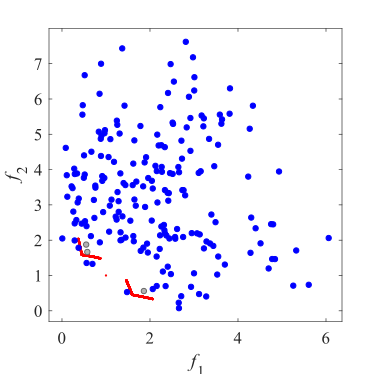Initial population on the MW11|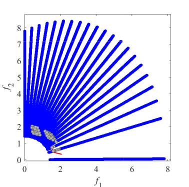Grid Points on the MW11|
|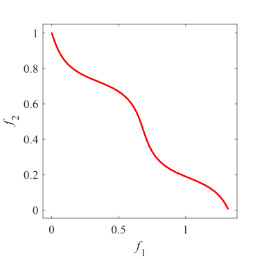Pareto Front on the MW12|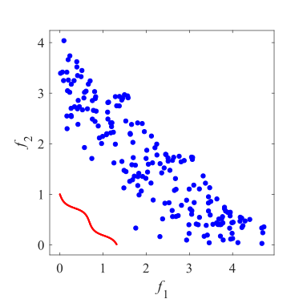Initial population on the MW12|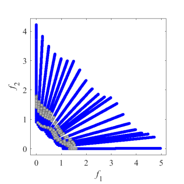Grid Points on the MW12|
|Pareto Front on the MW13|Initial population on the MW13|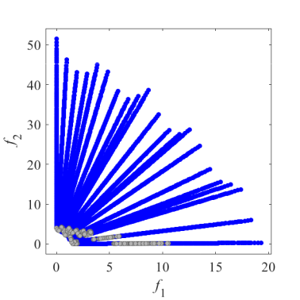Grid Points on the MW13|
|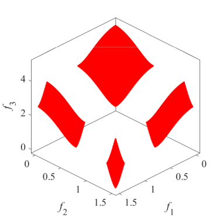Pareto Front on the MW14|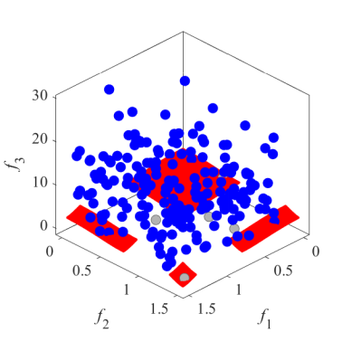Initial population on the MW14|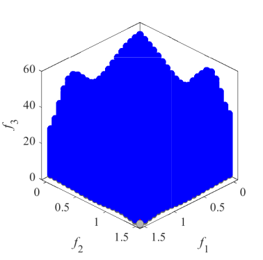Grid Points on the MW14|