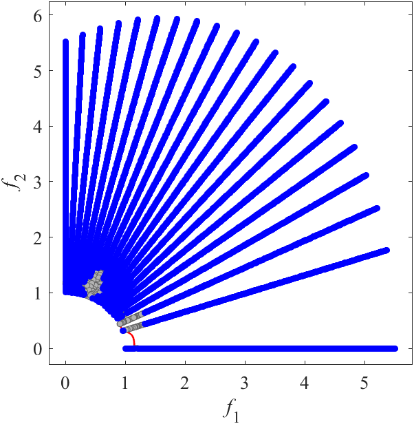

# MW: Constrained benchmark MOP proposed by Ma and Wang
Reference
Z. Ma and Y. Wang, Evolutionary constrained multiobjective optimization: Test suite construction and performance comparisons, IEEE Transactions on Evolutionary Computation, 2019, 23(6): 972-986.

||||
|:-:|:-:|:-:|
||||
|Pareto Front on the MW1 (_M_=2)|Random points on the MW1 (_M_=2)|Grid Points on the MW1 (_M_=2)|
||||
|Pareto Front on the MW2 (_M_=2)|Random points on the MW2 (_M_=2)|Grid Points on the MW2 (_M_=2)|
||||
|Pareto Front on the MW3 (_M_=2)|Random points on the MW3 (_M_=2)|Grid Points on the MW3 (_M_=2)|
||||
|Pareto Front on the MW4 (_M_=3)|Random points on the MW4 (_M_=3)|Grid Points on the MW4 (_M_=3)|
||||
|Pareto Front on the MW5 (_M_=2)|Random points on the MW5 (_M_=2)|Grid Points on the MW5 (_M_=2)|
||||
|Pareto Front on the MW6 (_M_=2)|Random points on the MW6 (_M_=2)|Grid Points on the MW6 (_M_=2)|
||||
|Pareto Front on the MW7 (_M_=2)|Random points on the MW7 (_M_=2)|Grid Points on the MW7 (_M_=2)|
||||
|Pareto Front on the MW8 (_M_=3)|Random points on the MW8 (_M_=3)|Grid Points on the MW8 (_M_=3)|
||||
|Pareto Front on the MW9 (_M_=2)|Random points on the MW9 (_M_=2)|Grid Points on the MW9 (_M_=2)|
||||
|Pareto Front on the MW10 (_M_=2)|Random points on the MW10 (_M_=2)|Grid Points on the MW10 (_M_=2)|
||||
|Pareto Front on the MW11 (_M_=2)|Random points on the MW11 (_M_=2)|Grid Points on the MW11 (_M_=2)|
||||
|Pareto Front on the MW12 (_M_=2)|Random points on the MW12 (_M_=2)|Grid Points on the MW12 (_M_=2)|
||||
|Pareto Front on the MW13 (_M_=2)|Random points on the MW13 (_M_=2)|Grid Points on the MW13 (_M_=2)|
||||
|Pareto Front on the MW14 (_M_=2)|Random points on the MW14 (_M_=2)|Grid Points on the MW14 (_M_=2)|
||||
|Pareto Front on the MW14 (_M_=3)|Random points on the MW14 (_M_=3)|Grid Points on the MW14 (_M_=3)|
