# MaF  
### Modified 15 test problems for many-objective optimization  
Reference  
R. Cheng, M. Li, Y. Tian, X. Zhang, S. Yang, Y. Jin, and X. Yao, A
benchmark test suite for evolutionary many-objective optimization,
Complex & Intelligent Systems, 2017, 3(1): 67-81.

|Pareto Front on the MaF1|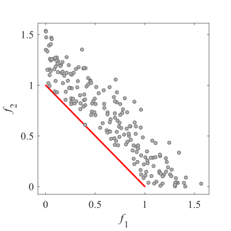Initial population on the MaF1|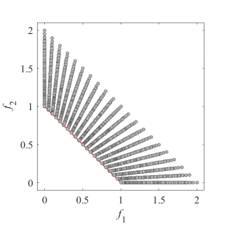Grid Points on the MaF1|
|:-:|:-:|:-:|
|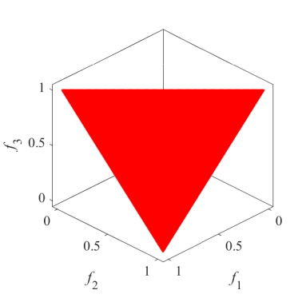Pareto Front on the MaF1|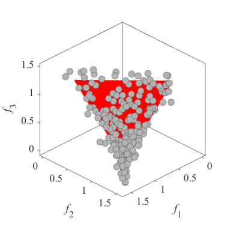Initial population on the MaF1|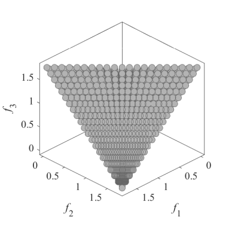Grid Points on the MaF1|
|Pareto Front on the MaF2|Initial population on the MaF2|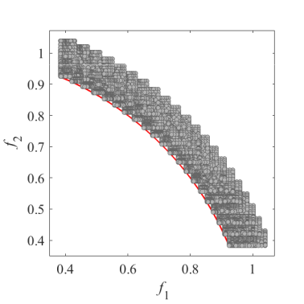Grid Points on the MaF2|
|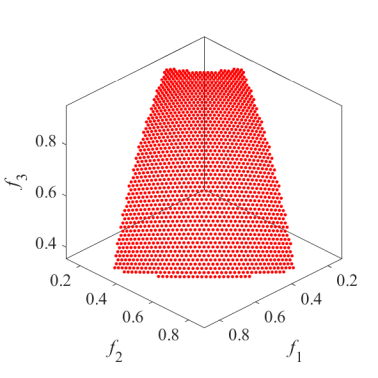Pareto Front on the MaF2|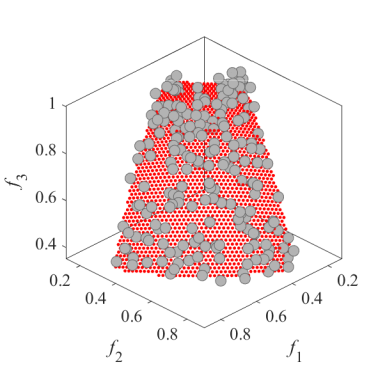Initial population on the MaF2|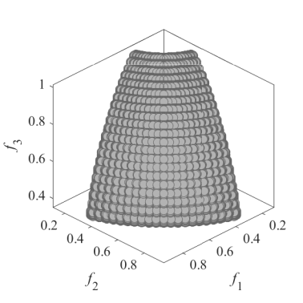Grid Points on the MaF2|
|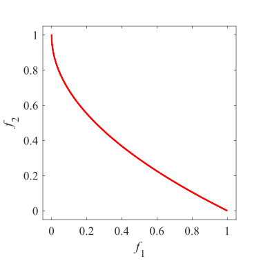Pareto Front on the MaF3|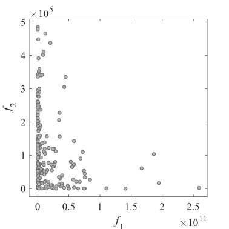Initial population on the MaF3|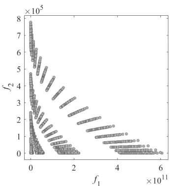Grid Points on the MaF3|
|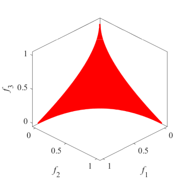Pareto Front on the MaF3|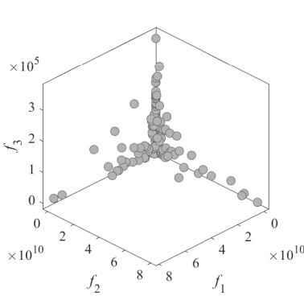Initial population on the MaF3|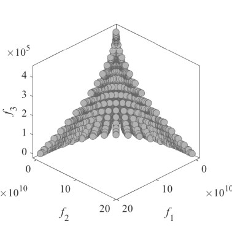Grid Points on the MaF3|
|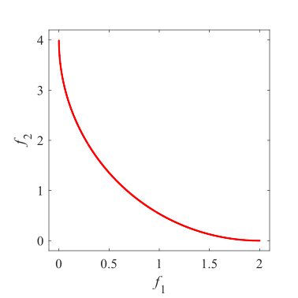Pareto Front on the MaF4|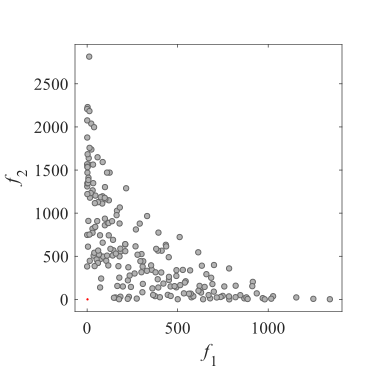Initial population on the MaF4|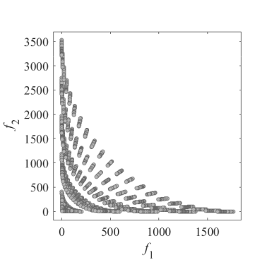Grid Points on the MaF4|
|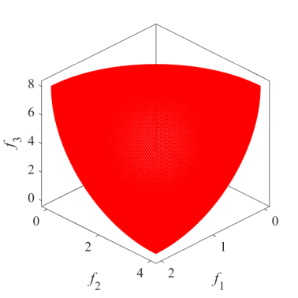Pareto Front on the MaF4|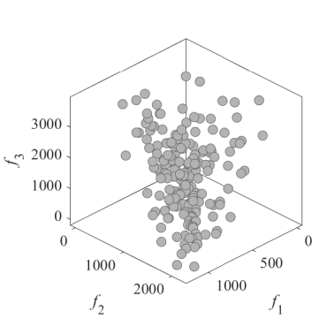Initial population on the MaF4|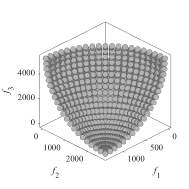Grid Points on the MaF4|
|Pareto Front on the MaF5|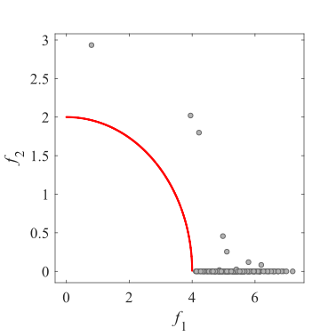Initial population on the MaF5|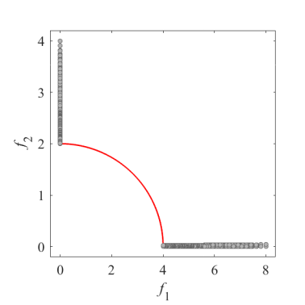Grid Points on the MaF5|
|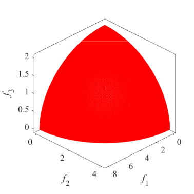Pareto Front on the MaF5|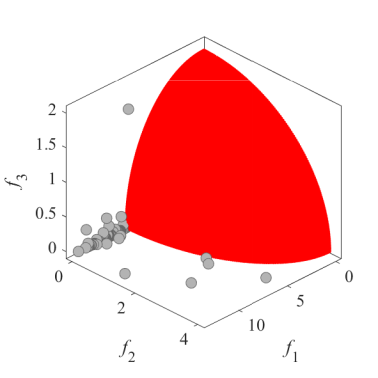Initial population on the MaF5|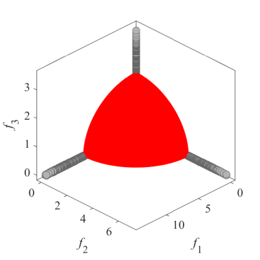Grid Points on the MaF5|
|Pareto Front on the MaF6|Initial population on the MaF6|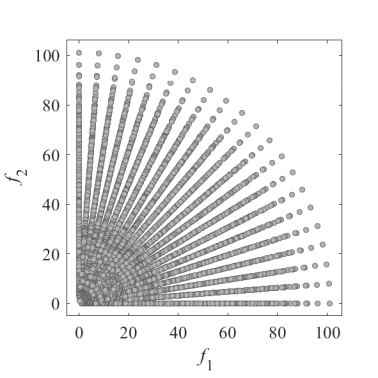Grid Points on the MaF6|
|Pareto Front on the MaF6|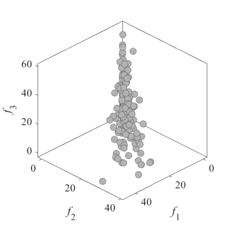Initial population on the MaF6|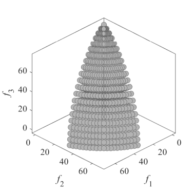Grid Points on the MaF6|
|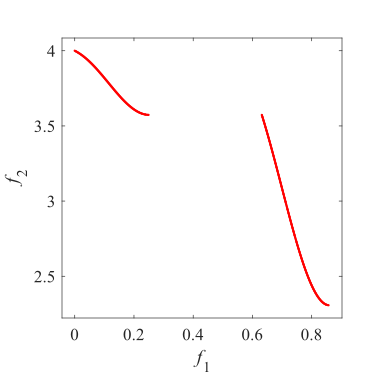Pareto Front on the MaF7|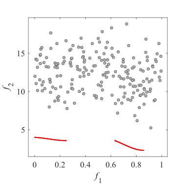Initial population on the MaF7|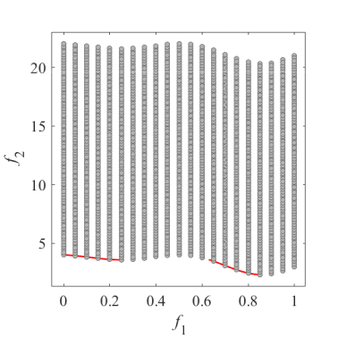Grid Points on the MaF7|
|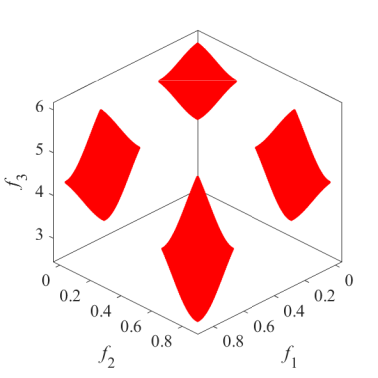Pareto Front on the MaF7|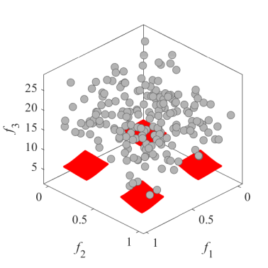Initial population on the MaF7|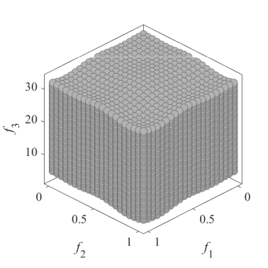Grid Points on the MaF7|
|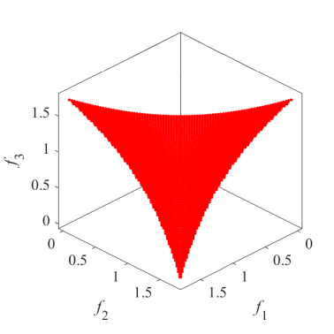Pareto Front on the MaF8|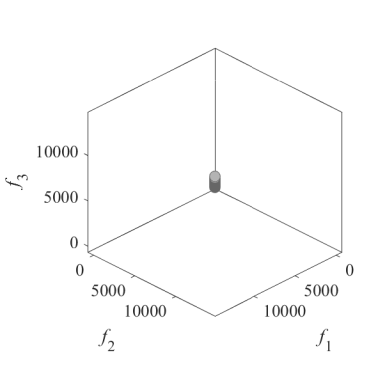Initial population on the MaF8|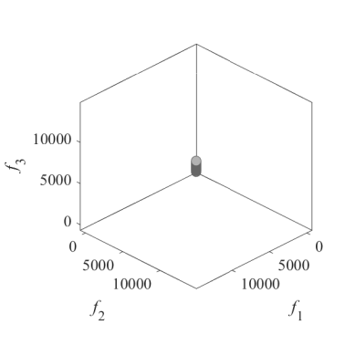Grid Points on the MaF8|
|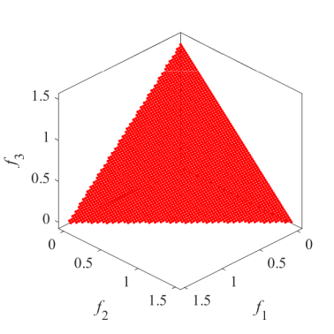Pareto Front on the MaF9|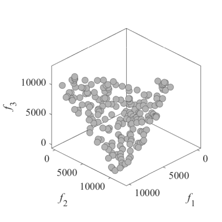Initial population on the MaF9|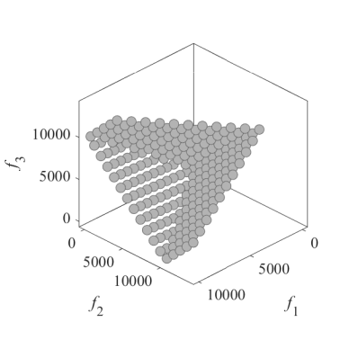Grid Points on the MaF9|
|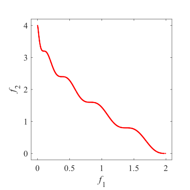Pareto Front on the MaF10|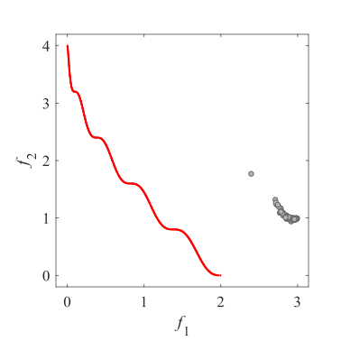Initial population on the MaF10|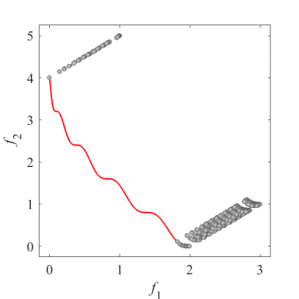Grid Points on the MaF10|
|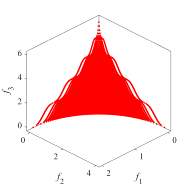Pareto Front on the MaF10|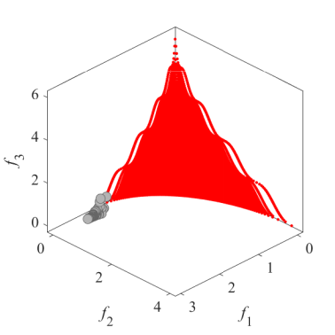Initial population on the MaF10|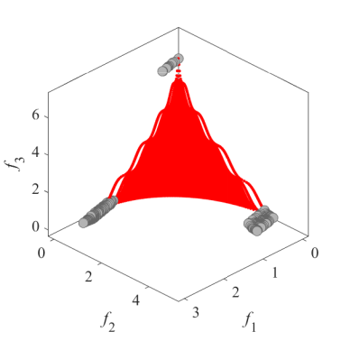Grid Points on the MaF10|
|Pareto Front on the MaF11|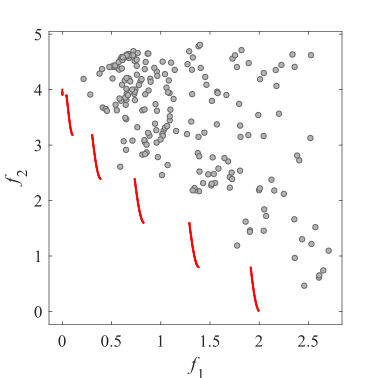Initial population on the MaF11|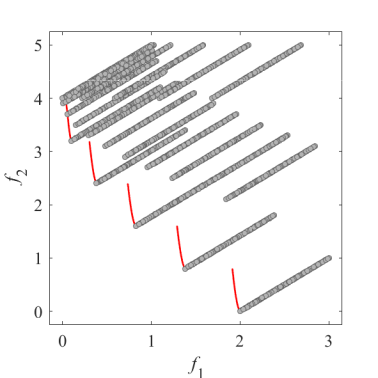Grid Points on the MaF11|
|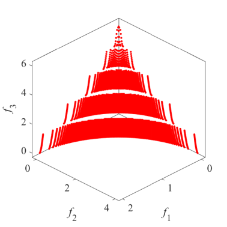Pareto Front on the MaF11|Initial population on the MaF11|Grid Points on the MaF11|
|Pareto Front on the MaF12|Initial population on the MaF12|Grid Points on the MaF12|
|Pareto Front on the MaF12|Initial population on the MaF12|Grid Points on the MaF12|
|Pareto Front on the MaF13|Initial population on the MaF13|Grid Points on the MaF13|
|Pareto Front on the MaF13|Initial population on the MaF13|Grid Points on the MaF13|
|Pareto Front on the MaF14|Initial population on the MaF14|Grid Points on the MaF14|
|Pareto Front on the MaF14|Initial population on the MaF14|Grid Points on the MaF14|
|Pareto Front on the MaF15|Initial population on the MaF15|Grid Points on the MaF15|
|Pareto Front on the MaF15|Initial population on the MaF15|Grid Points on the MaF15|
 