# SMOP
### Benchmark MOP with sparse Pareto optimal solutions
Reference  
Y. Tian, X. Zhang, C. Wang, and Y. Jin, An evolutionary algorithm for
large-scale sparse multi-objective optimization problems, IEEE
Transactions on Evolutionary Computation, 2019.
 
|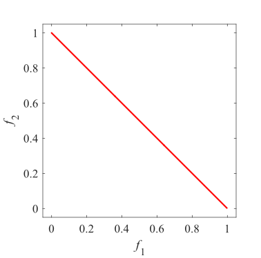Pareto Front on the SMOP1|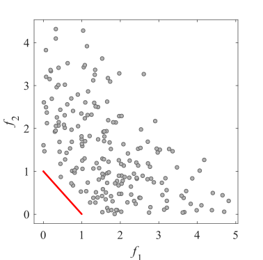Initial population on the SMOP1|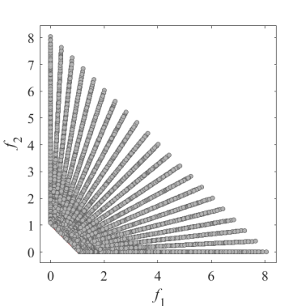Grid Points on the SMOP1|
|:-:|:-:|:-:|
|Pareto Front on the SMOP1|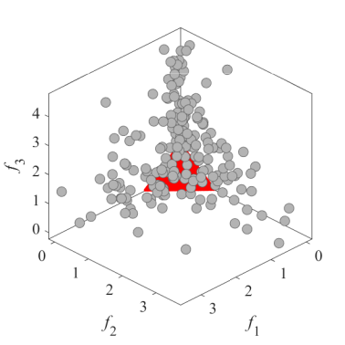Initial population on the SMOP1|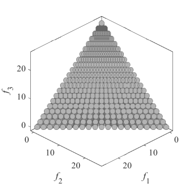Grid Points on the SMOP1|
|Pareto Front on the SMOP2|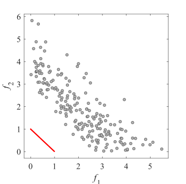Initial population on the SMOP2|Grid Points on the SMOP2|
|Pareto Front on the SMOP2|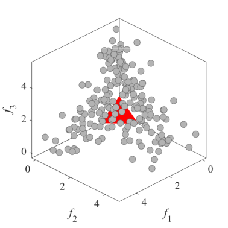Initial population on the SMOP2|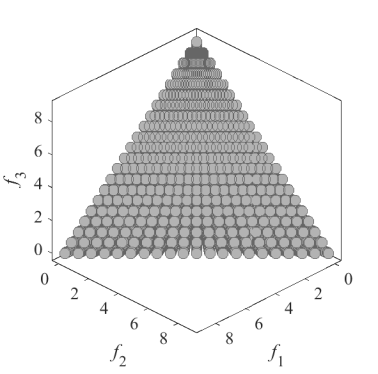Grid Points on the SMOP2|
|Pareto Front on the SMOP3|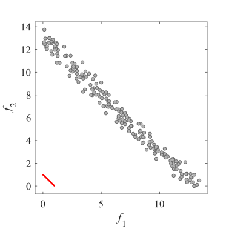Initial population on the SMOP3|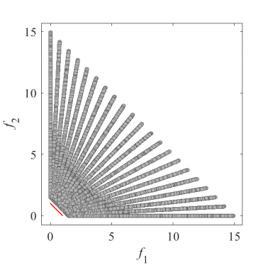Grid Points on the SMOP3|
|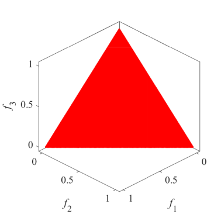Pareto Front on the SMOP3|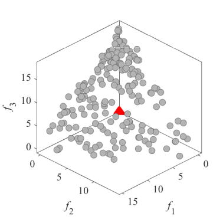Initial population on the SMOP3|Grid Points on the SMOP3|
|Pareto Front on the SMOP4|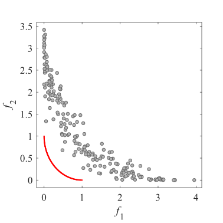Initial population on the SMOP4|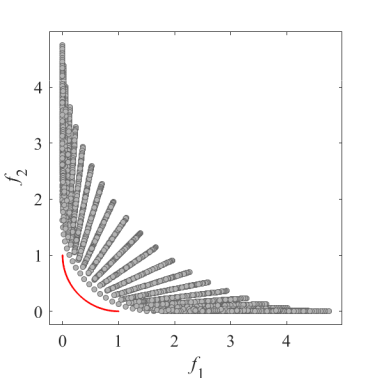Grid Points on the SMOP4|
|Pareto Front on the SMOP4|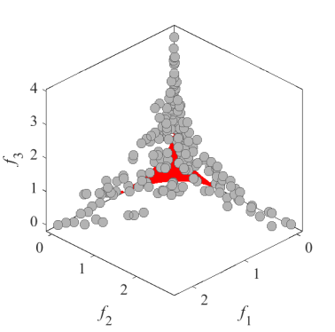Initial population on the SMOP4|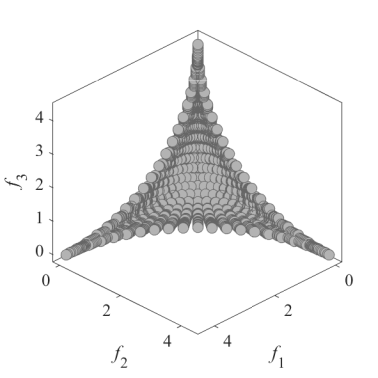Grid Points on the SMOP4|
|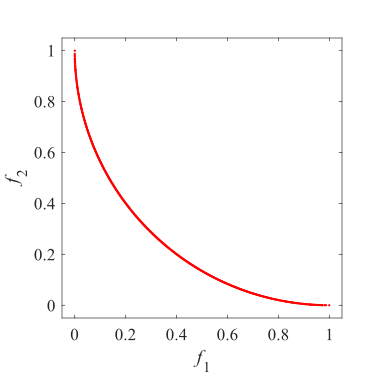Pareto Front on the SMOP5|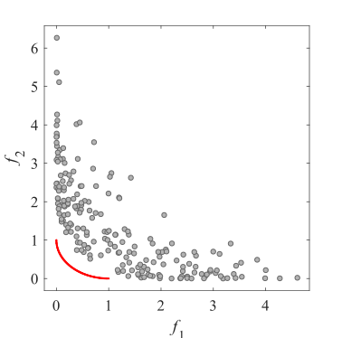Initial population on the SMOP5|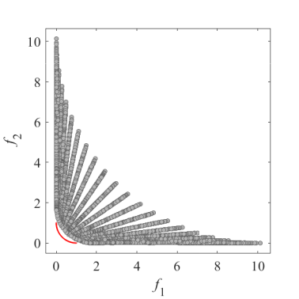Grid Points on the SMOP5|
|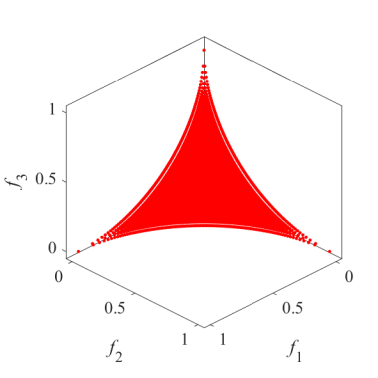Pareto Front on the SMOP5|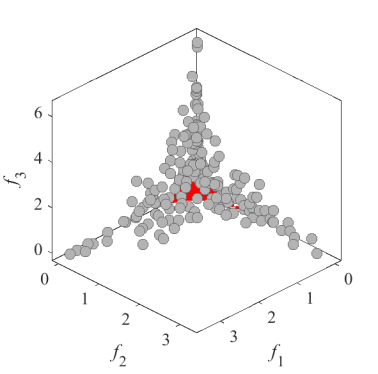Initial population on the SMOP5|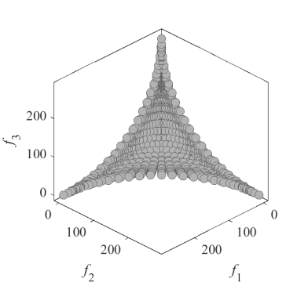Grid Points on the SMOP5|
|Pareto Front on the SMOP6|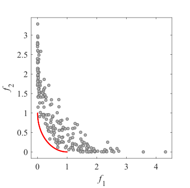Initial population on the SMOP6|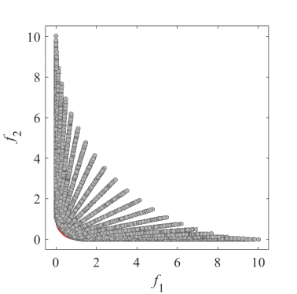Grid Points on the SMOP6|
|Pareto Front on the SMOP6|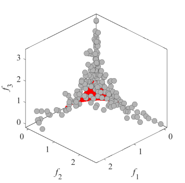Initial population on the SMOP6|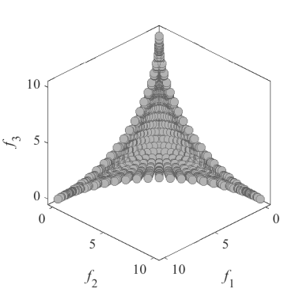Grid Points on the SMOP6|
|Pareto Front on the SMOP7|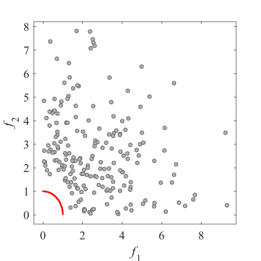Initial population on the SMOP7|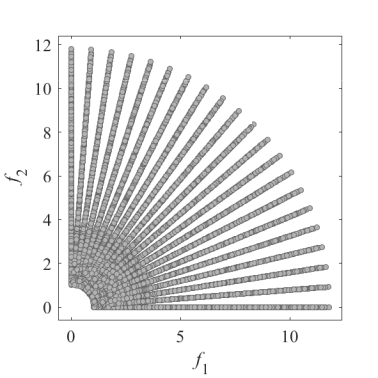Grid Points on the SMOP7|
|Pareto Front on the SMOP7|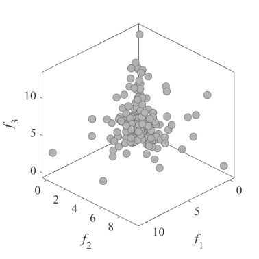Initial population on the SMOP7|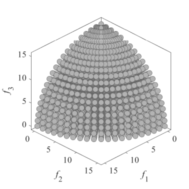Grid Points on the SMOP7|
|Pareto Front on the SMOP8|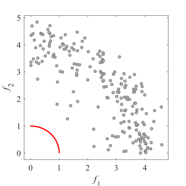Initial population on the SMOP8|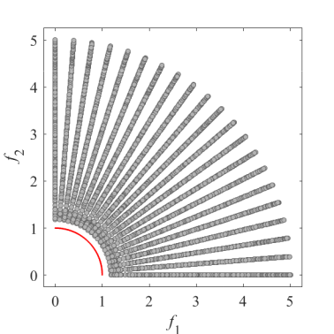Grid Points on the SMOP8|
|Pareto Front on the SMOP8|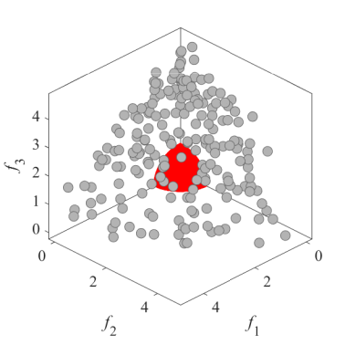Initial population on the SMOP8|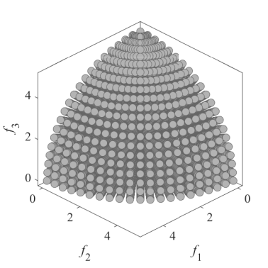Grid Points on the SMOP8|
