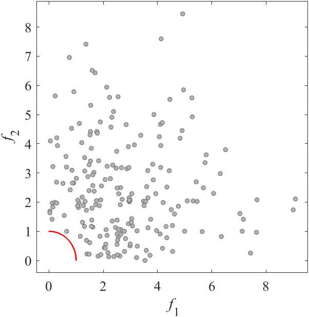
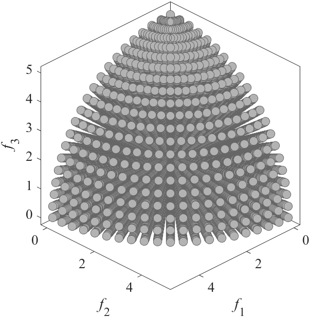

# SMOP: Benchmark MOP with sparse Pareto optimal solutions
Reference  
Y. Tian, X. Zhang, C. Wang, and Y. Jin, An evolutionary algorithm for large-scale sparse multi-objective optimization problems, IEEE Transactions on Evolutionary Computation, 2019, 24(2): 380-393.

||||
|:-:|:-:|:-:|
||||
|Pareto Front on the SMOP1 (_M_=2)|Random points on the SMOP1 (_M_=2)|Grid Points on the SMOP1 (_M_=2)|
||||
|Pareto Front on the SMOP1 (_M_=3)|Random points on the SMOP1 (_M_=3)|Grid Points on the SMOP1 (_M_=3)|
||||
|Pareto Front on the SMOP2 (_M_=2)|Random points on the SMOP2 (_M_=2)|Grid Points on the SMOP2 (_M_=2)|
||||
|Pareto Front on the SMOP2 (_M_=3)|Random points on the SMOP2 (_M_=3)|Grid Points on the SMOP2 (_M_=3)|
||||
|Pareto Front on the SMOP3 (_M_=2)|Random points on the SMOP3 (_M_=2)|Grid Points on the SMOP3 (_M_=2)|
||||
|Pareto Front on the SMOP3 (_M_=3)|Random points on the SMOP3 (_M_=3)|Grid Points on the SMOP3 (_M_=3)|
||||
|Pareto Front on the SMOP4 (_M_=2)|Random points on the SMOP4 (_M_=2)|Grid Points on the SMOP4 (_M_=2)|
||||
|Pareto Front on the SMOP4 (_M_=3)|Random points on the SMOP4 (_M_=3)|Grid Points on the SMOP4 (_M_=3)|
||||
|Pareto Front on the SMOP5 (_M_=2)|Random points on the SMOP5 (_M_=2)|Grid Points on the SMOP5 (_M_=2)|
||||
|Pareto Front on the SMOP5 (_M_=3)|Random points on the SMOP5 (_M_=3)|Grid Points on the SMOP5 (_M_=3)|
||||
|Pareto Front on the SMOP6 (_M_=2)|Random points on the SMOP6 (_M_=2)|Grid Points on the SMOP6 (_M_=2)|
||||
|Pareto Front on the SMOP6 (_M_=3)|Random points on the SMOP6 (_M_=3)|Grid Points on the SMOP6 (_M_=3)|
||||
|Pareto Front on the SMOP7 (_M_=2)|Random points on the SMOP7 (_M_=2)|Grid Points on the SMOP7 (_M_=2)|
||||
|Pareto Front on the SMOP7 (_M_=3)|Random points on the SMOP7 (_M_=3)|Grid Points on the SMOP7 (_M_=3)|
||||
|Pareto Front on the SMOP8 (_M_=2)|Random points on the SMOP8 (_M_=2)|Grid Points on the SMOP8 (_M_=2)|
||||
|Pareto Front on the SMOP8 (_M_=3)|Random points on the SMOP8 (_M_=3)|Grid Points on the SMOP8 (_M_=3)|
