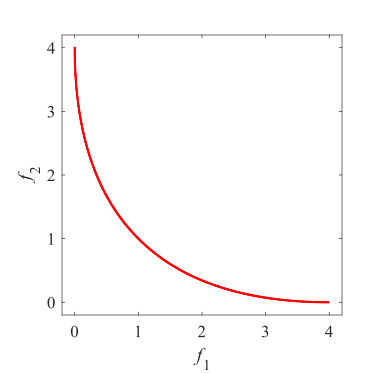
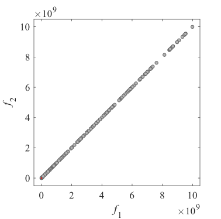
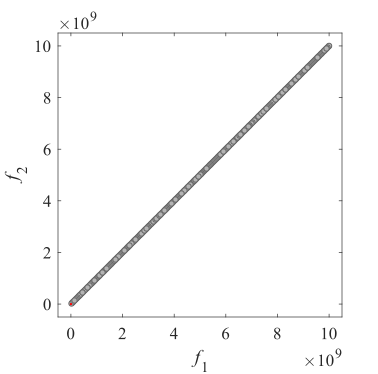
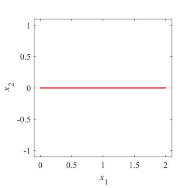
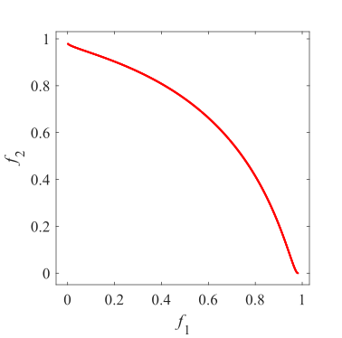
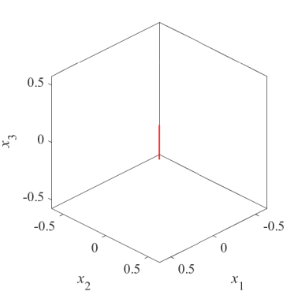
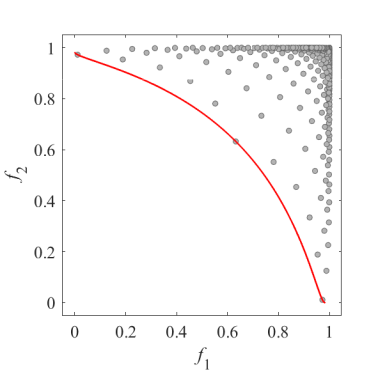

# TMOP
### Traditional benchmark MOP
Reference  
Coello, Carlos A. Coello, Gary B. Lamont, and David A. Van Veldhuizen,
Evolutionary algorithms for solving multi-objective problems, 2007, 5.
 
|Pareto Front on the TMOP1|Initial population on the TMOP1|Grid Points on the TMOP1|
|:-:|:-:|:-:|
|Pareto Set on the TMOP1|coming soon|Grid Points on the TMOP1|
|Pareto Front on the TMOP2|Pareto Set on the TMOP2|Grid Points on the TMOP2|Grid Points on the TMOP2|