# TMOP
### Traditional benchmark MOP
Reference  
Coello, Carlos A. Coello, Gary B. Lamont, and David A. Van Veldhuizen,
Evolutionary algorithms for solving multi-objective problems, 2007, 5.
 
|Pareto Front on the ZDT1|Initial population on the ZDT1|Grid Points on the ZDT1|
|:-:|:-:|:-:|
|Pareto Front on the ZDT2|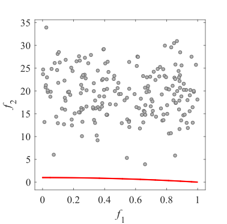Initial population on the ZDT2|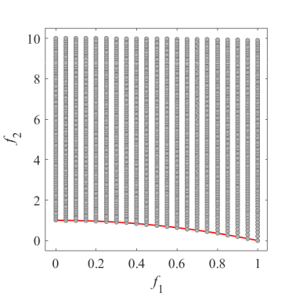Grid Points on the ZDT2|
|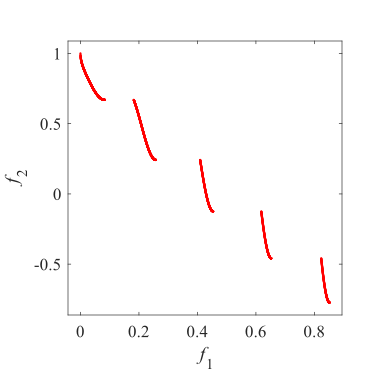Pareto Front on the ZDT3|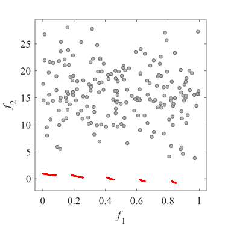Initial population on the ZDT3|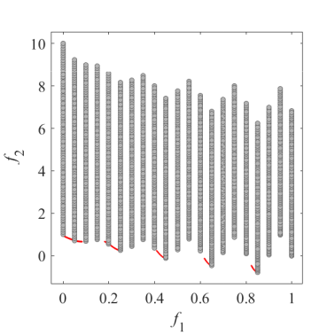Grid Points on the ZDT3|
|Pareto Front on the ZDT4|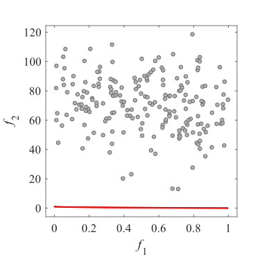Initial population on the ZDT4|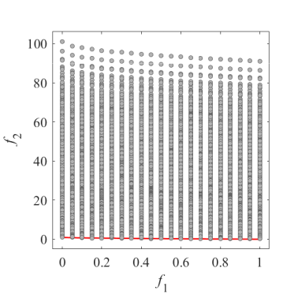Grid Points on the ZDT4|
|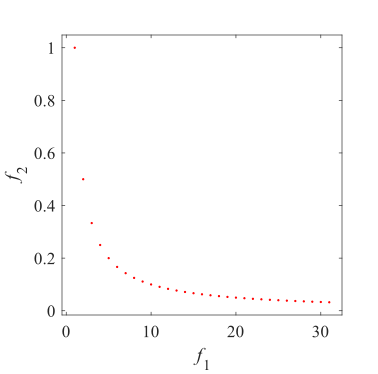Pareto Front on the ZDT5|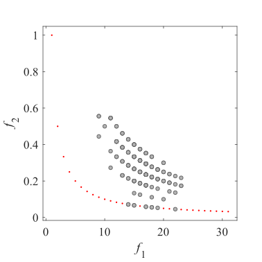Initial population on the ZDT5|ZDT5 have binary encoding decision variables. I have no image.|
|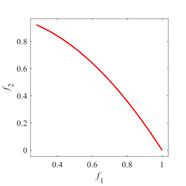Pareto Front on the ZDT6|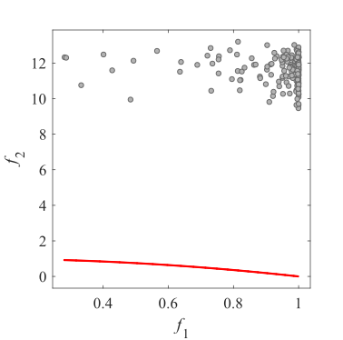Initial population on the ZDT6|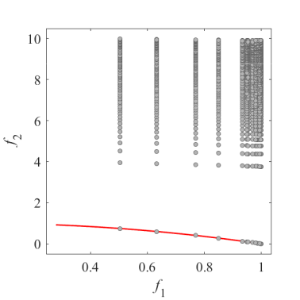Grid Points on the ZDT6|
