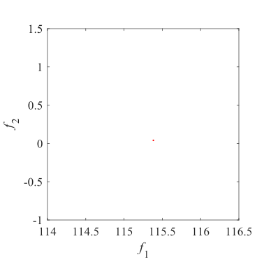
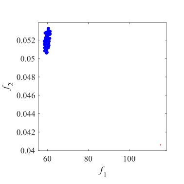
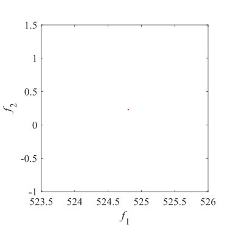
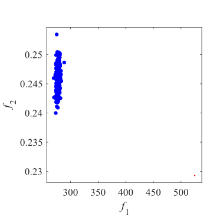
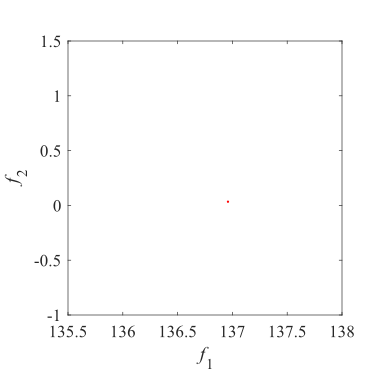
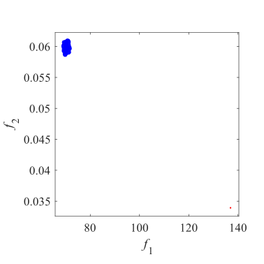
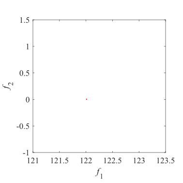
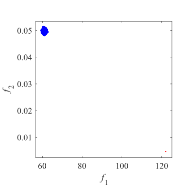
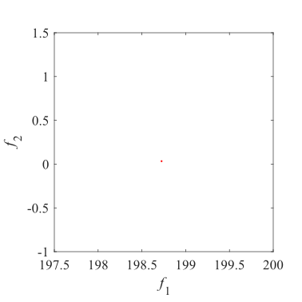
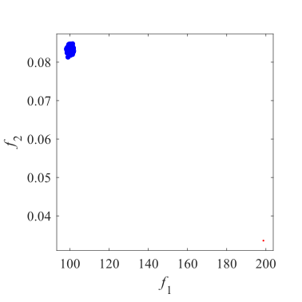

# TREE  
### The time-varying ratio error estimation problems  
Reference  
C. He, R. Cheng, C. Zhang, Y. Tian, Q. Chen, and X. Yao, Evolutionary
large-scale multiobjective optimization for ratio error estimation of
voltage transformers, IEEE Transactions on Evolutionary Computation,
2020.

|Pareto Front on the TREE1|Initial population on the TREE1|TREE have too many decision variables.I have no image.|
|:-:|:-:|:-:|
|Pareto Front on the TREE2|Initial population on the TREE2|TREE have too many decision variables.I have no image.|
|Pareto Front on the TREE3|Initial population on the TREE3|TREE have too many decision variables.I have no image.|
|Pareto Front on the TREE4|Initial population on the TREE4|TREE have too many decision variables.I have no image.|
|Pareto Front on the TREE5|Initial population on the TREE5|TREE have too many decision variables.I have no image.|
|Pareto Front on the TREE6|Initial population on the TREE6|TREE have too many decision variables.I have no image.|
