# UF
### Unconstrained benchmark MOP
Reference  
Q. Zhang, A. Zhou, S. Zhao, P. N. Suganthan, W. Liu, and S. Tiwari,
Multiobjective optimization test instances for the CEC 2009 special
session and competition, School of CS & EE, University of Essex, Working
Report CES-487, 2009.
 
|Pareto Front on the UF1|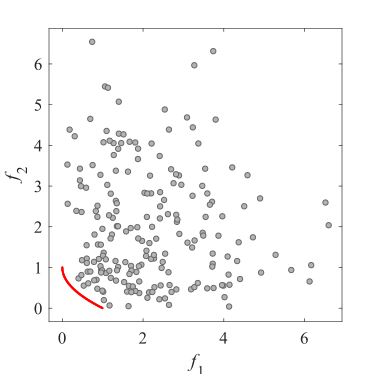Initial population on the UF1|Grid Points on the UF1|
|:-:|:-:|:-:|
|Pareto Front on the UF2|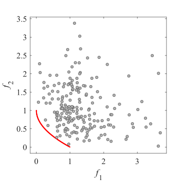Initial population on the UF2|Grid Points on the UF2|
|Pareto Front on the UF3|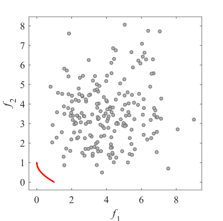Initial population on the UF3|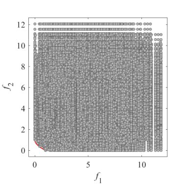Grid Points on the UF3|
|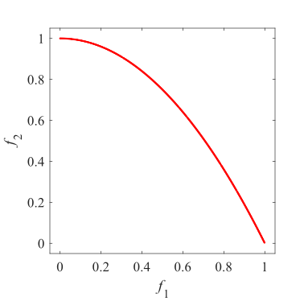Pareto Front on the UF4|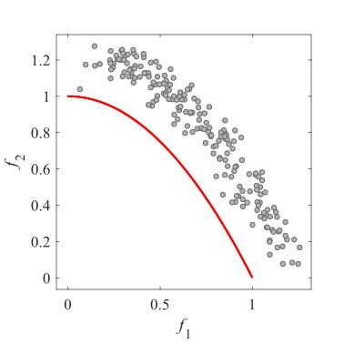Initial population on the UF4|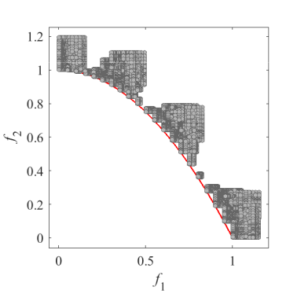Grid Points on the UF4|
|Pareto Front on the UF5|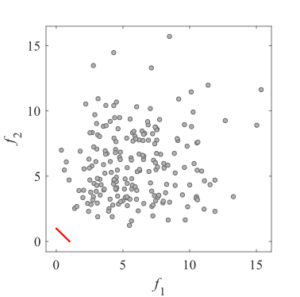Initial population on the UF5|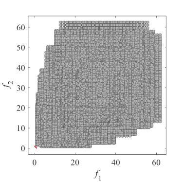Grid Points on the UF5|
|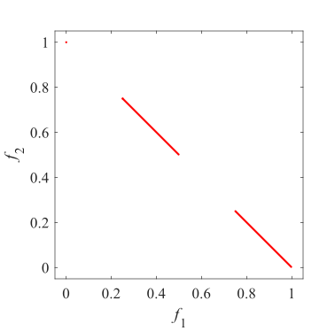Pareto Front on the UF6|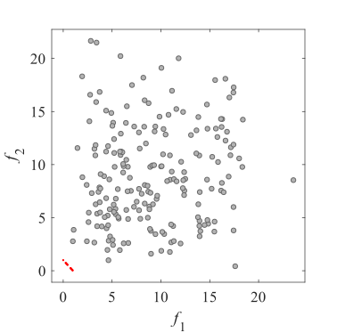Initial population on the UF6|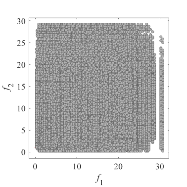Grid Points on the UF6|
|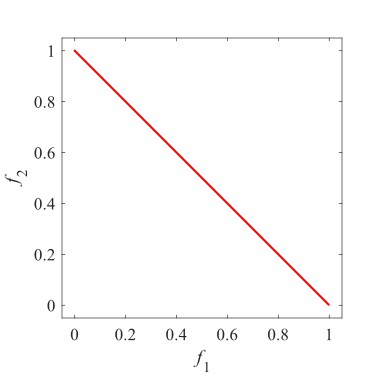Pareto Front on the UF7|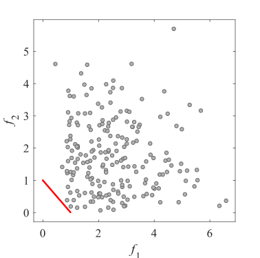Initial population on the UF7|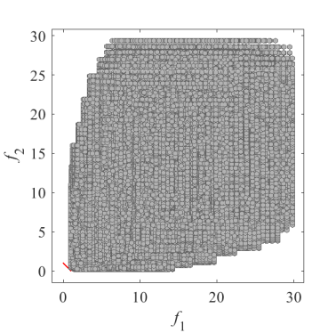Grid Points on the UF7|
|Pareto Front on the UF8|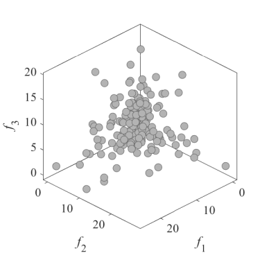Initial population on the UF8|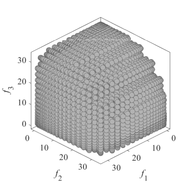Grid Points on the UF8|
|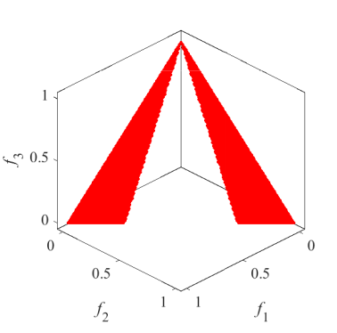Pareto Front on the UF9|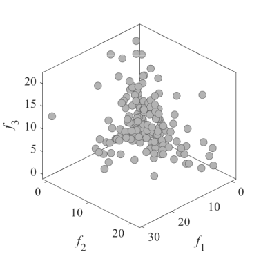Initial population on the UF9|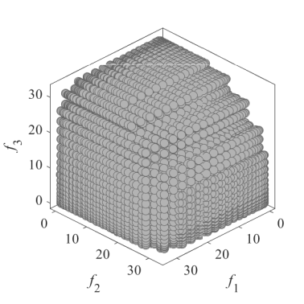Grid Points on the UF9|
|Pareto Front on the UF10|Initial population on the UF10|Grid Points on the UF10|

UF11 and UF12 have 5 objectives. I have no image.
