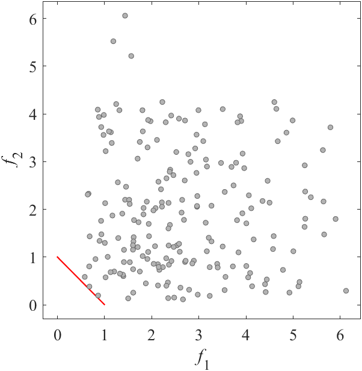
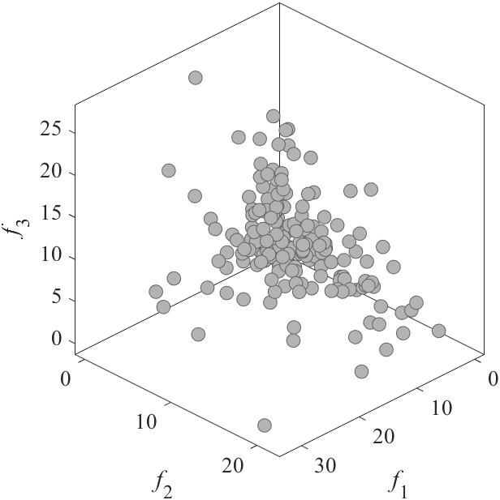

# UF: Unconstrained benchmark MOP
Reference  
Q. Zhang, A. Zhou, S. Zhao, P. N. Suganthan, W. Liu, and S. Tiwari, Multiobjective optimization test instances for the CEC 2009 special session and competition, School of CS & EE, University of Essex, Working Report CES-487, 2009.

||||
|:-:|:-:|:-:|
||||
|Pareto Front on the UF1 (_M_=2)|Random points on the UF1 (_M_=2)|Grid Points on the UF1 (_M_=2)|
||||
|Pareto Front on the UF2 (_M_=2)|Random points on the UF2 (_M_=2)|Grid Points on the UF2 (_M_=2)|
||||
|Pareto Front on the UF3 (_M_=2)|Random points on the UF3 (_M_=2)|Grid Points on the UF3 (_M_=2)|
||||
|Pareto Front on the UF4 (_M_=2)|Random points on the UF4 (_M_=2)|Grid Points on the UF4 (_M_=2)|
||||
|Pareto Front on the UF5 (_M_=2)|Random points on the UF5 (_M_=2)|Grid Points on the UF5 (_M_=2)|
||||
|Pareto Front on the UF6 (_M_=2)|Random points on the UF6 (_M_=2)|Grid Points on the UF6 (_M_=2)|
||||
|Pareto Front on the UF7 (_M_=2)|Random points on the UF7 (_M_=2)|Grid Points on the UF7 (_M_=2)|
||||
|Pareto Front on the UF8 (_M_=3)|Random points on the UF8 (_M_=3)|Grid Points on the UF8 (_M_=3)|
||||
|Pareto Front on the UF9 (_M_=3)|Random points on the UF9 (_M_=3)|Grid Points on the UF9 (_M_=3)|
||||
|Pareto Front on the UF10 (_M_=3)|Random points on the UF10 (_M_=3)|Grid Points on the UF10 (_M_=3)|

UF11 and UF12 have 5 objectives. I have no image.
