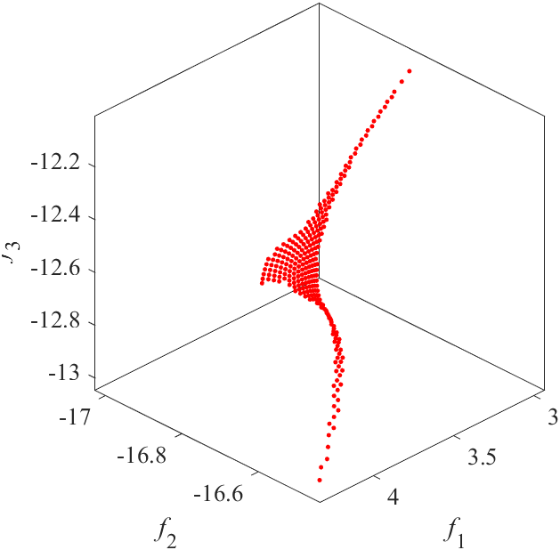
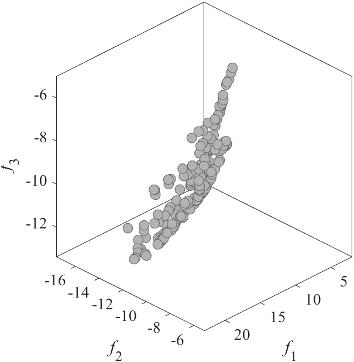
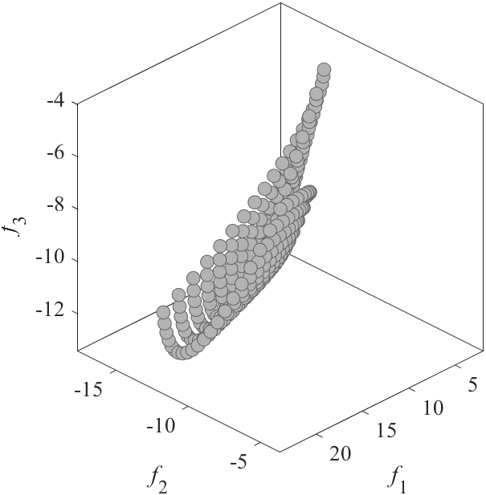
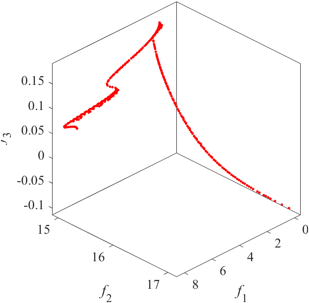
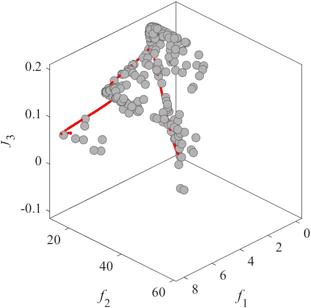
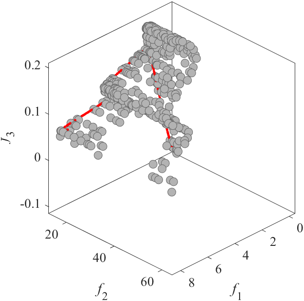
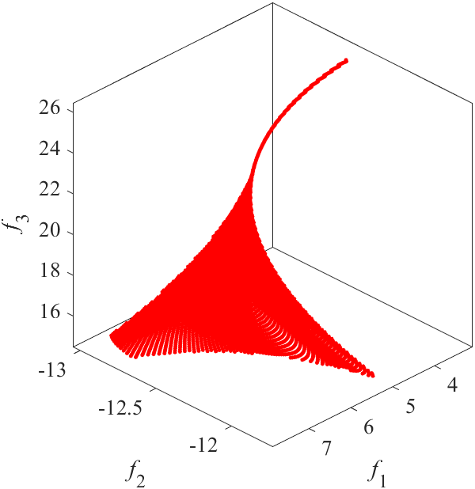
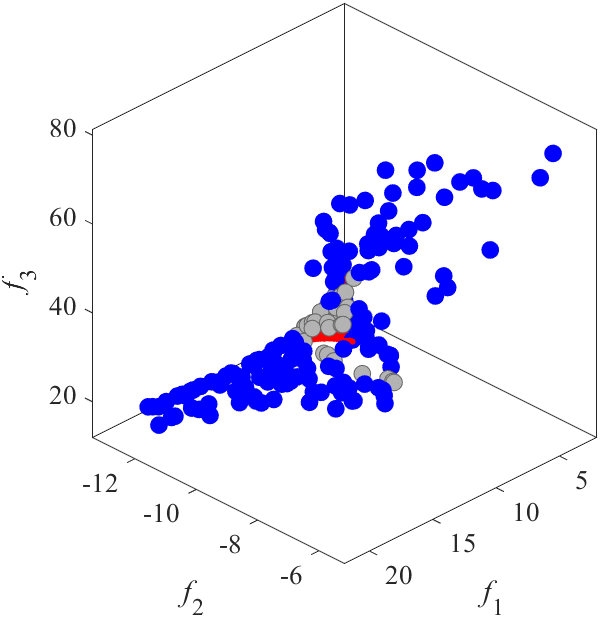
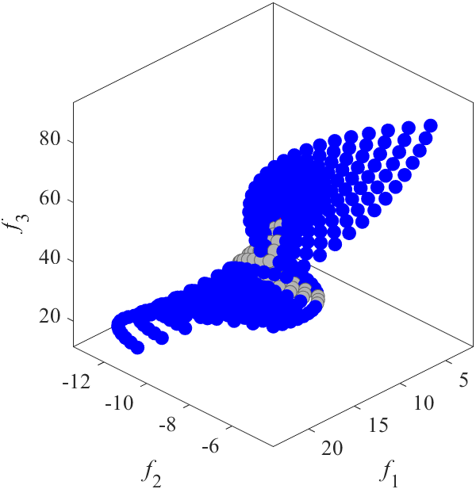

# VNT: Benchmark MOP proposed by Viennet
Reference  
R. Viennet, C. Fonteix, and I. Marc, Multicriteria optimization using a genetic algorithm for determining a Pareto set, International Journal of Systems Science, 1996, 27(2): 255-260.

||||
|:-:|:-:|:-:|
|Pareto Front on the VNT1 (_M_=3)|Random points on the VNT1 (_M_=3)|Grid Points on the VNT1 (_M_=3)|
||||
|Pareto Front on the VNT2 (_M_=3)|Random points on the VNT2 (_M_=3)|Grid Points on the VNT2 (_M_=3)|
||||
|Pareto Front on the VNT3 (_M_=3)|Random points on the VNT3 (_M_=3)|Grid Points on the VNT3 (_M_=3)|
||||
|Pareto Front on the VNT4 (_M_=3)|Random points on the VNT4 (_M_=3)|Grid Points on the VNT4 (_M_=3)|
