# WFG
###Benchmark MOP proposed by Walking Fish Group
Reference  
S. Huband, P. Hingston, L. Barone, and L. While, A review of
multiobjective test problems and a scalable test problem toolkit, IEEE
Transactions on Evolutionary Computation, 2006, 10(5): 477-506.
 
|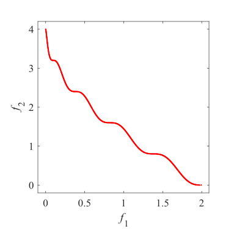Pareto Front on the WFG1|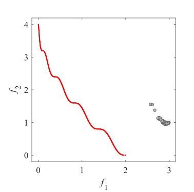Initial population on the WFG1|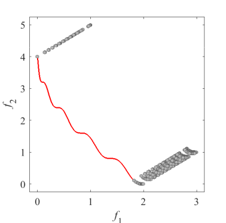Grid Points on the WFG1|
|:-:|:-:|:-:|
|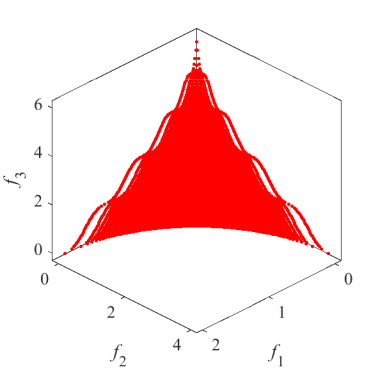Pareto Front on the WFG1|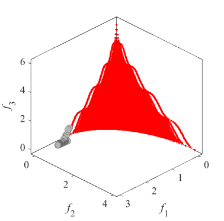Initial population on the WFG1|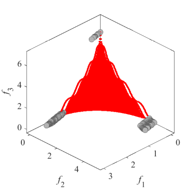Grid Points on the WFG1|
|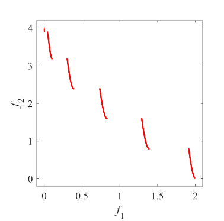Pareto Front on the WFG2|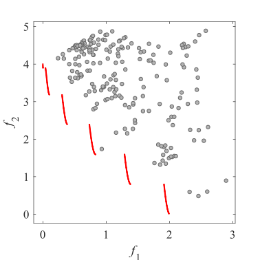Initial population on the WFG2|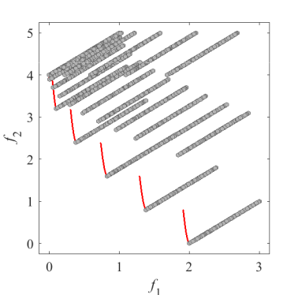Grid Points on the WFG2|
|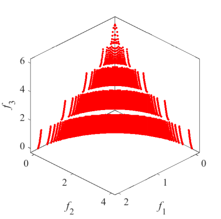Pareto Front on the WFG2|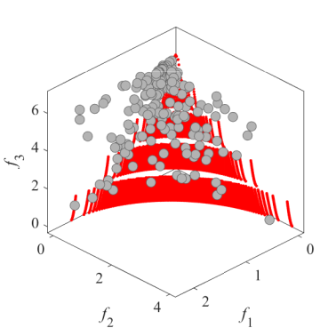Initial population on the WFG2|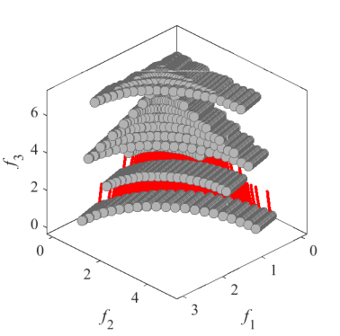Grid Points on the WFG2|
|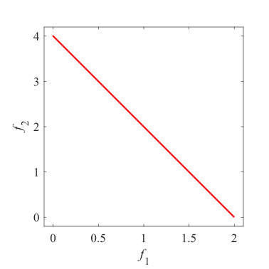Pareto Front on the WFG3|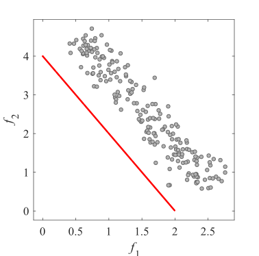Initial population on the WFG3|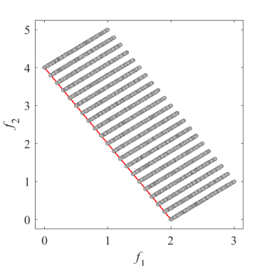Grid Points on the WFG3|
|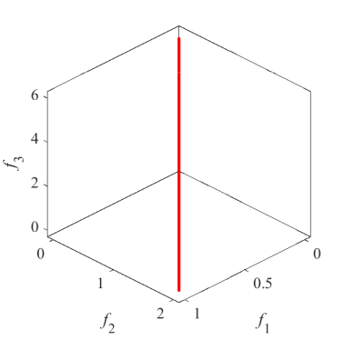Pareto Front on the WFG3|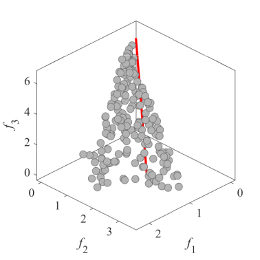Initial population on the WFG3|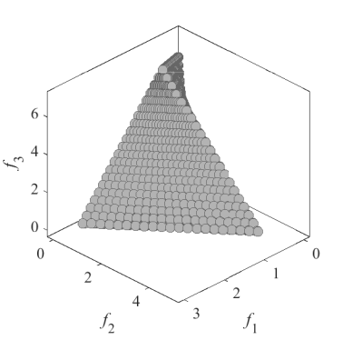Grid Points on the WFG3|
|Pareto Front on the WFG4|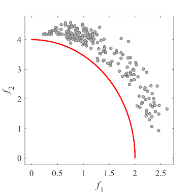Initial population on the WFG4|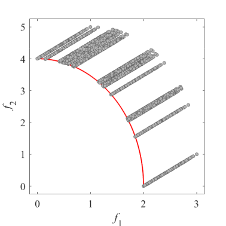Grid Points on the WFG4|
|Pareto Front on the WFG4|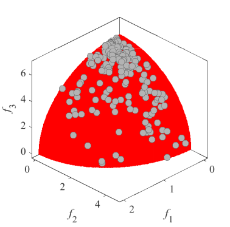Initial population on the WFG4|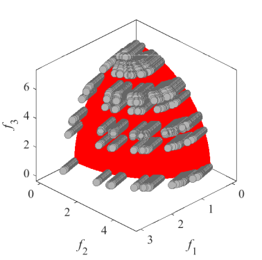Grid Points on the WFG4|
|Pareto Front on the WFG5|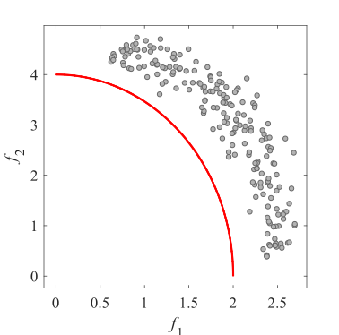Initial population on the WFG5|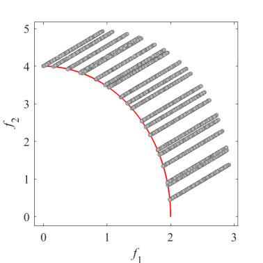Grid Points on the WFG5|
|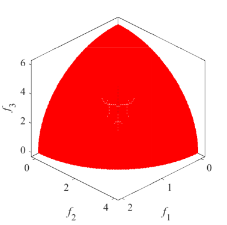Pareto Front on the WFG5|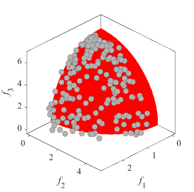Initial population on the WFG5|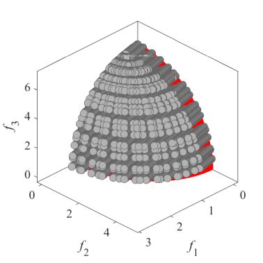Grid Points on the WFG5|
|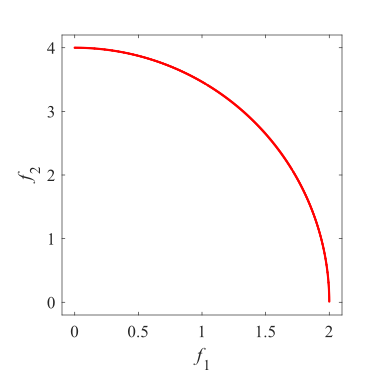Pareto Front on the WFG6|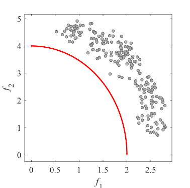Initial population on the WFG6|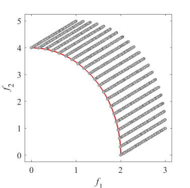Grid Points on the WFG6|
|Pareto Front on the WFG6|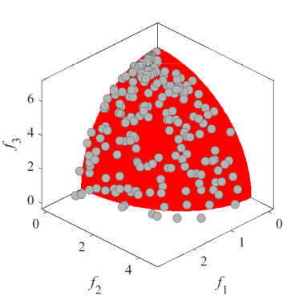Initial population on the WFG6|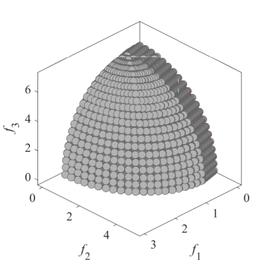Grid Points on the WFG6|
|Pareto Front on the WFG7|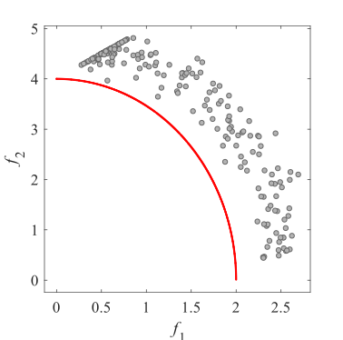Initial population on the WFG7|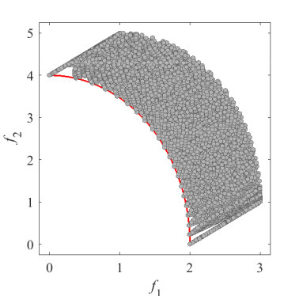Grid Points on the WFG7|
|Pareto Front on the WFG7|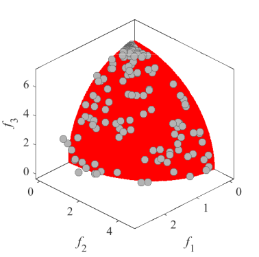Initial population on the WFG7|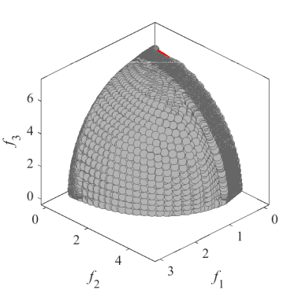Grid Points on the WFG7|
|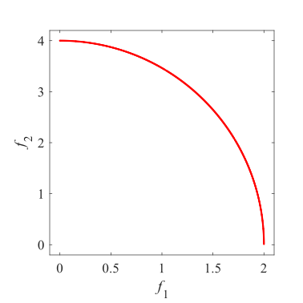Pareto Front on the WFG8|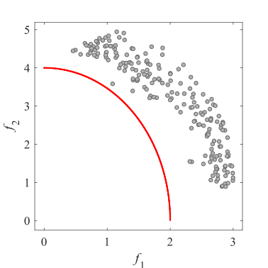Initial population on the WFG8|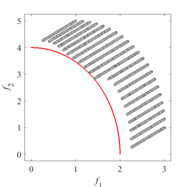Grid Points on the WFG8|
|Pareto Front on the WFG8|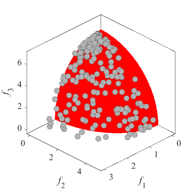Initial population on the WFG8|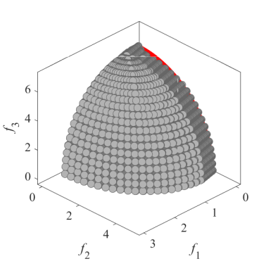Grid Points on the WFG8|
|Pareto Front on the WFG9|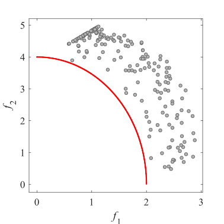Initial population on the WFG9|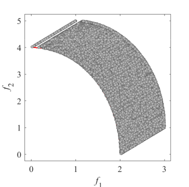Grid Points on the WFG9|
|Pareto Front on the WFG9|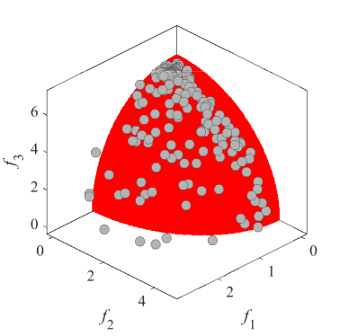Initial population on the WFG9|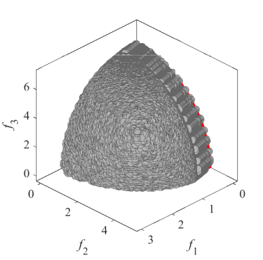Grid Points on the WFG9|
 