# ZDT: Benchmark MOP proposed by Zitzler, Deb, and Thiele
Reference  
E. Zitzler, K. Deb, and L. Thiele, Comparison of multiobjective evolutionary algorithms: Empirical results, Evolutionary computation, 2000, 8(2): 173-195.

||||
|:-:|:-:|:-:|
|Pareto Front on the ZDT1 (_M_=2)|Random points on the ZDT1 (_M_=2)|Grid Points on the ZDT1 (_M_=2)|
|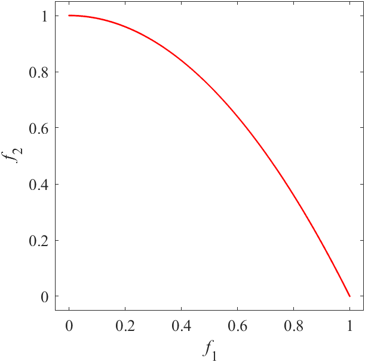|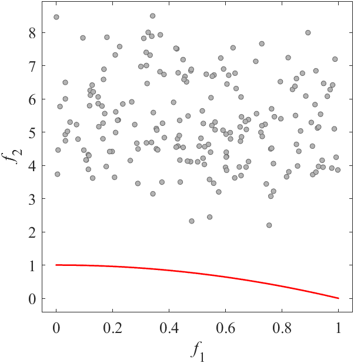|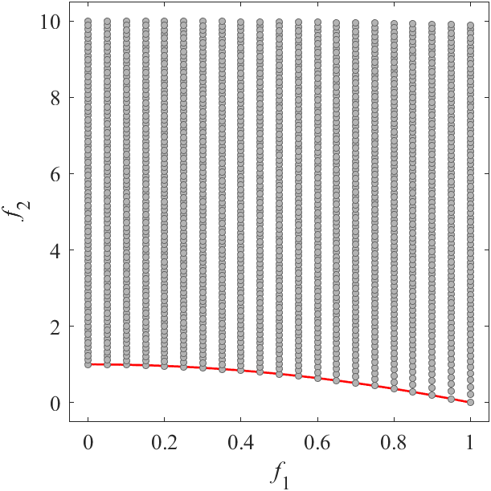|
|Pareto Front on the ZDT2 (_M_=2)|Random points on the ZDT2 (_M_=2)|Grid Points on the ZDT2 (_M_=2)|
|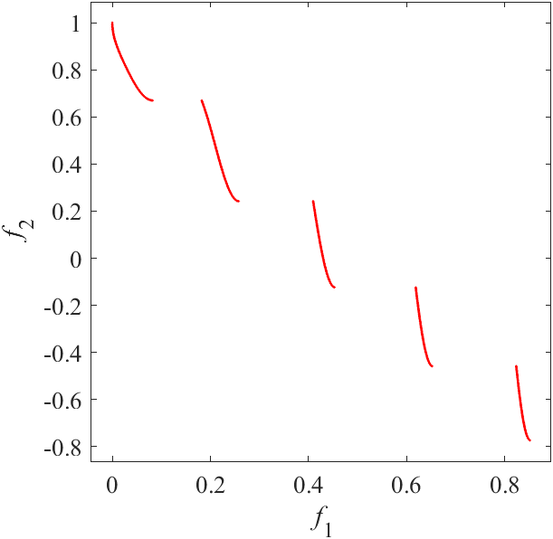|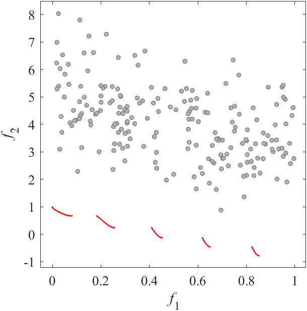|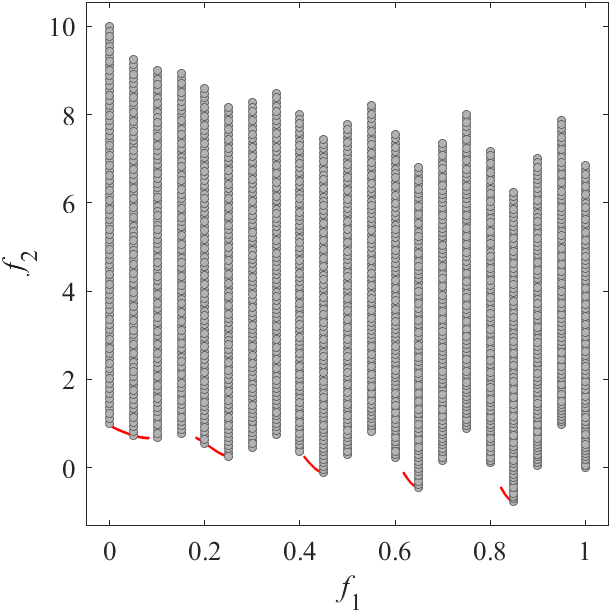|
|Pareto Front on the ZDT3 (_M_=2)|Random points on the ZDT3 (_M_=2)|Grid Points on the ZDT3 (_M_=2)|
|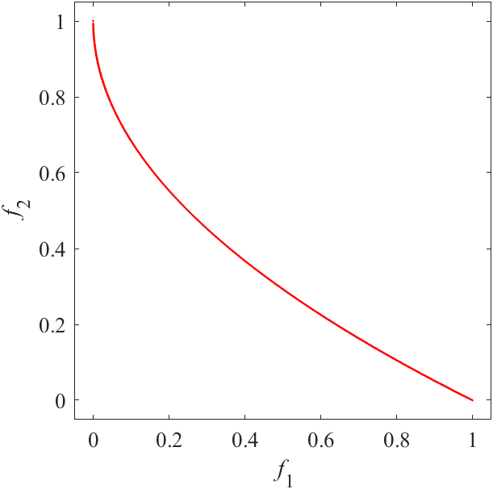|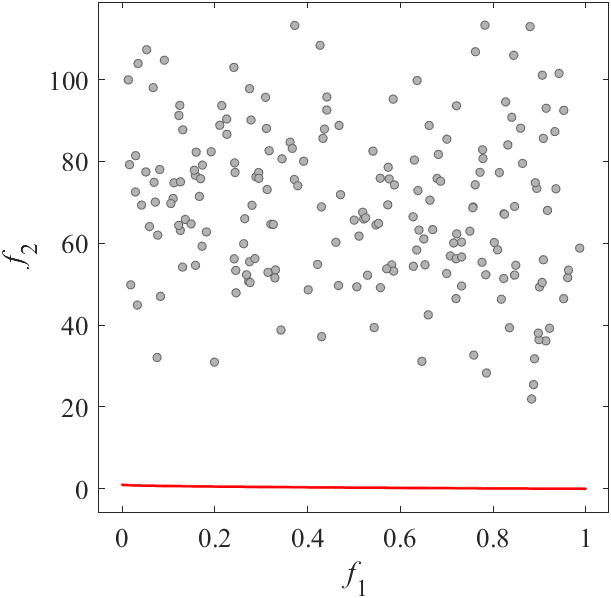|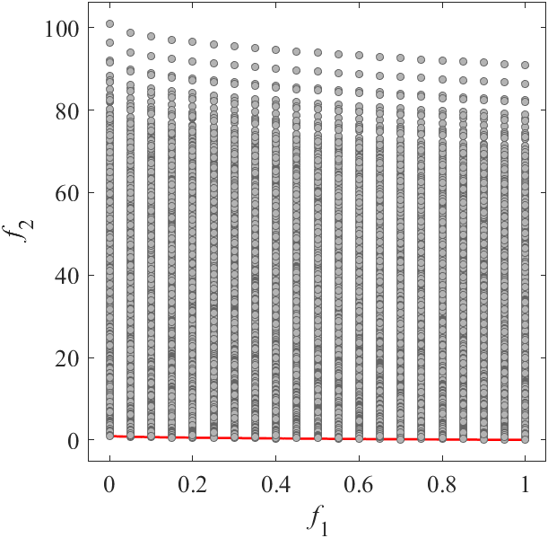|
|Pareto Front on the ZDT4 (_M_=2)|Random points on the ZDT4 (_M_=2)|Grid Points on the ZDT4 (_M_=2)|
|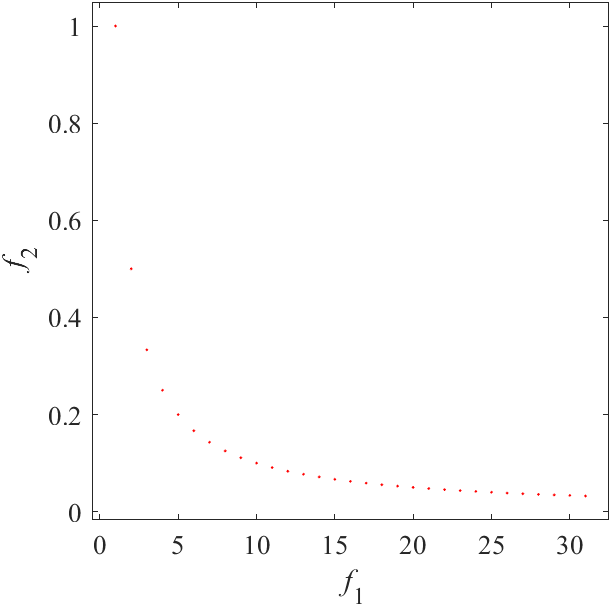|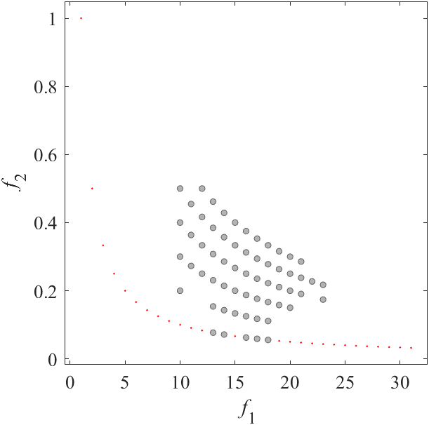|ZDT5 have 35 decision variables. I have no image.|
|Pareto Front on the ZDT5 (_M_=2)|Random points on the ZDT5 (_M_=2)|Grid Points on the ZDT5 (_M_=2)|
|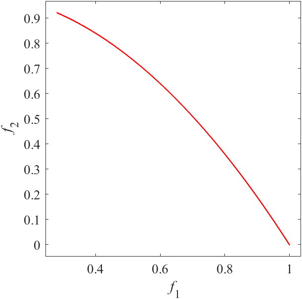|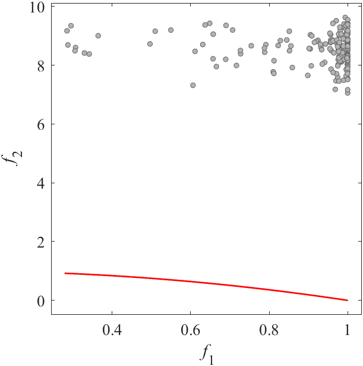|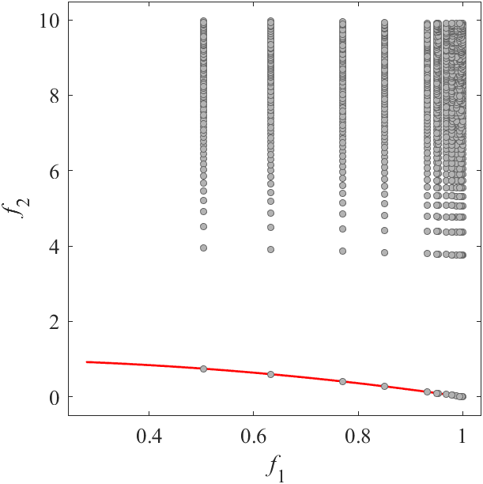|
|Pareto Front on the ZDT6 (_M_=2)|Random points on the ZDT6 (_M_=2)|Grid Points on the ZDT6 (_M_=2)|
