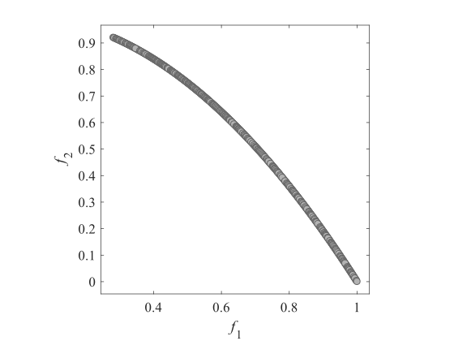

# Test_Functions_for_Multi_Objective_Optimization
test functions for optimization
## ZDT
|ZDT1|ZDT2|
|:-:|:-:|
|ZDT3|ZDT4|
|ZDT5|ZDT6|

## DTLZ
|DTLZ1 (_m_=2)|DTLZ1 (_m_=3)|
|:-:|:-:|
|DTLZ2 (_m_=2)|DTLZ2 (_m_=3)|
|DTLZ3 (_m_=2)|DTLZ3 (_m_=3)|
|DTLZ4 (_m_=2)|DTLZ4 (_m_=3)|
|DTLZ5 (_m_=2)|DTLZ5 (_m_=3)|
|DTLZ6 (_m_=2)|DTLZ6 (_m_=3)|
|DTLZ7 (_m_=2)|DTLZ7 (_m_=3)|
|DTLZ8 (_m_=2)|DTLZ8 (_m_=3)|
|DTLZ9 (_m_=2)|DTLZ9 (_m_=3)|
|DTLZ5IM (_m_=2)|DTLZ5IM (_m_=3)|
|CDTLZ2 (_m_=2)|CDTLZ2 (_m_=3)|
|C1_DTLZ1 (_m_=2)|C1_DTLZ1 (_m_=3)|
|C2_DTLZ2 (_m_=2)|C2_DTLZ2 (_m_=3)|
|C3_DTLZ4 (_m_=2)|C3_DTLZ4 (_m_=3)|
|SDTLZ1 (_m_=2)|SDTLZ1 (_m_=3)|
|SDTLZ2 (_m_=2)|SDTLZ2 (_m_=3)|
|IDTLZ1 (_m_=2)|IDTLZ1 (_m_=3)|
|IDTLZ2 (_m_=2)|IDTLZ2 (_m_=3)|

## WFG
|WFG1(_m_=2)|WFG1(_m_=3)|
|:-:|:-:|
|WFG2(_m_=2)|WFG2(_m_=3)|
|WFG3(_m_=2)|WFG3(_m_=3)|
|WFG4(_m_=2)|WFG4(_m_=3)|
|WFG5(_m_=2)|WFG5(_m_=3)|
|WFG6(_m_=2)|WFG6(_m_=3)|
|WFG7(_m_=2)|WFG7(_m_=3)|
|WFG8(_m_=2)|WFG8(_m_=3)|
|WFG9(_m_=2)|WFG9(_m_=3)|

