# Test_Functions_for_Multi_Objective_Optimization
test functions for optimization

## DTLZ
Benchmark MOP proposed by Deb, Thiele, Laumanns, and Zitzler
 
Reference
 
K. Deb, L. Thiele, M. Laumanns, and E. Zitzler, Scalable test problems
for evolutionary multiobjective optimization, Evolutionary multiobjective
Optimization. Theoretical Advances and Applications, 2005, 105-145.
 
|DTLZ1 (_m_=2)|DTLZ1 (_m_=3)|
|:-:|:-:|
|DTLZ2 (_m_=2)|DTLZ2 (_m_=3)|
|DTLZ3 (_m_=2)|DTLZ3 (_m_=3)|
|DTLZ4 (_m_=2)|DTLZ4 (_m_=3)|
|DTLZ5 (_m_=2)|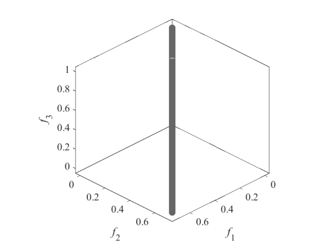DTLZ5 (_m_=3)|
|DTLZ6 (_m_=2)|DTLZ6 (_m_=3)|
|DTLZ7 (_m_=2)|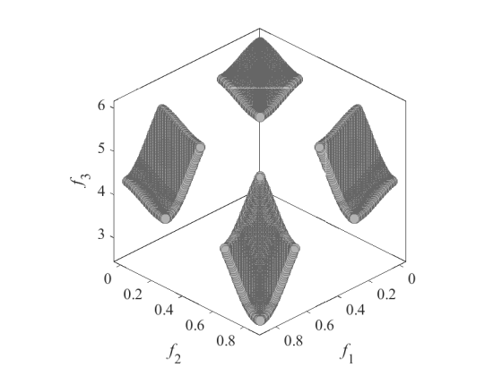DTLZ7 (_m_=3)|
|DTLZ8 (_m_=2)|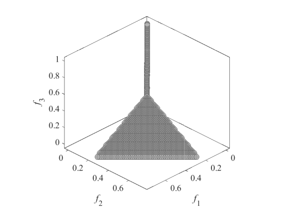DTLZ8 (_m_=3)|
|DTLZ9 (_m_=2)|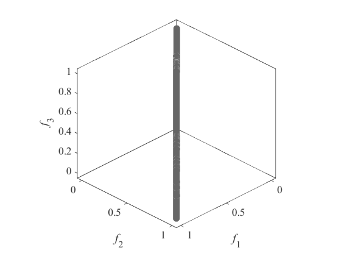DTLZ9 (_m_=3)|
 
Extended DTLZ5    I --- 2 --- Dimensionality of the true Pareto front
 
Reference
 
K. Deb and D. K. Saxena, On finding Pareto-optimal solutions through
dimensionality reduction for certain large-dimensional multi-objective
optimization problems, KanGAL Report 2005011, 2005.
 
|DTLZ5IM (_m_=2)|DTLZ5IM (_m_=3)|
|:-:|:-:|
 
Scaled DTLZ and Convex DTLZ2
 
Reference
 
K. Deb and H. Jain, An evolutionary many-objective optimization algorithm
using reference-point based non-dominated sorting approach, part I:
Solving problems with box constraints, IEEE Transactions on Evolutionary
Computation, 2014, 18(4): 577-601.
  
|SDTLZ1 (_m_=2)|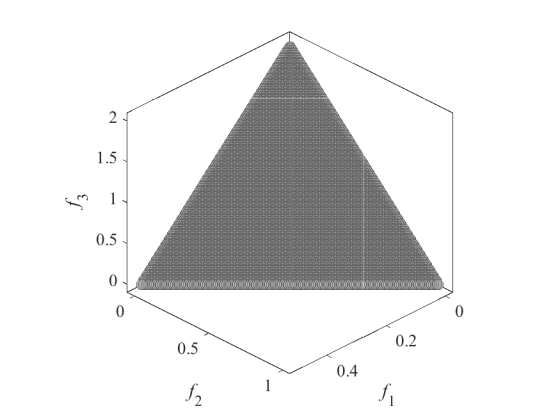SDTLZ1 (_m_=3)|
|:-:|:-:|
|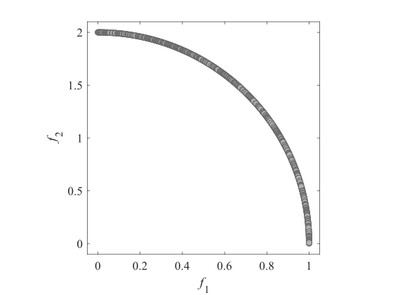SDTLZ2 (_m_=2)|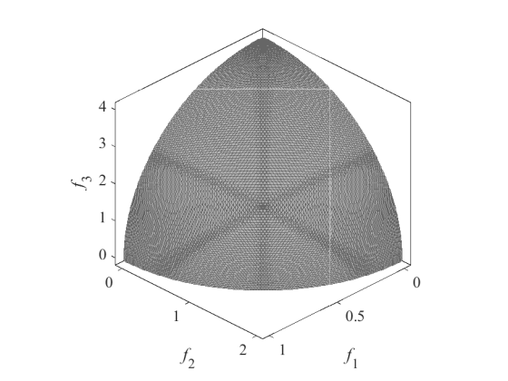SDTLZ2 (_m_=3)|
|CDTLZ2 (_m_=2)|CDTLZ2 (_m_=3)|
 
Constrained DTLZ and Inverted DTLZ
 
Reference
 
H. Jain and K. Deb, An evolutionary many-objective optimization algorithm
using reference-point based non-dominated sorting approach, part II:
Handling constraints and extending to an adaptive approach, IEEE
Transactions on Evolutionary Computation, 2014, 18(4): 602-622.
 
|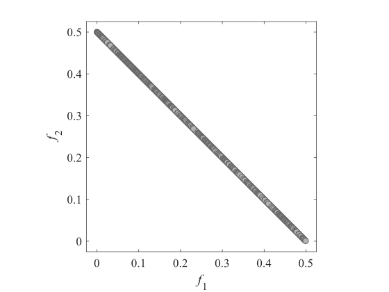C1_DTLZ1 (_m_=2)|C1_DTLZ1 (_m_=3)|
|:-:|:-:|
|C2_DTLZ2 (_m_=2)|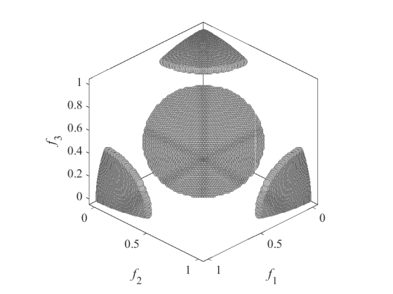C2_DTLZ2 (_m_=3)|
|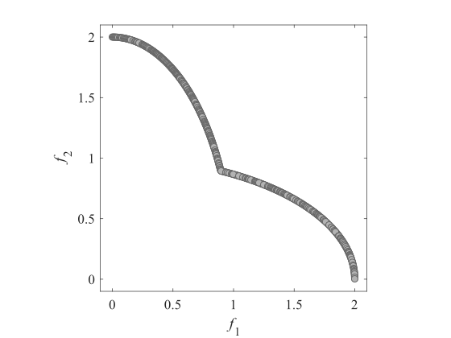C3_DTLZ4 (_m_=2)|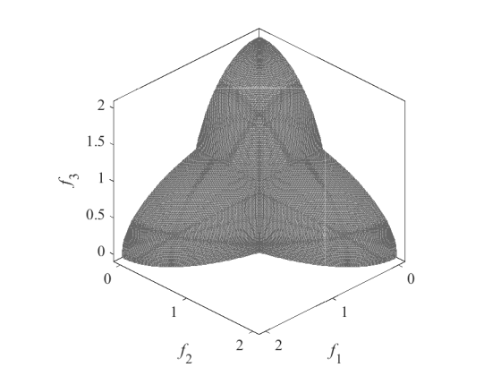C3_DTLZ4 (_m_=3)|
|IDTLZ1 (_m_=2)|IDTLZ1 (_m_=3)|
|IDTLZ2 (_m_=2)|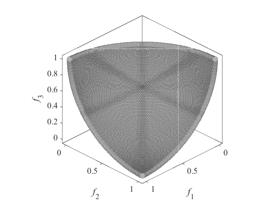IDTLZ2 (_m_=3)|
 
## WFG
Benchmark MOP proposed by Walking Fish Group
 
Reference
 
S. Huband, P. Hingston, L. Barone, and L. While, A review of
multiobjective test problems and a scalable test problem toolkit, IEEE
Transactions on Evolutionary Computation, 2006, 10(5): 477-506.
 
|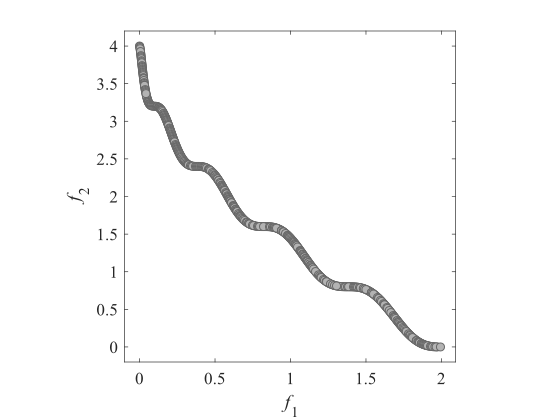WFG1 (_m_=2)|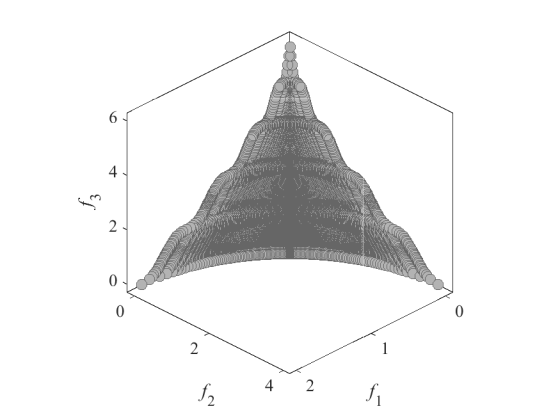WFG1 (_m_=3)|
|:-:|:-:|
|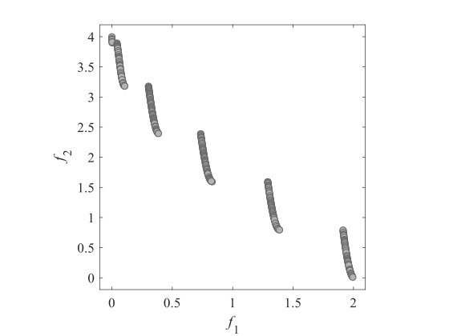WFG2 (_m_=2)|WFG2 (_m_=3)|
|WFG3 (_m_=2)|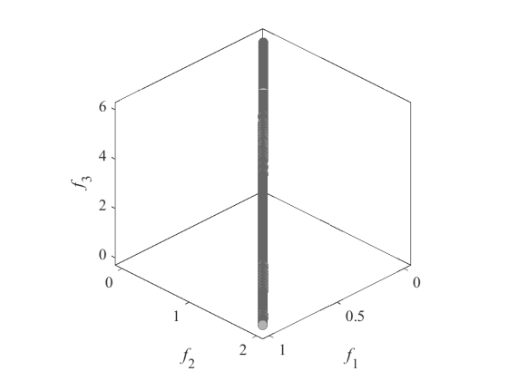WFG3 (_m_=3)|
|WFG4 (_m_=2)|WFG4 (_m_=3)|
|WFG5 (_m_=2)|WFG5 (_m_=3)|
|WFG6 (_m_=2)|WFG6 (_m_=3)|
|WFG7 (_m_=2)|WFG7 (_m_=3)|
|WFG8 (_m_=2)|WFG8 (_m_=3)|
|WFG9 (_m_=2)|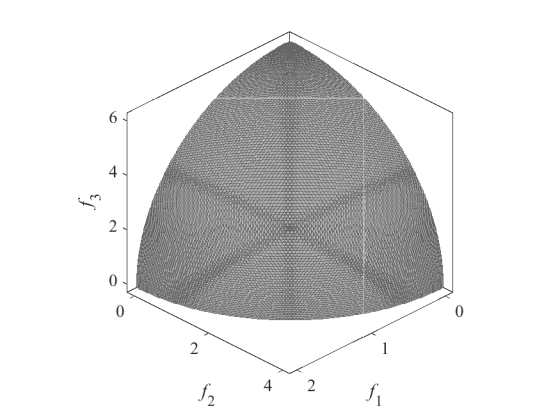WFG9 (_m_=3)|
 
## SMOP
Benchmark MOP with sparse Pareto optimal solutions
 
Reference
 
Y. Tian, X. Zhang, C. Wang, and Y. Jin, An evolutionary algorithm for
large-scale sparse multi-objective optimization problems, IEEE
Transactions on Evolutionary Computation, 2019.
 
|SMOP1 (_m_=2)|SMOP1 (_m_=3)|
|:-:|:-:|
|SMOP2 (_m_=2)|SMOP2 (_m_=3)|
|SMOP3 (_m_=2)|SMOP3 (_m_=3)|
|SMOP4 (_m_=2)|SMOP4 (_m_=3)|
|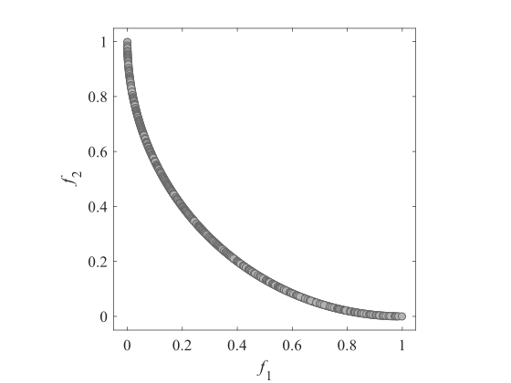SMOP5 (_m_=2)|SMOP5 (_m_=3)|
|SMOP6 (_m_=2)|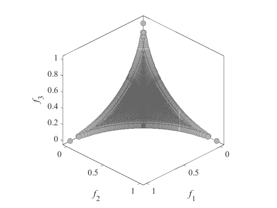SMOP6 (_m_=3)|
|SMOP7 (_m_=2)|SMOP7 (_m_=3)|
|SMOP8 (_m_=2)|SMOP8 (_m_=3)|
 
## LSMOP
Large-scale benchmark MOP
 
Reference
 
R. Cheng, Y. Jin, and M. Olhofer, Test problems for large-scale
multiobjective and many-objective optimization, IEEE Transactions on
Cybernetics, 2017, 47(12): 4108-4121.
 
|LSMOP1 (_m_=2)|LSMOP1 (_m_=3)|
|:-:|:-:|
|LSMOP2 (_m_=2)|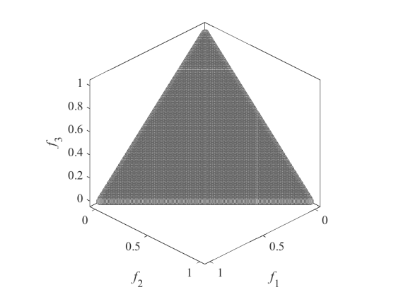LSMOP2 (_m_=3)|
|LSMOP3 (_m_=2)|LSMOP3 (_m_=3)|
|LSMOP4 (_m_=2)|LSMOP4 (_m_=3)|
|LSMOP5 (_m_=2)|LSMOP5 (_m_=3)|
|LSMOP6 (_m_=2)|LSMOP6 (_m_=3)|
|LSMOP7 (_m_=2)|LSMOP7 (_m_=3)|
|LSMOP8 (_m_=2)|LSMOP8 (_m_=3)|
|LSMOP9 (_m_=2)|LSMOP9 (_m_=3)|
 
## ZDT
Benchmark MOP proposed by Zitzler, Deb, and Thiele
 
Reference
 
E. Zitzler, K. Deb, and L. Thiele, Comparison of multiobjective
evolutionary algorithms: Empirical results, Evolutionary computation,
2000, 8(2): 173-195.
 
|ZDT1|ZDT2|
|:-:|:-:|
|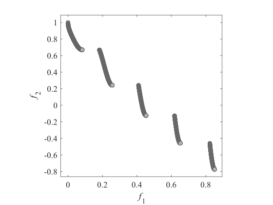ZDT3|ZDT4|
|ZDT5|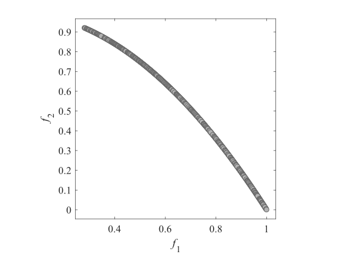ZDT6|
 
## BT
Benchmark MOP with bias feature
 
Reference
 
H. Li, Q. Zhang, and J. Deng, Biased multiobjective optimization and
decomposition algorithm, IEEE Transactions on Cybernetics, 2017, 47(1):
52-66.
 
|BT1|BT2|
|:-:|:-:|
|BT3|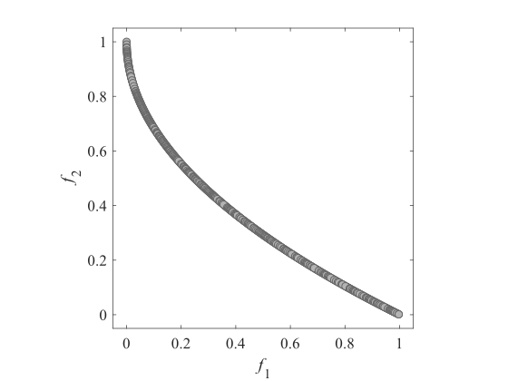BT4|
|BT5|BT6|
|BT7|BT8|
|BT9||
 
## CF
Constrained benchmark MOP
 
Reference
 
Q. Zhang, A. Zhou, S. Zhao, P. N. Suganthan, W. Liu, and S. Tiwari,
Multiobjective optimization test instances for the CEC 2009 special
session and competition, School of CS & EE, University of Essex, Working
Report CES-487, 2009.
 
|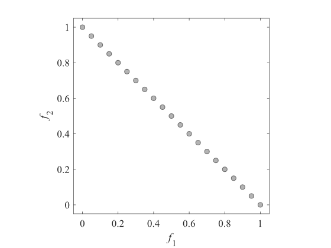CF1|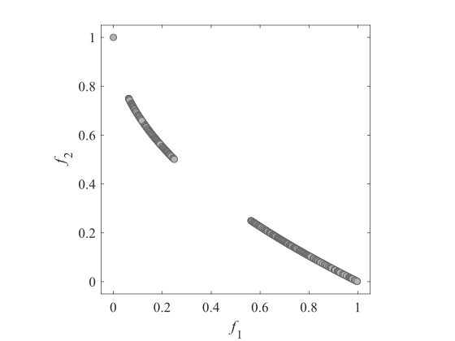CF2|
|:-:|:-:|
|CF3|CF4|
|CF5|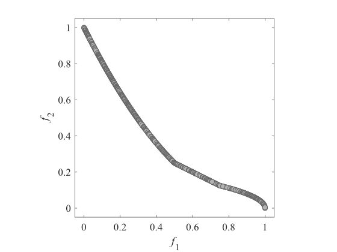CF6|
|CF7|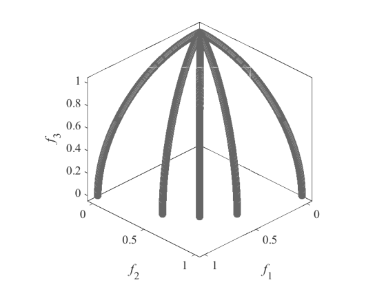CF8|
|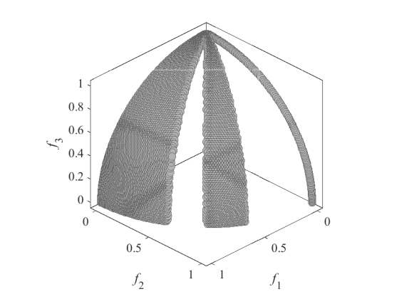CF9|CF10|
 
## IMOP
Benchmark MOP with irregular Pareto front
 
Reference
 
Y. Tian, R. Cheng, X. Zhang, M. Li, and Y. Jin, Diversity assessment of
multi-objective evolutionary algorithms: Performance metric and benchmark
problems, IEEE Computational Intelligence Magazine, 2019.
 
|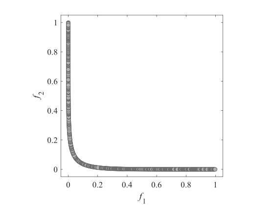IMOP1|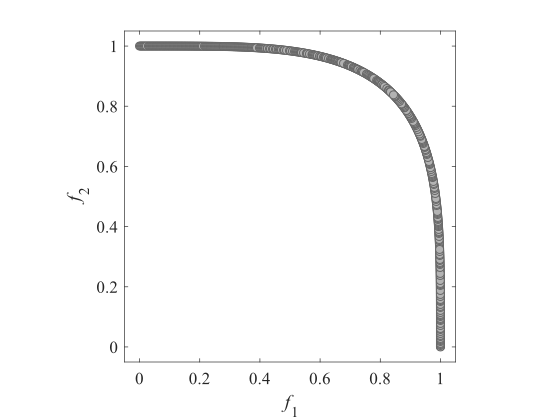IMOP2|
|:-:|:-:|
|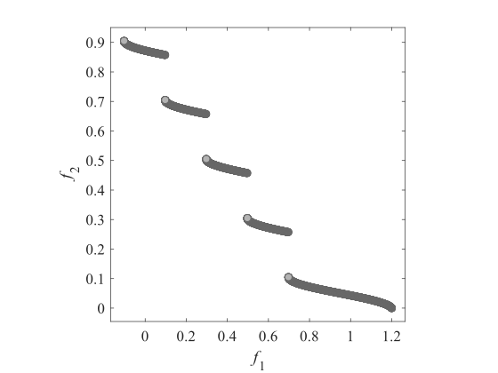IMOP3|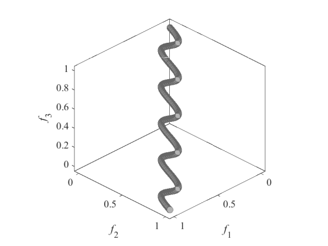IMOP4|
|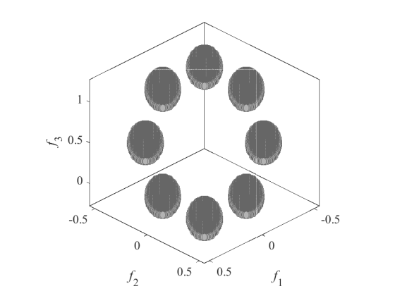IMOP5|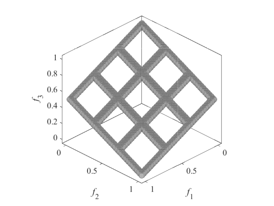IMOP6|
|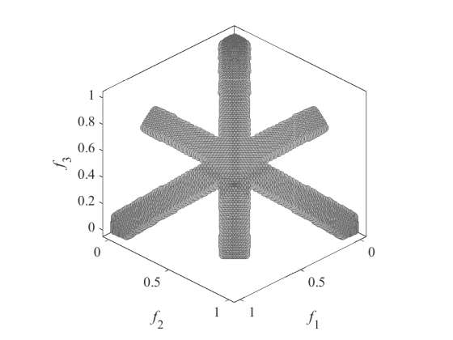IMOP7|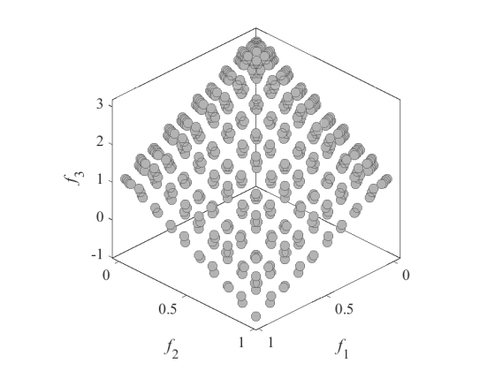IMOP8|
 
## IMMOEA
Benchmark MOP for Inverse Modeling - MOEA
 
Reference
 
R. Cheng, Y. Jin, K. Narukawa, and B. Sendhoff, A multiobjective
evolutionary algorithm using Gaussian process-based inverse modeling,
IEEE Transactions on Evolutionary Computation, 2015, 19(6): 838-856.
 
|IMMOEA_F1|IMMOEA_F2|
|:-:|:-:|
|IMMOEA_F3|IMMOEA_F4|
|IMMOEA_F5|IMMOEA_F6|
|IMMOEA_F7|IMMOEA_F8|
|IMMOEA_F9|IMMOEA_F10|
 
## VNT
 
Reference
 
R. Viennet, C. Fonteix, and I. Marc, Multicriteria optimization using a
genetic algorithm for determining a Pareto set, International Journal of
Systems Science, 1996, 27(2): 255-260.
 
|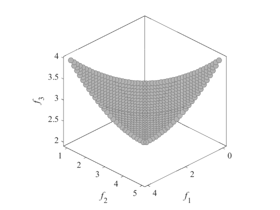VNT1|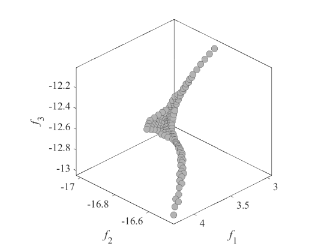VNT2|
|:-:|:-:|
|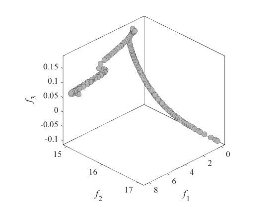VNT3|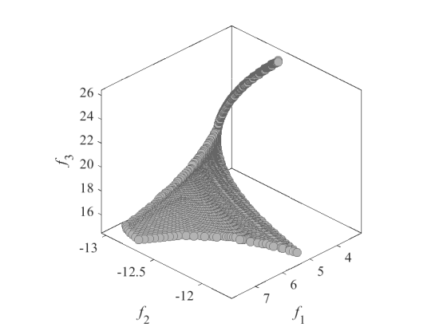VNT4|
 
## RMMEDA
Benchmark MOP for Regularity Model-based - MEDA
 
Reference
 
Q. Zhang, A. Zhou, and Y. Jin, RM-MEDA: A regularity model-based
multiobjective estimation of distribution algorithm, IEEE Transactions on
Evolutionary Computation, 2008, 12(1): 41-63.
 
|RMMEDA_F1|RMMEDA_F2|
|:-:|:-:|
|RMMEDA_F3|RMMEDA_F4|
|RMMEDA_F5|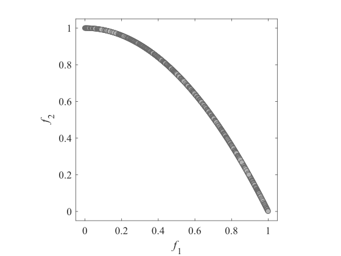RMMEDA_F6|
|RMMEDA_F7|RMMEDA_F8|
|RMMEDA_F9|RMMEDA_F10|
 
## UF
Unconstrained benchmark MOP
 
Reference
 
Q. Zhang, A. Zhou, S. Zhao, P. N. Suganthan, W. Liu, and S. Tiwari,
Multiobjective optimization test instances for the CEC 2009 special
session and competition, School of CS & EE, University of Essex, Working
Report CES-487, 2009.
 
|UF1|UF2|
|:-:|:-:|
|UF3|UF4|
|UF5|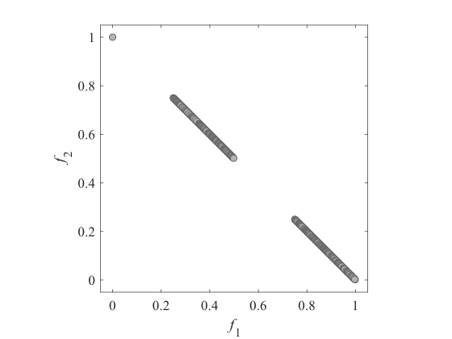UF6|
|UF7|UF8|
|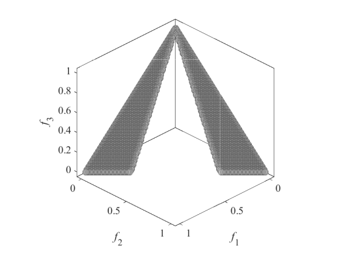UF9|UF10|
|UF11|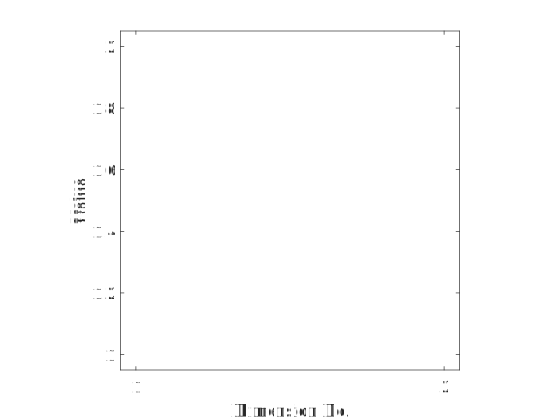UF12|
 
## MOEADDE
Benchmark MOP for MOEA/D-DE
 
Reference
 
H. Li and Q. Zhang, Multiobjective optimization problems with complicated
Pareto sets, MOEA/D and NSGA-II, IEEE Transactions on Evolutionary
Computation, 2009, 13(2): 284-302.
 
|MOEADDE_F1|MOEADDE_F2|
|:-:|:-:|
|MOEADDE_F3|MOEADDE_F4|
|MOEADDE_F5|MOEADDE_F6|
|MOEADDE_F7|MOEADDE_F8|
|MOEADDE_F9||
 
## MOEADM2M
Benchmark MOP for MOEA/D-M2M
 
Reference
 
H. Liu, F. Gu, and Q. Zhang, Decomposition of a multiobjective
optimization problem into a number of simple multiobjective subproblems,
IEEE Transactions on Evolutionary Computation, 2014, 18(3): 450-455.
 
|MOEADM2M_F1|MOEADM2M_F2|
|:-:|:-:|
|MOEADM2M_F3|MOEADM2M_F4|
|MOEADM2M_F5|MOEADM2M_F6|
|MOEADM2M_F7||
