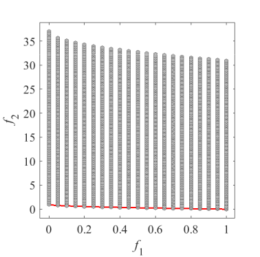
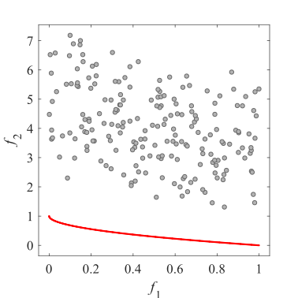

# Test_Functions_for_Multi_Objective_Optimization
Test functions for multi-objective optimization
 
### Left image is Pareto Front
 
### Center image is Pareto Front and initial population  
Number of variables _D_ = 5, Population size _N_ = 200
 
### Right image is Pareto Front and grid points  
Number of variables _D_ = 5, Points size _N_ = 21^5
 
Red points are Parto Optimal Solution  
Blue points are infeasible Solution  
Grey points are feasible Solution  

## Example
 
|Pareto Front on the ZDT1|Initial population on the ZDT1|Grid Points on the ZDT1|
|:-:|:-:|:-:|
 
I use PlatEMO. All Problems directory files and some Public directory files are same as PlatEMO.  
I hope visitors can help their visual understanding of multi-objective optimization problem.
 
Reference  
Ye Tian, Ran Cheng, Xingyi Zhang, and Yaochu Jin, PlatEMO: A MATLAB platform
for evolutionary multi-objective optimization [educational forum], IEEE
Computational Intelligence Magazine, 2017, 12(4): 73-87".  
[PlatEMO](https://github.com/BIMK/PlatEMO/)