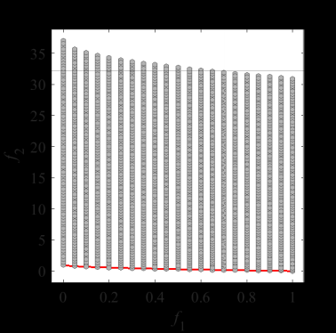

# Test_Functions_for_Multi_Objective_Optimization
Test functions for multi-objective optimization
 
### Left image is Pareto Front
 
### Center image is Pareto Front and initial population  
Number of variables _D_ = 5, Population size _N_ = 200
 
### Right image is Pareto Front and grid points  
Number of variables _D_ = 5, Points size _N_ = 21^5  
Each element is one of {0,0.05,0.1,...,0.95,1}
 
Red points are Parto Optimal Solution  
Blue points are infeasible Solution  
Grey points are feasible Solution
 
## Example
 
|Pareto Front on the ZDT1 |Initial population on the ZDT1| Grid Points on the ZDT1|
|:-:|:-:|:-:|