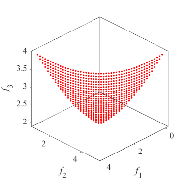
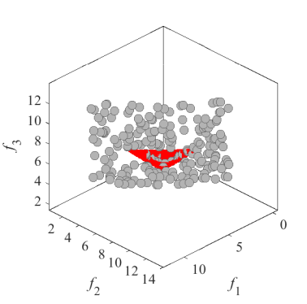
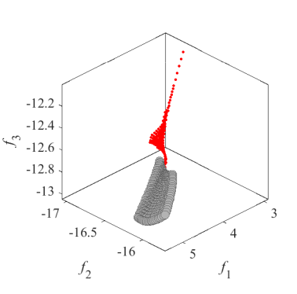
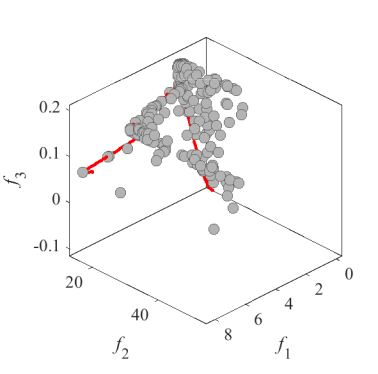
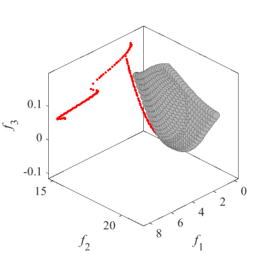
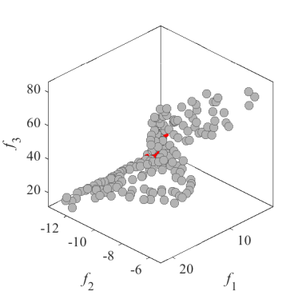
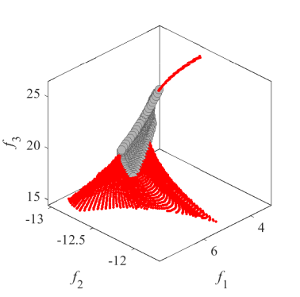

# Test_Functions_for_Multi_Objective_Optimization
test functions for multi-bjective optimization
 
## VNT
Benchmark MOP proposed by Viennet  
Reference  
R. Viennet, C. Fonteix, and I. Marc, Multicriteria optimization using a
genetic algorithm for determining a Pareto set, International Journal of
Systems Science, 1996, 27(2): 255-260.
 
|Pareto Front on the VNT1 |Initial population on the VNT1| Grid Points on the VNT1|
|:-:|:-:|:-:|
|Pareto Front on the VNT2 |Initial population on the VNT2| Grid Points on the VNT2|
|Pareto Front on the VNT3 |Initial population on the VNT3| Grid Points on the VNT3|
|Pareto Front on the VNT4 |Initial population on the VNT4| Grid Points on the VNT4|