# VNT
### Benchmark MOP proposed by Viennet  
Reference  
R. Viennet, C. Fonteix, and I. Marc, Multicriteria optimization using a
genetic algorithm for determining a Pareto set, International Journal of
Systems Science, 1996, 27(2): 255-260.
 
|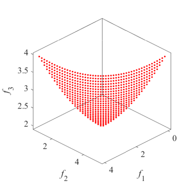Pareto Front on the VNT1|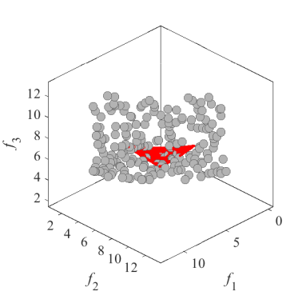Initial population on the VNT1|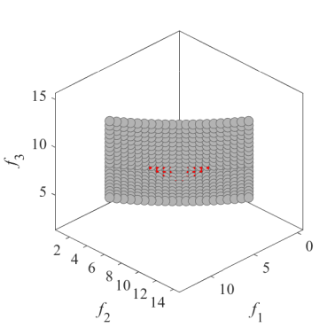Grid Points on the VNT1|
|:-:|:-:|:-:|
|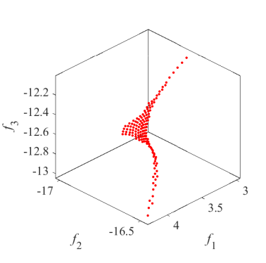Pareto Front on the VNT2|Initial population on the VNT2|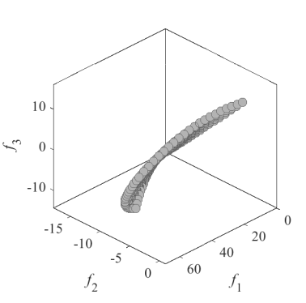Grid Points on the VNT2|
|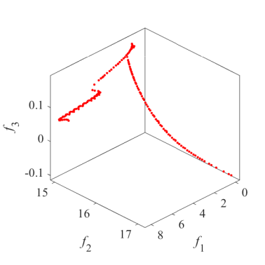Pareto Front on the VNT3|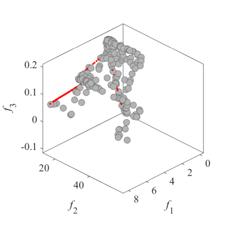Initial population on the VNT3|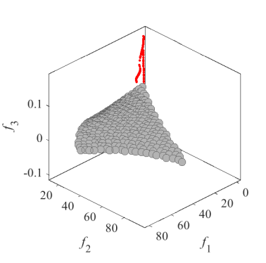Grid Points on the VNT3|
|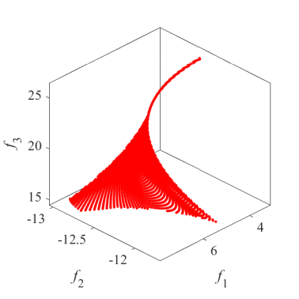Pareto Front on the VNT4|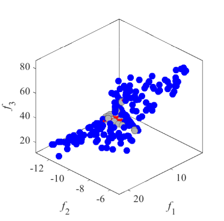Initial population on the VNT4|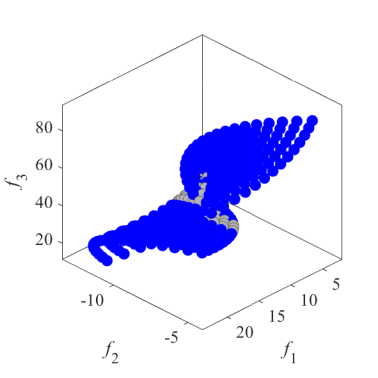Grid Points on the VNT4|