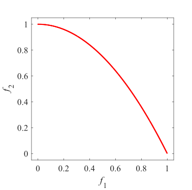
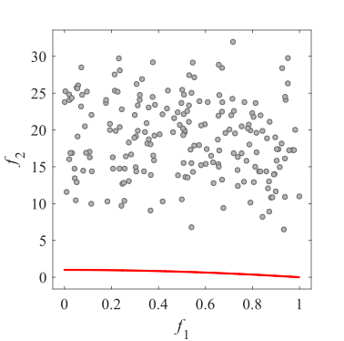
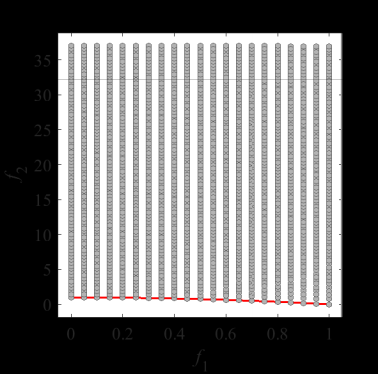
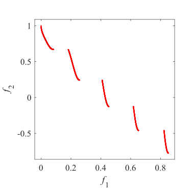
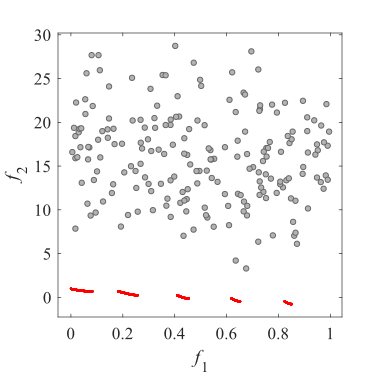
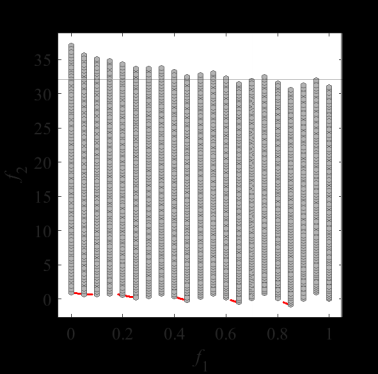
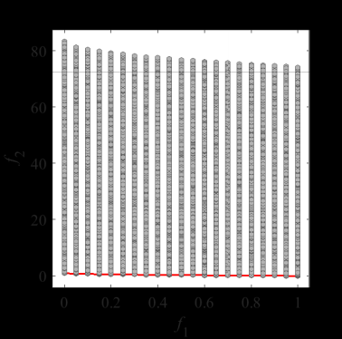
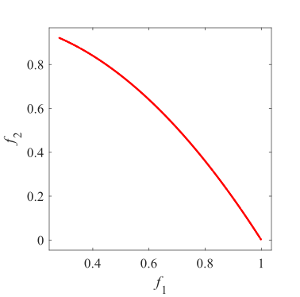
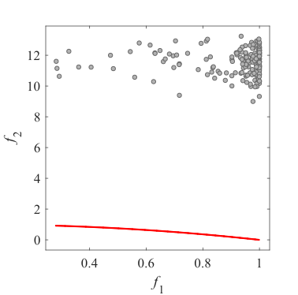
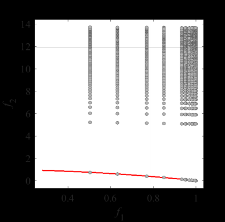

# Test_Functions_for_Multi_Objective_Optimization
test functions for Multi Objective optimization
 
## ZDT
Benchmark MOP proposed by Zitzler, Deb, and Thiele  
Reference  
E. Zitzler, K. Deb, and L. Thiele, Comparison of multiobjective
evolutionary algorithms: Empirical results, Evolutionary computation,
2000, 8(2): 173-195.
 
|Pareto Front on the ZDT1 |Initial population on the ZDT1| Grid Points on the ZDT1|
|:-:|:-:|:-:|
|Pareto Front on the ZDT2 |Initial population on the ZDT2| Grid Points on the ZDT2|
|Pareto Front on the ZDT3 |Initial population on the ZDT3| Grid Points on the ZDT3|
|Pareto Front on the ZDT4 |Initial population on the ZDT4| Grid Points on the ZDT4|
|Pareto Front on the ZDT5 |Initial population on the ZDT5| ZDT5 have  binary encoding decision variables. I have no image. |
|Pareto Front on the ZDT6 |Initial population on the ZDT6| Grid Points on the ZDT6|
